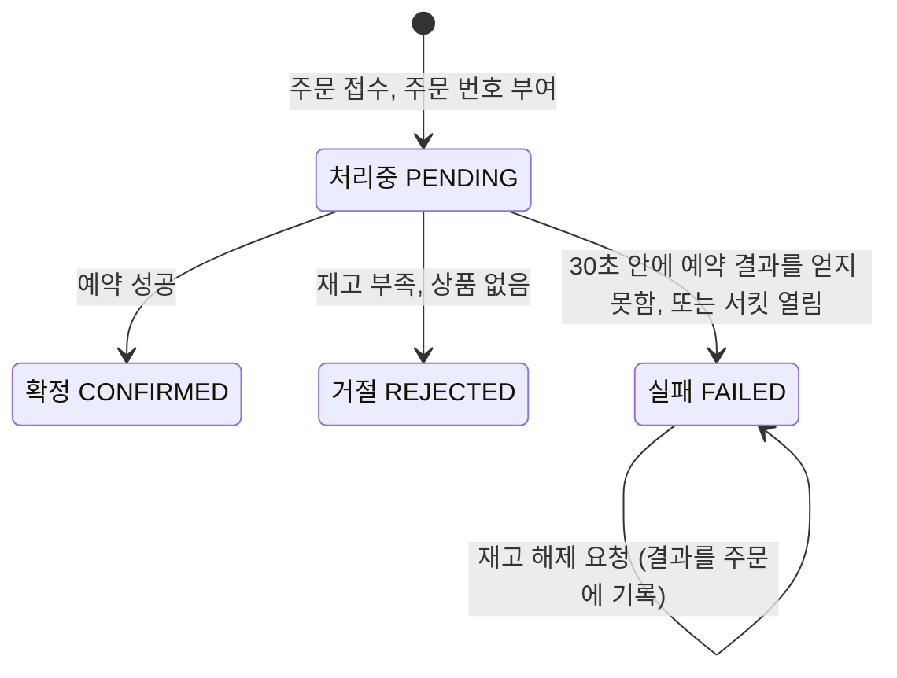
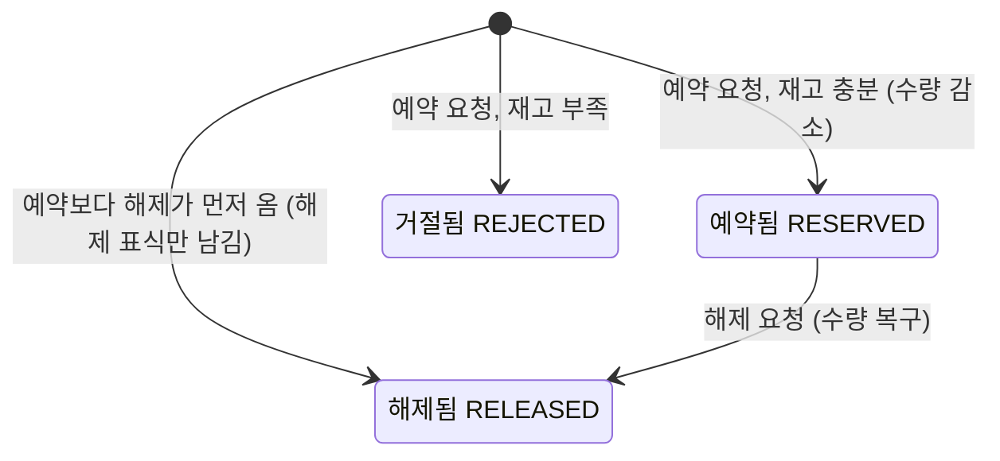

# 도메인 분석 — 주문과 재고

- 상태: 초안 (2026-10-04, OQ-001~009 모두 결정)
- 출처: P = [마이크로서비스와 쿠버네티스 기초](../references/msa-k8s-primer.md)
- 관련: [UC-001](../requirements/uc-001-place-order.md), [UC-002](../requirements/uc-002-view-orders.md), [NFR](../requirements/non-functional.md), [STD](../standards/architecture-rules.md)

## 1. 범위

| 단계 | 대상 | 다루는 것 |
|---|---|---|
| 현재 | 주문(order), 재고(inventory), 인증(Keycloak) | 주문 생성, 주문 조회, 재고 예약과 해제, 장애 상황의 동작, 기본 인증 |
| 후속 | 결제(payment) 추가 | 서비스 사이 데이터 일관성(Saga). P§6-③ |

`services/payment-service/`는 저장소 구조에 자리만 있고, 이번 단계의 spec에는 넣지 않는다.

## 2. 서비스 경계와 데이터 소유

| 구성 요소 | 책임 | 소유 데이터 | 다른 서비스에 주는 것 |
|---|---|---|---|
| 주문 서비스 | 주문 접수, 주문 번호 부여, 주문 상태 관리, 주문 조회 | 주문 | 없음 (현재 단계) |
| 재고 서비스 | 상품별 재고 수량 관리, 재고 예약과 해제 | 재고 수량, 예약 기록 | 재고 예약 API, 예약 해제 API |
| Keycloak | 고객 계정, 로그인, 토큰 발급 | 사용자, 역할 | JWT 발급, 서명 검증용 공개 키 |

- 데이터는 소유한 쪽만 읽고 쓴다. 주문 서비스는 재고 DB에 접속하지 않는다. (P§5, STD-001)
- 재고는 초기 데이터로만 넣는다. 재고 등록·조회 API는 만들지 않고, 재고 서비스는 외부에 열지 않는다. (OQ-001)
- Keycloak은 직접 만드는 서비스가 아니라 가져다 쓰는 제품이다. (ADR-0006)

## 3. 핵심 개념

| 개념 | 뜻 | 소유 | 출처 |
|---|---|---|---|
| 고객 | 로그인한 사용자. Keycloak 토큰의 `sub`로 구별한다 | Keycloak | OQ-007 |
| 주문 | 고객이 주문 항목 하나 이상을 정해 요청한 것. 결과와 관계없이 모두 기록한다 | 주문 | P§0, OQ-002 |
| 주문 항목 | 주문 안의 한 줄. 상품과 수량. 한 주문에 같은 상품은 한 줄만 있다 | 주문 | OQ-006 |
| 주문 번호 | 주문 서비스가 처음 저장할 때 붙이는 번호. 재고 예약의 멱등 키가 된다 | 주문 | P§5-3, OQ-005 |
| 주문 상태 | 처리중, 확정, 거절, 실패 (4절) | 주문 | OQ-002 |
| 주문 요청 키 | 고객이 같은 주문을 다시 보낼 때 같은 주문으로 알아보는 키 (7절) | 주문 | OQ-008 |
| 재고 수량 | 상품별로 남은 수량. 0보다 작아지지 않는다 | 재고 | P§5-5, BR-003 |
| 재고 예약 | 주문 수량만큼 재고 수량을 줄이는 것 | 재고 | P§5-5 |
| 예약 해제 | 실패한 주문의 예약을 되돌려 재고 수량을 복구하는 것 | 재고 | OQ-002 |
| 예약 기록 | 주문 번호마다 한 줄. 예약 결과(예약됨/거절됨/해제됨)를 남긴다 | 재고 | P§6-①, OQ-005 |

## 4. 주문 상태

| 상태 | 재고 | 고객에게 | 출처 |
|---|---|---|---|
| 처리중 | 아직 모름 | 같은 주문 요청이 다시 오면 "처리중"을 돌려준다 | OQ-002 `[제안]` |
| 확정 | 줄었다 | 확정 | P§5-6 |
| 거절 | 그대로다 | 거절과 사유(재고 부족 등) | P§0, OQ-002 |
| 실패 | 그대로다. 예약 요청을 보낸 적이 있으면 해제한다 | "잠시 후 다시 시도" | P§6-②, OQ-002, OQ-009 |

- **처리중을 먼저 저장한다.** 원문(P§5)은 예약 뒤에 "확정"만 저장하지만, OQ-002에 따라 모든 주문을 기록하려면 예약 전에 주문을 남겨야 한다. 그러면 중간에 Pod가 죽어도 주문이 "처리중"으로 남아 조회할 수 있다. `[제안]`
- **실패한 주문의 재고 해제**: 시간 초과는 "재고가 줄지 않았다"는 뜻이 아니다. 예약은 됐는데 응답만 늦었을 수 있다(P§6-①). 그래서 실패로 바꾼 뒤 재고 서비스에 해제를 요청하고, 해제 결과(완료/실패)를 주문에 기록한다.
- **해제마저 실패하면**: 오류 로그를 남기고 주문에 "해제 실패"로 기록한다. 관리자 조회(UC-002)로 찾을 수 있다. 자동으로 다시 맞추는 일은 결제 단계의 Saga에서 다룬다. OQ-003의 (가)와 같은 처리다.

## 5. 예약 기록 상태 (재고 서비스)

예약 기록은 이번 단계에서 지우지 않는다.

## 6. 재고 예약의 멱등성 (OQ-005)

멱등 키는 **주문 번호**로 한다. 주문 하나에 예약 하나가 짝지어지므로 따로 키를 만들 필요가 없다. 예약 하나에는 주문 항목 전체가 들어간다. 같은 주문 번호로 온 요청은 "같은 요청"이고, 내용(상품 순으로 정렬한 항목 목록)이 다르면 호출한 쪽의 버그로 본다.

| # | 상황 | 처리 | 검증 |
|---|---|---|---|
| 1 | 같은 주문 번호, 같은 내용으로 재요청 (응답 유실 후 재시도) | 저장된 첫 결과를 그대로 돌려준다. 재고는 변하지 않는다 | TC-003 |
| 2 | 첫 요청이 아직 처리 중일 때 재시도가 다른 재고 Pod에 도착 | 예약 기록의 주문 번호 고유 제약 때문에 한쪽만 반영된다. 나중 요청은 앞 요청이 끝나기를 기다렸다가 그 결과를 돌려준다 | TC-003 |
| 3 | 같은 주문 번호, 다른 내용 | 반영하지 않고 "요청 키 충돌" 오류를 돌려준다. 재시도하지 않는다 | TC-008 |
| 4 | 재고 부족으로 거절된 주문 번호로 재요청 | 첫 결과(재고 부족)를 그대로 돌려준다. 그사이 재고가 늘어도 다시 판단하지 않는다 | TC-003 |
| 5 | 해제 요청, 예약됨 상태 | 수량을 복구하고 해제됨으로 바꾼다 | TC-004 |
| 6 | 해제 요청, 예약 기록 없음 (예약 요청이 아직 안 왔거나 사라짐) | 해제 표식(해제됨)만 남긴다 | TC-007 |
| 7 | 해제 표식이 있는데 늦게 예약 요청이 도착 | 반영하지 않고 "해제됨"을 돌려준다 | TC-007 |
| 8 | 해제 요청을 여러 번 | 수량은 한 번만 복구된다 | TC-007 |
| 9 | 다른 주문 번호, 같은 내용 | 별개의 예약이다. 정상 처리한다 | TC-005 |

- 예약 기록 저장과 모든 항목의 수량 변경은 재고 DB의 한 트랜잭션에서 한다. 둘이 나뉘면 1, 2번이 깨지고, 항목 일부만 줄어든 채 남을 수 있다(BR-002). `[추론]`
- 주문 번호는 주문 서비스의 DB 시퀀스로 만든다. 나중에 재고를 호출하는 서비스가 늘면 키를 (호출 서비스, 번호)로 넓힌다.
- **여러 항목을 동시에 예약할 때의 교착**: 주문 X가 A→B 순서로, 주문 Y가 B→A 순서로 재고 행을 잠그면 서로를 기다리다 교착이 생긴다. 항목을 언제나 상품 ID 순서로 처리해서 막는다. `[추론]` (TC-012)

## 7. 고객의 중복 주문 (OQ-008)

"같은 주문이 두 번"은 아래 네 경우가 섞여 있다. 시간 간격만으로는 구별되지 않는다.

| # | 경우 | 간격 | 고객의 의도 | 막아야 하나 |
|---|---|---|---|---|
| 1 | 정기 구매, 다시 주문 | 몇 분에서 몇 달 | 두 건 | 막으면 안 된다 |
| 2 | 버튼 두 번 클릭, 새로고침, 뒤로 가기 후 다시 제출 | 수 밀리초에서 몇 초 | 한 건 | 막아야 한다 |
| 3 | 고객 앱이나 네트워크의 자동 재전송. 앱이 응답을 못 받아(제한 시간, 모바일 연결 끊김) 다시 보낸다 | 몇 초에서 30초 이상 | 한 건 | 막아야 한다 |
| 4 | 두 기기나 두 탭에서 거의 동시에 같은 상품 주문 | 1초 안팎 | 알 수 없다 | 고객이 결정할 일 |

**1초 규칙(같은 고객·상품·수량이 1초 안에 오면 중복으로 본다)의 문제**

- 3번을 못 막는다. 주문 처리에 최대 30초가 걸리므로(OQ-004), 고객 앱이 그보다 먼저 포기하고 다시 보내면 1초를 훌쩍 넘는다.
- 1번과 4번 중 일부를 잘못 막는다. 고객이 일부러 같은 상품을 연달아 주문해도 거절된다.

**결정 (2026-10-04): 주문 요청 키(Idempotency-Key 헤더)**

- 고객 앱이 **주문 화면에서 "주문하기"를 처음 누를 때** 키(UUID)를 하나 만들고, 그 주문 시도를 다시 보낼 때는 같은 키를 쓴다. 새 주문을 할 때는 새 키를 만든다.
- 서버는 (고객, 키)가 같으면 새 주문을 만들지 않고 이미 있는 주문을 돌려준다. 처리 중이면 "처리중"을 돌려준다.
- 같은 키인데 내용이 다르면 오류를 돌려준다.
- 이렇게 하면 2, 3번은 막고 1번은 막지 않는다. 4번은 키가 서로 다르므로 두 건이 된다(고객의 선택을 존중).
- 주문 생성 요청에는 키가 반드시 있어야 한다. 없으면 오류를 돌려준다. `[제안]`
- 키는 주문과 함께 저장하고 지우지 않는다. 같은 고객 안에서만 비교한다.
- 이 방식은 IETF의 Idempotency-Key 헤더 초안과 결제 API들(Stripe 등)이 쓰는 방식이다. `[문헌]` `[현장]`

## 8. 장애 모드 분석

| 상황 | 결과 | 대응 | 출처 | 기준 |
|---|---|---|---|---|
| 예약은 처리됐는데 응답이 사라져 주문이 다시 요청한다 | 재고가 두 번 줄어든다 | 주문 번호 멱등 예약 | P§6-① | BR-001, STD-005, TC-003 |
| 재고 서비스가 잠깐 오류를 낸다 | 주문이 실패한다 | 재시도 (즉시, 1, 2, 4, 8초 뒤) | OQ-004 | STD-016, TC-006 |
| 재고 서비스가 느리거나 멈춘다 | 주문 서비스의 스레드가 묶인다 | 시도당 2.5초, 전체 30초 한도. 넘으면 실패 처리 | P§6-②, OQ-004 | NFR-002, STD-004, TC-004 |
| 재고 서비스가 오래 멈춘다 | 주문마다 30초씩 스레드를 잡아 주문 서비스가 멈출 수 있다 | 서킷 브레이커. 실패가 몰리면 재고를 부르지 않고 바로 실패 처리 | OQ-004에서 `[추론]`, OQ-009 | STD-019, TC-013, TC-105 |
| 여러 항목 주문이 동시에 서로 다른 순서로 재고 행을 잠근다 | 교착 (Oracle은 한쪽을 ORA-00060 오류로 끊는다) | 항목을 상품 ID 순서로 처리 | `[추론]` | TC-012 |
| 30초 안에 결과를 못 받았지만 재고는 실제로 줄었다 | 고객은 실패로 알고 재고만 줄어 있다 | 실패로 바꾼 뒤 예약 해제 요청 | OQ-002 | BR-005, TC-004 |
| 해제 요청보다 예약 요청이 늦게 도착한다 | 실패한 주문의 재고가 줄어든다 | 해제 표식 | `[추론]` | TC-007 |
| 해제 요청도 실패한다 | 재고만 줄어든 채 남을 수 있다 | 주문에 "해제 실패" 기록, 오류 로그. 자동 복구는 후속 | OQ-003 (가) | UC-002 |
| 예약 성공 후 주문을 확정으로 바꾸는 저장이 실패한다 | 주문은 처리중, 재고는 줄어 있다 | 오류 로그. 알려진 한계 | P§6-③, OQ-003 (가) | NFR-009 |
| 같은 상품에 주문이 동시에 들어온다 | 초과 판매, 재고 음수 | 조건부 UPDATE | `[추론]` | BR-003, TC-005 |
| Pod가 교체된다 | Pod 메모리·로컬 디스크의 데이터가 사라진다 | 무상태 | P§6-④ | STD-006 |
| 앱이 다 뜨기 전에 요청이 들어온다 | 요청이 실패한다 | readiness 프로브 | P§6-⑤ | STD-007 |
| 처리 중에 종료 신호를 받는다 | 처리 중인 요청이 끊긴다 | 그레이스풀 셧다운 | P§6-⑤ | STD-008, TC-103 |
| 배포 중 옛 버전과 새 버전이 섞인다 | 필드를 지우거나 이름을 바꾸면 호출이 실패한다 | 추가하는 방식으로만 변경 | P§6-⑦ | STD-010, TC-106 |
| 프로세스는 살아 있는데 응답이 없다 (교착) | 요청이 계속 실패한다 | liveness 프로브로 재시작 | P§7 | STD-007, TC-102 |
| Pod를 늘렸는데 DB가 병목이다 | 빨라지지 않는다 | 확장 전에 병목 위치 확인 | P§7 `[추론]` | — |

## 9. 미결 사항

`/speckit-clarify`를 돌릴 때 같이 확인한다. 정해지면 "고칠 문서"를 갱신하고 결론과 날짜를 적는다.

| ID | 질문 | 결론 | 반영한 문서 |
|---|---|---|---|
| OQ-001 | 재고 데이터는 어떻게 넣는가? | **결정 (2026-10-04)**: 초기 데이터로만 넣는다. 재고 등록·조회 API는 만들지 않는다 | UC-001, design |
| OQ-002 | 확정이 아닌 결과에서 주문을 기록하는가? | **결정 (2026-10-04)**: 모든 주문을 기록한다. 재고 부족은 "거절", 시간 초과·오류는 "실패"로 두고 재고는 차감하지 않으며(혹시 줄었으면 해제), 조회할 수 있게 한다 | UC-001, UC-002, 4절, design, TC-002, TC-004 |
| OQ-003 | 예약 성공 후 주문 저장이 실패하면? | **결정 (2026-10-04)**: (가) 알려진 한계로 두고 로그만 남긴다 | ADR-0004, NFR-009 |
| OQ-004 | 제한 시간과 재시도는? | **결정 (2026-10-04)**: 재시도를 포함한 전체 한도 30초. 최초 시도 후 재시도 최대 5회(총 6회), 재시도 전 대기는 즉시, 1, 2, 4, 8초. 시도당 제한 시간 2.5초. 30초를 시도당 제한 시간으로 보면 최악 195초가 걸려서 전체 한도로 정했다 | NFR-002, STD-004, STD-016, design |
| OQ-005 | 재고 예약의 멱등 기준은? | **결정 (2026-10-04)**: 주문 번호. 6절. 2단계 예약(예약 ID 발급 → 확정/취소, 시간이 지나면 자동 해제)은 결제 단계의 Saga를 설계할 때 다시 검토한다 | design, TC-003, TC-007, TC-008, ADR-0004 |
| OQ-006 | 한 주문에 여러 상품을 담을 수 있는가? | **결정 (2026-10-04)**: 담을 수 있다. 예약은 주문 단위로 전부 되거나 전부 안 된다(BR-002). 같은 상품은 한 줄로 쓴다(BR-009) | UC-001, UC-002, 3·6절, design, TC-001, TC-002, TC-012, TC-014 |
| OQ-007 | 주문 조회, 주문 취소, 고객 인증을 넣는가? | **결정 (2026-10-04)**: 기본 인증을 넣는다(ADR-0006). 주문 조회는 OQ-002 때문에 넣는다(UC-002). 주문 취소는 넣지 않는다 | UC-001, UC-002, ADR-0006, STD-017 |
| OQ-008 | 고객이 같은 주문을 두 번 보내는 경우도 막는가? | **결정 (2026-10-04)**: 주문 요청 키로 막는다. 7절 | UC-001, design, TC-011 |
| OQ-009 | 재고 서비스가 오래 멈췄을 때 주문 서비스를 어떻게 지키는가? 주문마다 최대 30초씩 요청 스레드를 잡는데, Java 17이라 가상 스레드를 쓸 수 없다. 초당 7건 남짓(Tomcat 기본 스레드 200개 ÷ 30초)만 들어와도 스레드가 바닥난다 | **결정 (2026-10-04)**: 서킷 브레이커를 둔다. 최근 호출의 실패율이 높으면 재고를 부르지 않고 바로 "실패"로 처리하고, 잠시 뒤 시험 호출로 회복을 확인한다. 설정값은 design 4절 `[제안]` | UC-001 A5, NFR-002, STD-019, design, TC-013, TC-105 |
