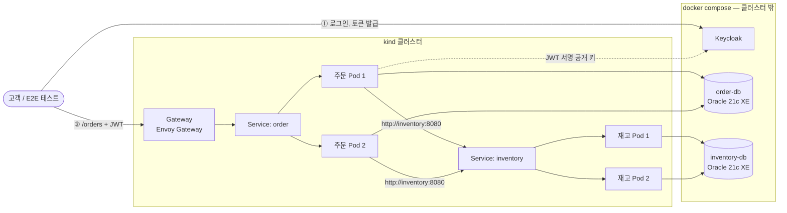
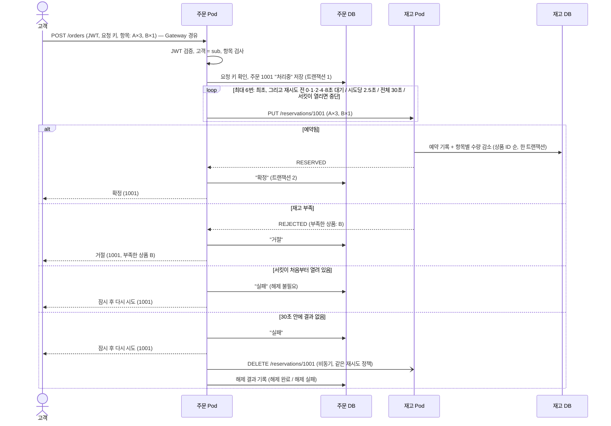

# 아키텍처 설계 — 주문·재고 (현재 단계)

- 상태: 초안 (2026-10-04, OQ-001~009, ADR-0005~0007 반영)
- 출처: P = [마이크로서비스와 쿠버네티스 기초](../references/msa-k8s-primer.md)
- 관련: [ADR-0003](../adr/0003-local-k8s-runtime.md), [ADR-0004](../adr/0004-sync-reservation-call.md), [ADR-0005](../adr/0005-oracle-xe-instance-per-service.md), [ADR-0006](../adr/0006-keycloak-jwt-auth.md), [ADR-0007](../adr/0007-envoy-gateway.md), [도메인 분석](../analysis/domain-analysis.md), [STD](../standards/architecture-rules.md), [기술 스택](../standards/tech-stack.md)

서비스 사이 API의 정식 명세는 `contracts/`에 OpenAPI로 둔다. 이 문서 5절과 6절의 경로, 필드, 열 이름은 제안이고, `/speckit-plan`이 `specs/NNN/contracts/` 초안을 만들 때 입력으로 쓴다. `[제안]` 단, 테스트 케이스가 기대값으로 쓰는 HTTP 상태 코드는 `docs/test-cases/`에서 확정했다.

## 1. 런타임 구성

- 무상태 앱(주문, 재고)은 kind 클러스터 안에, 상태를 가진 인프라(Oracle, Keycloak)는 클러스터 밖 docker compose로 띄운다. 클러스터를 지웠다 다시 만들어도 데이터가 남는다. (ADR-0005)
- 서비스마다 Oracle XE 컨테이너가 하나씩 있다. 주문 서비스는 `order-db`만, 재고 서비스는 `inventory-db`만 안다. 한쪽 DB가 멈춰도 다른 서비스의 DB는 영향을 받지 않는다. (ADR-0005, STD-001)
- 재고 서비스는 외부에 열지 않는다. (OQ-001)
- compose의 컨테이너는 `kind` Docker 네트워크에 붙여, 클러스터 안의 Pod가 `order-db:1521`처럼 이름으로 찾게 한다. 실제로 되는지는 plan에서 확인한다. `[현장]`

## 2. 쿠버네티스 객체

| 객체 | 주문 | 재고 | 출처 |
|---|---|---|---|
| 라벨 | `app=order` | `app=inventory` | P§4-2 |
| Deployment | replicas 2, 롤링 업데이트 | replicas 2, 롤링 업데이트 | P§0, P§7 |
| Service | 이름 `order`, 포트 8080 | 이름 `inventory`, 포트 8080 | P§4-3 |
| HTTPRoute | `/orders`, `/admin/orders` → `order`. **요청 제한 시간 40초** | 없음 | P§5-1, OQ-001 |
| ConfigMap | DB 주소, 재고 주소, 재시도 설정, Keycloak 주소 | DB 주소 | P§6-⑥ |
| Secret | DB 비밀번호 | DB 비밀번호 | P§6-⑥ |
| 프로브 | readiness, liveness | readiness, liveness | P§6-⑤ |

- **HTTPRoute의 제한 시간을 40초로 둔다.** 주문 처리는 최대 30초 걸린다(4절). Envoy의 기본 요청 제한 시간은 15초라서, 그대로 두면 주문 서비스가 아직 처리하는 중에 Gateway가 요청을 끊는다. 고객 앱의 제한 시간도 같은 이유로 40초 이상으로 둔다. (ADR-0007)
- Envoy 프록시는 NodePort로 열고 kind의 extraPortMappings로 호스트 80번에 연결한다. (ADR-0007, 2026-10-05 결정)
- 매니페스트는 `infra/k8s/`, compose 파일은 `infra/compose/`, kind 설정은 `infra/kind/`에 둔다. 서비스 배포를 매니페스트 파일로 할지 Helm 차트로 할지는 plan에서 정한다.

## 3. 요청 흐름

- 재고 호출은 DB 트랜잭션 밖에서 한다. "처리중" 저장과 결과 저장은 각각 따로 커밋한다. (STD-018)
- 주문 번호는 첫 예약 요청 **전에** 정하고, 재시도할 때 같은 번호를 보낸다. (P§6-①)
- 해제는 고객 응답 뒤에 비동기로 한다. 해제를 하던 Pod가 죽으면 해제 결과가 비어 있는 "실패" 주문이 남는다. 관리자 조회로 찾을 수 있다. 자동 복구는 결제 단계에서 다룬다. (OQ-003 (가))

## 4. 재시도와 제한 시간 (OQ-004)

| 항목 | 값 |
|---|---|
| 전체 한도 | 30초. 넘으면 남은 재시도를 하지 않고 "실패"로 처리한다 |
| 시도 횟수 | 최초 1번 + 재시도 최대 5번 |
| 재시도 전 대기 | 즉시, 1초, 2초, 4초, 8초 |
| 시도당 제한 시간 | 2.5초 (연결 포함) |
| 재시도하는 경우 | 연결 실패, 시도 제한 시간 초과, 502·503·504 |
| 재시도하지 않는 경우 | RESERVED·REJECTED·RELEASED 응답, 400·401·403·409·500 |

모든 시도가 시간 초과일 때의 최악 시간표다. 시도당 2.5초는 이 표가 정확히 30초에 끝나도록 정한 값이다.

| 시도 | 시작 | 끝 (시간 초과) |
|---|---|---|
| 1 (최초) | 0초 | 2.5초 |
| 2 (즉시) | 2.5초 | 5초 |
| 3 (1초 대기) | 6초 | 8.5초 |
| 4 (2초 대기) | 10.5초 | 13초 |
| 5 (4초 대기) | 17초 | 19.5초 |
| 6 (8초 대기) | 27.5초 | 30초 |

### 서킷 브레이커 (OQ-009)

재고 서비스가 오래 멈추면 주문마다 요청 스레드를 최대 30초 잡게 된다. 이를 막으려고 재고 호출에 서킷 브레이커를 둔다. 값은 2026-10-05에 정했다. 값을 바꿔야 하면 근거를 들어 사용자에게 묻는다.

| 항목 | 값 |
|---|---|
| 대상 | 재고 서비스 호출(예약, 해제)에 서킷 하나 |
| 기록 단위 | 시도 하나하나 (재시도 안쪽에서 센다) |
| 실패로 세는 것 | 연결 실패, 시도 제한 시간 초과, 5xx. 업무 결과(RESERVED·REJECTED·RELEASED)와 4xx는 성공으로 센다 |
| 열리는 조건 | 최근 10번의 시도 중 50% 이상 실패 (최소 10번 기록된 뒤) |
| 열려 있는 시간 | 10초. 그 뒤 반쯤 열린 상태로 바꿔 시험 호출 3번을 보낸다 |
| 반쯤 열린 상태 | 시험 호출이 기준 아래로 실패하면 닫고, 아니면 다시 연다 |
| 열려 있을 때 | 재고를 부르지 않고 바로 실패한다. **재시도도 하지 않는다** (STD-019) |

- 서킷이 처음부터 열려 있어 예약 요청을 한 번도 보내지 않은 주문은 해제할 것이 없다. 주문에 "해제 불필요"로 기록한다.
- 예약 요청을 한 번이라도 보낸 뒤 서킷이 열리면, 그 주문은 "실패"로 끝내고 해제를 요청한다. 해제도 서킷에 막히면 해제 재시도 정책을 따르고, 끝내 실패하면 "해제 실패"로 기록한다.
- 기대 효과: 재고가 멈추고 주문이 몰리면, 처음 10번 남짓의 시도(수 초)가 실패한 뒤 서킷이 열린다. 그 뒤 주문은 1초 안에 실패 응답을 받고 스레드를 오래 잡지 않는다. `[추론]`

## 5. 인터페이스 (개념 수준)

| 구분 | 메서드와 경로 | 호출 | 입력 | 출력 | 특성 |
|---|---|---|---|---|---|
| 외부 | `POST /orders` | 고객 → 주문 | 헤더: JWT, `Idempotency-Key`(필수, OQ-008). 본문: 주문 항목 목록(상품, 수량) | 주문 번호, 상태, 사유(재고 부족이면 부족한 상품 목록, 상품 없음이면 없는 상품 목록) | 거절·실패여도 주문 번호를 돌려준다 |
| 외부 | `GET /orders` | 고객 → 주문 | JWT | 자기 주문 목록 | UC-002 |
| 외부 | `GET /orders/{orderNo}` | 고객 → 주문 | JWT | 자기 주문 하나. 남의 주문이면 404 | BR-101 |
| 외부 | `GET /admin/orders?status=&releaseStatus=` | 관리자 → 주문 | JWT(`ADMIN`) | 조건에 맞는 모든 주문 | UC-002 |
| 내부 | `PUT /reservations/{orderNo}` | 주문 → 재고 | 주문 항목 목록(상품, 수량) | 상태(RESERVED/REJECTED/RELEASED), 사유, 부족한 상품 목록, 없는 상품 목록 | 멱등. 전부 예약되거나 전부 안 된다. 같은 번호에 다른 항목이면 409 |
| 내부 | `DELETE /reservations/{orderNo}` | 주문 → 재고 | — | 상태 | 멱등. 예약이 없으면 해제 표식을 남긴다 |

- 예약을 `PUT /reservations/{주문 번호}`로 둔 것은 "이 번호의 예약을 이 내용으로 만든다"는 뜻이 HTTP에서도 멱등이기 때문이다.
- HTTP 상태 코드와 오류 형식(RFC 9457 Problem Details)은 `/speckit-plan`에서 정해 `contracts/`에 적는다.

## 6. 데이터

| DB (계정) | 테이블 | 열 | 제약 |
|---|---|---|---|
| order-db (ORDER_SVC) | ORDERS | ORDER_NO(시퀀스), CUSTOMER_ID(토큰 sub), REQUEST_KEY, STATUS, REASON, RELEASE_STATUS, CREATED_AT, UPDATED_AT | PK(ORDER_NO), UNIQUE(CUSTOMER_ID, REQUEST_KEY) |
| order-db (ORDER_SVC) | ORDER_ITEMS | ORDER_NO, PRODUCT_ID, QUANTITY | PK(ORDER_NO, PRODUCT_ID), FK(ORDER_NO), CHECK(QUANTITY >= 1) |
| inventory-db (INVENTORY_SVC) | STOCK | PRODUCT_ID, QUANTITY | PK(PRODUCT_ID), CHECK(QUANTITY >= 0) |
| inventory-db (INVENTORY_SVC) | RESERVATIONS | ORDER_NO, REQUEST_HASH, STATUS, REASON, CREATED_AT, UPDATED_AT | PK(ORDER_NO) |
| inventory-db (INVENTORY_SVC) | RESERVATION_ITEMS | ORDER_NO, PRODUCT_ID, QUANTITY | PK(ORDER_NO, PRODUCT_ID), FK(ORDER_NO) |

- RELEASE_STATUS: 비어 있음(해제 요청 전) / 해제 불필요 / 해제 완료 / 해제 실패
- REQUEST_HASH: 상품 ID 순으로 정렬한 항목 목록의 해시. 같은 주문 번호의 재요청이 같은 내용인지 비교할 때 쓴다. plan에서 다른 비교 방법(예: RESERVATION_ITEMS를 직접 비교)으로 바꿀 수 있다.
- PK(ORDER_NO, PRODUCT_ID)가 "같은 상품은 한 줄"(BR-009)을 DB에서도 보장한다.

**예약 처리 (재고 DB, 한 트랜잭션)**

1. RESERVATIONS에서 주문 번호를 찾는다. 있으면 REQUEST_HASH를 비교해 다르면 409, 같으면 저장된 결과를 돌려준다.
2. 없으면 항목의 재고 행을 **상품 ID 순서로 하나씩** `SELECT QUANTITY FROM STOCK WHERE PRODUCT_ID = :상품 FOR UPDATE`로 잠그고 읽는다. 행이 없는 상품은 없는 상품 목록에, 수량이 모자란 상품은 부족한 상품 목록에 모은다.
3. 없는 상품이나 부족한 상품이 하나라도 있으면 아무 수량도 바꾸지 않고 결과를 REJECTED로 정한다. 없으면 항목마다 수량을 줄이고 결과를 RESERVED로 정한다.
4. RESERVATIONS와 RESERVATION_ITEMS에 결과를 넣고 커밋한다. 같은 주문 번호가 동시에 들어와 고유 제약에 걸리면 전체를 롤백하고 1번부터 다시 한다.

**해제 처리 (재고 DB, 한 트랜잭션)**

1. RESERVATIONS에서 주문 번호를 잠그고 읽는다(`SELECT ... FOR UPDATE`).
2. RESERVED면 RESERVATION_ITEMS의 항목을 상품 ID 순서로 수량을 되돌리고 RELEASED로 바꾼다. REJECTED나 RELEASED면 그대로 둔다. 없으면 RELEASED 표식을 넣는다(고유 제약에 걸리면 1번부터 다시).

- 행 잠금으로 동시 예약의 초과 판매를 막고, STOCK의 CHECK 제약이 마지막 방어선이 된다. (BR-003)
- 재고 행을 언제나 상품 ID 순서로 잠가 여러 항목 주문끼리의 교착을 막는다. (TC-012)
- 잠금을 먼저 다 잡고 판단하므로, 일부 항목만 줄였다가 되돌리는 일이 없다. (BR-002)
- 초기 데이터(STOCK)는 Flyway로 넣는다. (OQ-001)
- SQL은 MyBatis Mapper XML에 쓴다. 잠금 순서와 조건은 [coding-conventions.md](../standards/coding-conventions.md) 3-2절을 따른다.

## 7. 인증 (ADR-0006)

- Keycloak에 realm 하나를 두고, 고객과 관리자 계정을 초기 데이터(realm 가져오기 파일)로 넣는다.
- 고객이나 E2E 테스트는 Keycloak에서 토큰을 받아 `Authorization: Bearer`로 보낸다.
- 주문 서비스는 OAuth2 Resource Server로 JWT의 서명, 만료, 발급자를 검증한다. 역할은 Keycloak realm 역할(`CUSTOMER`, `ADMIN`)을 Spring Security 권한으로 바꿔 쓴다.
- 재고 서비스는 외부에 열지 않으므로 이번 단계에서 서비스 간 인증을 하지 않는다. (ADR-0006의 감수할 점)
- 토큰의 발급자(`iss`)는 토큰을 받은 주소로 정해진다. 고객이 `localhost`로 받은 토큰을 클러스터 안에서 다른 주소로 검증하면 발급자가 달라 실패한다. Keycloak의 hostname을 하나로 고정하고 그 값으로 검증한다. `[현장]`

## 8. 상태 확인과 수명 주기

- 두 서비스 모두 Spring Boot Actuator의 health 엔드포인트로 readiness와 liveness에 답한다. (P§6-⑤)
- readiness에는 DB 연결 같은 준비 상태를 넣는다. liveness에는 재고 서비스, DB, Keycloak 같은 외부 상태를 넣지 않는다. 외부 장애로 모든 Pod가 함께 재시작되는 것을 막기 위해서다. (STD-007)
- 종료 신호를 받으면 새 요청을 받지 않고 처리 중인 요청을 끝낸 뒤 종료한다. (STD-008)
- 주문 요청은 최대 30초 걸리므로, 앱의 종료 대기 시간은 35초, Pod의 `terminationGracePeriodSeconds`는 45초로 둔다. `preStop` 대기를 더하면 그 시간만큼 Pod 쪽 값을 늘린다.

## 9. 설정

- 이미지는 서비스마다 하나다. 환경마다 다른 값은 ConfigMap과 Secret에 두고 환경변수로 넣는다. (P§6-⑥)
- 재고 서비스 주소, 재시도 횟수와 대기, 시도당 제한 시간, 전체 한도는 설정값으로 둔다. 테스트에서 짧게 바꿀 수 있어야 한다. (testing.md)

## 10. 관측성

- 서비스 사이 호출에 추적 정보를 HTTP 헤더로 넘긴다. 형식은 OpenTelemetry 기본인 W3C Trace Context(`traceparent`)다. (P§7)
- 로그 한 줄마다 trace ID를 남긴다. 재시도도 몇 번째 시도인지 로그에 남긴다. (P§7)
- **저장소와 화면**: `grafana/otel-lgtm` 컨테이너 하나를 compose에 둔다. 안에 OpenTelemetry Collector, Tempo(추적), Loki(로그), Prometheus(메트릭), Grafana(화면)가 들어 있는 개발용 이미지다. `[문헌]` 클러스터 밖에 있으므로 Pod나 클러스터를 지워도 로그와 추적이 남는다. (TC-108)
- **보내는 방법**: 앱은 Spring Boot 4의 OpenTelemetry 지원으로 추적, 로그, 메트릭을 OTLP로 `lgtm:4318`에 보낸다. 로그를 OTLP로 보내려면 OpenTelemetry Logback appender를 `logback-spring.xml`에 따로 설정해야 한다(Spring Boot에 들어 있지 않다). `[문헌]` 로그는 표준 출력에도 계속 쓴다(`kubectl logs`용).
- **화면**: Grafana `http://localhost:3000`. trace ID로 Tempo에서 호출 흐름을, Loki에서 같은 trace ID의 로그를 찾는다.

## 11. 정하지 않은 설계 항목

| 항목 | 상태 |
|---|---|
| DB 제품과 배치 | **정함**: 서비스마다 Oracle 21c XE 컨테이너 하나, 클러스터 밖 (ADR-0005) |
| 영속성 | **정함**: MyBatis (coding-conventions.md) |
| 인증 | **정함**: Keycloak + 서비스가 JWT 검증 (ADR-0006) |
| Gateway API 구현체 | **정함**: Envoy Gateway (ADR-0007) |
| kind 노드 수 | **정함 (2026-10-04)**: control-plane 1 + worker 2. 설정은 `infra/kind/cluster.yaml`, 실행은 `tools/` 스크립트. 노드 이미지 버전은 설정에 고정한다 |
| 이미지 빌드 방식 | **정함**: 호스트에서 Gradle로 bootJar → 공용 Dockerfile(`infra/docker/spring-boot.Dockerfile`)로 이미지 → 로컬 레지스트리 `localhost:5001`에 push. Dockerfile은 JRE 17, root가 아닌 사용자, exec 형식 ENTRYPOINT(종료 신호가 Java에 바로 닿게, STD-008), 컨테이너 메모리에 맞춘 JVM 설정, Spring Boot 계층 추출을 쓴다 |
| 로그·추적 저장소 | **정함**: `grafana/otel-lgtm` (10절) |
| 프로젝트 폴더 원칙 | **정함**: 로컬 환경은 모두 이 저장소 안에서 정의하고 실행한다. 설정은 `infra/`(kind, compose, docker, k8s, keycloak), 실행 스크립트는 `tools/`(PowerShell). 외부 서비스는 쓰지 않는다 |
| 서킷 브레이커 | **정함**: 재고 호출에 둔다 (4절). 구현 라이브러리는 plan에서 Spring Boot 4.1 호환 여부를 확인해 정한다 |
| 로컬 Docker 환경 | [references/docker-desktop.md](../references/docker-desktop.md) |
