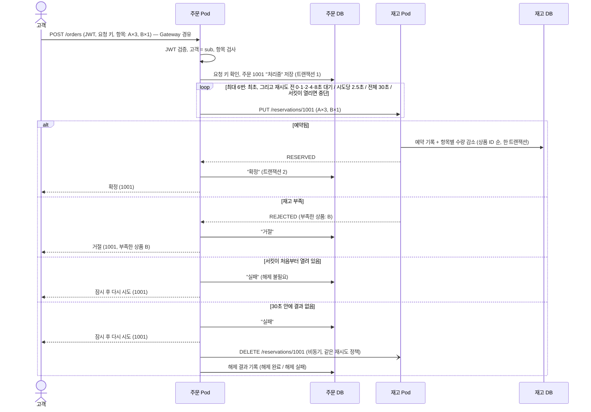

# 아키텍처 설계 — 주문·재고 (현재 단계)

- 상태: **확정 (2026-10-05)** (2026-10-04 초안, OQ-001~009, ADR-0005~0007 반영). 5절과 6절의 경로, 필드, 열 이름은 2026-10-07에 001 plan(`specs/001-place-order/`)에서 정한 이름으로 바꿨다
- 출처: P = [마이크로서비스와 쿠버네티스 기초](../references/msa-k8s-primer.md)
- 관련: [ADR-0003](../adr/0003-local-k8s-runtime.md), [ADR-0004](../adr/0004-sync-reservation-call.md), [ADR-0005](../adr/0005-oracle-xe-instance-per-service.md), [ADR-0006](../adr/0006-keycloak-jwt-auth.md), [ADR-0007](../adr/0007-envoy-gateway.md), [도메인 분석](../analysis/domain-analysis.md), [STD](../standards/architecture-rules.md), [기술 스택](../standards/tech-stack.md)

서비스 사이 API의 정식 명세는 `contracts/`에 OpenAPI로 둔다. 재고 API는 001의 P1 단계 PR에서 `contracts/inventory-api.yaml`로 만든다. 이 문서 5절과 6절은 개념 수준의 요약이고, 필드와 열의 자세한 정의는 `contracts/`와 `specs/001-place-order/data-model.md`에 있다. 테스트 케이스가 기대값으로 쓰는 HTTP 상태 코드는 `docs/test-cases/`에서 확정했다.

## 1. 런타임 구성

- 무상태 앱(주문, 재고)은 kind 클러스터 안에, 상태를 가진 인프라(Oracle, Keycloak)는 클러스터 밖 docker compose로 띄운다. 클러스터를 지웠다 다시 만들어도 데이터가 남는다. (ADR-0005)
- 서비스마다 Oracle XE 컨테이너가 하나씩 있다. 주문 서비스는 `order-db`만, 재고 서비스는 `inventory-db`만 안다. 한쪽 DB가 멈춰도 다른 서비스의 DB는 영향을 받지 않는다. (ADR-0005, STD-001)
- 재고 서비스는 외부에 열지 않는다. (OQ-001)
- compose의 컨테이너는 `kind` Docker 네트워크에 붙여, 클러스터 안의 Pod가 `order-db:1521`처럼 이름으로 찾게 한다. 2026-10-05에 클러스터 안 임시 Pod에서 `order-db:1521`, `inventory-db:1521`, `keycloak:8080`, `lgtm:4318`로 모두 연결되는 것을 확인했다. ([references/docker-desktop.md](../references/docker-desktop.md) 3-4절)

## 2. 쿠버네티스 객체

| 객체 | 주문 | 재고 | 출처 |
|---|---|---|---|
| 라벨 | `app=order` | `app=inventory` | P§4-2 |
| Deployment | replicas 2, 롤링 업데이트 | replicas 2, 롤링 업데이트 | P§0, P§7 |
| Service | 이름 `order`, 포트 8080 | 이름 `inventory`, 포트 8080 | P§4-3 |
| HTTPRoute | `/orders`, `/admin/orders` → `order`. **요청 제한 시간 40초** | 없음 | P§5-1, OQ-001 |
| ConfigMap | DB 주소, 재고 주소, 재시도 설정, Keycloak 주소 | DB 주소 | P§6-⑥ |
| Secret | DB 비밀번호 | DB 비밀번호 | P§6-⑥ |
| 프로브 | readiness, liveness | readiness, liveness | P§6-⑤ |

- **HTTPRoute의 제한 시간을 40초로 둔다.** 주문 처리는 최대 30초 걸린다(4절). Envoy의 기본 요청 제한 시간은 15초라서, 그대로 두면 주문 서비스가 아직 처리하는 중에 Gateway가 요청을 끊는다. 고객 앱의 제한 시간도 같은 이유로 40초 이상으로 둔다. (ADR-0007)
- Envoy 프록시는 NodePort로 열고 kind의 extraPortMappings로 호스트 80번에 연결한다. (ADR-0007, 2026-10-05 결정)
- 매니페스트는 `infra/k8s/`, compose 파일은 `infra/compose/`, kind 설정은 `infra/kind/`에 둔다. 서비스 배포를 매니페스트 파일로 할지 Helm 차트로 할지는 plan에서 정한다.

## 3. 요청 흐름

- 재고 호출은 DB 트랜잭션 밖에서 한다. "처리중" 저장과 결과 저장은 각각 따로 커밋한다. (STD-018)
- 주문 번호는 첫 예약 요청 **전에** 정하고, 재시도할 때 같은 번호를 보낸다. (P§6-①)
- 해제는 고객 응답 뒤에 비동기로 한다. 해제를 하던 Pod가 죽으면 해제 결과가 비어 있는 "실패" 주문이 남는다. 관리자 조회로 찾을 수 있다. 자동 복구는 결제 단계에서 다룬다. (OQ-003 (가))

## 4. 재시도와 제한 시간 (OQ-004)

| 항목 | 값 |
|---|---|
| 전체 한도 | 30초. 넘으면 남은 재시도를 하지 않고 "실패"로 처리한다 |
| 시도 횟수 | 최초 1번 + 재시도 최대 5번 |
| 재시도 전 대기 | 즉시, 1초, 2초, 4초, 8초 |
| 시도당 제한 시간 | 2.5초 (연결 포함) |
| 재시도하는 경우 | 연결 실패, 시도 제한 시간 초과, 502·503·504 |
| 재시도하지 않는 경우 | RESERVED·REJECTED·RELEASED 응답, 400·401·403·409·500 |

모든 시도가 시간 초과일 때의 최악 시간표다. 시도당 2.5초는 이 표가 정확히 30초에 끝나도록 정한 값이다.

| 시도 | 시작 | 끝 (시간 초과) |
|---|---|---|
| 1 (최초) | 0초 | 2.5초 |
| 2 (즉시) | 2.5초 | 5초 |
| 3 (1초 대기) | 6초 | 8.5초 |
| 4 (2초 대기) | 10.5초 | 13초 |
| 5 (4초 대기) | 17초 | 19.5초 |
| 6 (8초 대기) | 27.5초 | 30초 |

### 서킷 브레이커 (OQ-009)

재고 서비스가 오래 멈추면 주문마다 요청 스레드를 최대 30초 잡게 된다. 이를 막으려고 재고 호출에 서킷 브레이커를 둔다. 값은 2026-10-05에 정했다. 값을 바꿔야 하면 근거를 들어 사용자에게 묻는다.

| 항목 | 값 |
|---|---|
| 대상 | 재고 서비스 호출(예약, 해제)에 서킷 하나 |
| 기록 단위 | 시도 하나하나 (재시도 안쪽에서 센다) |
| 실패로 세는 것 | 연결 실패, 시도 제한 시간 초과, 5xx. 업무 결과(RESERVED·REJECTED·RELEASED)와 4xx는 성공으로 센다 |
| 열리는 조건 | 최근 10번의 시도 중 50% 이상 실패 (최소 10번 기록된 뒤) |
| 열려 있는 시간 | 10초. 그 뒤 반쯤 열린 상태로 바꿔 시험 호출 3번을 보낸다 |
| 반쯤 열린 상태 | 시험 호출이 기준 아래로 실패하면 닫고, 아니면 다시 연다 |
| 열려 있을 때 | 재고를 부르지 않고 바로 실패한다. **재시도도 하지 않는다** (STD-019) |

- 서킷이 처음부터 열려 있어 예약 요청을 한 번도 보내지 않은 주문은 해제할 것이 없다. 주문에 "해제 불필요"로 기록한다.
- 예약 요청을 한 번이라도 보낸 뒤 서킷이 열리면, 그 주문은 "실패"로 끝내고 해제를 요청한다. 해제도 서킷에 막히면 해제 재시도 정책을 따르고, 끝내 실패하면 "해제 실패"로 기록한다.
- 기대 효과: 재고가 멈추고 주문이 몰리면, 처음 10번 남짓의 시도(수 초)가 실패한 뒤 서킷이 열린다. 그 뒤 주문은 1초 안에 실패 응답을 받고 스레드를 오래 잡지 않는다. `[추론]`

## 5. 인터페이스 (개념 수준)

| 구분 | 메서드와 경로 | 호출 | 입력 | 출력 | 특성 |
|---|---|---|---|---|---|
| 외부 | `POST /orders` | 고객 → 주문 | 헤더: JWT, `Idempotency-Key`(필수, OQ-008). 본문: 주문 항목 목록 `items`(상품 `productId`, 수량 `quantity`) | 주문 번호 `orderNo`, 상태 `status`, 사유 `reason`, 부족한 상품 목록 `shortageProductIds`, 없는 상품 목록 `missingProductIds` | 거절·실패여도 주문 번호를 돌려준다 |
| 외부 | `GET /orders` | 고객 → 주문 | JWT | 자기 주문 목록 | UC-002 |
| 외부 | `GET /orders/{orderNo}` | 고객 → 주문 | JWT | 자기 주문 하나. 남의 주문이면 404 | BR-101 |
| 외부 | `GET /admin/orders?status=&releaseStatus=` | 관리자 → 주문 | JWT(`ADMIN`) | 조건에 맞는 모든 주문 | UC-002 |
| 내부 | `PUT /reservations/{orderNo}` | 주문 → 재고 | 주문 항목 목록 `items`(상품 `productId`, 수량 `quantity`) | `orderNo`, 상태 `status`(RESERVED/REJECTED/RELEASED), 사유 `reason`(OUT_OF_STOCK/PRODUCT_NOT_FOUND), `shortageProductIds`, `missingProductIds` | 멱등. 전부 예약되거나 전부 안 된다. 같은 번호에 다른 항목이면 409 |
| 내부 | `DELETE /reservations/{orderNo}` | 주문 → 재고 | — | `orderNo`, 상태 `status`(RELEASED. 거절된 예약이면 REJECTED 그대로) | 멱등. 예약이 없으면 해제 표식을 남긴다 |

- 예약을 `PUT /reservations/{주문 번호}`로 둔 것은 "이 번호의 예약을 이 내용으로 만든다"는 뜻이 HTTP에서도 멱등이기 때문이다.
- HTTP 상태 코드와 오류 형식은 2026-10-05 001 plan에서 정했다(`specs/001-place-order/research.md` 결정 13). 주문 생성은 새 주문이면 201, 같은 고객이 같은 키로 다시 보내면 200이다. 재고 API는 업무 결과면 처음이든 재요청이든 200, 같은 주문 번호에 다른 내용이면 409, 형식 오류면 400, 예상하지 못한 오류면 500이다. 오류 응답은 RFC 9457 Problem Details(`application/problem+json`)이고, `type`은 `urn:msa-example:problem:<코드>`, 확장 필드는 `code`와 `errors`다.

## 6. 데이터

| DB (계정) | 테이블 | 열 | 제약 |
|---|---|---|---|
| order-db (ORDER_SVC) | ORDERS | ORDER_NO(시퀀스), CUSTOMER_ID(토큰 sub), REQUEST_KEY, STATUS, REASON, RELEASE_STATUS, CREATED_AT, UPDATED_AT | PK(ORDER_NO), UNIQUE(CUSTOMER_ID, REQUEST_KEY) |
| order-db (ORDER_SVC) | ORDER_ITEMS | ORDER_NO, PRODUCT_ID, QUANTITY, REJECT_REASON | PK(ORDER_NO, PRODUCT_ID), FK(ORDER_NO), CHECK(QUANTITY BETWEEN 1 AND 99) |
| inventory-db (INVENTORY_SVC) | STOCK | PRODUCT_ID, QUANTITY | PK(PRODUCT_ID), CHECK(QUANTITY >= 0) |
| inventory-db (INVENTORY_SVC) | RESERVATIONS | ORDER_NO, STATUS, REASON, CREATED_AT, UPDATED_AT | PK(ORDER_NO) |
| inventory-db (INVENTORY_SVC) | RESERVATION_ITEMS | ORDER_NO, PRODUCT_ID, QUANTITY, RESULT | PK(ORDER_NO, PRODUCT_ID), FK(ORDER_NO) |

- RELEASE_STATUS: 비어 있음(해제 요청 전) / 해제 불필요(`NOT_REQUIRED`) / 해제 완료(`RELEASED`) / 해제 실패(`RELEASE_FAILED`)
- 같은 주문 번호의 재요청이 같은 내용인지는 RESERVATION_ITEMS를 상품 ID 순으로 읽어, 들어온 항목을 같은 순서로 정렬한 것과 직접 비교한다. 해시 열은 두지 않는다(2026-10-05 001 plan, `specs/001-place-order/research.md` 결정 14).
- REJECT_REASON(ORDER_ITEMS)과 RESULT(RESERVATION_ITEMS): 거절된 주문·예약에서 그 상품이 부족했으면 `OUT_OF_STOCK`, 없었으면 `PRODUCT_NOT_FOUND`이고, 그 밖에는 비어 있다. 같은 요청이 다시 와도 처음과 같은 부족한 상품 목록과 없는 상품 목록을 돌려주려고 둔다(001 plan, `specs/001-place-order/research.md` 4절).
- PK(ORDER_NO, PRODUCT_ID)가 "같은 상품은 한 줄"(BR-009)을 DB에서도 보장한다.

**예약 처리 (재고 DB, 한 트랜잭션)**

1. RESERVATIONS에서 주문 번호를 찾는다. 있으면, 해제 표식(항목 없음)이면 RELEASED를 돌려준다. 항목이 있으면 RESERVATION_ITEMS를 상품 ID 순으로 읽어 들어온 항목과 비교해, 다르면 409, 같으면 저장된 결과를 돌려준다.
2. 없으면 항목의 재고 행을 **상품 ID 순서로 하나씩** `SELECT QUANTITY FROM STOCK WHERE PRODUCT_ID = :상품 FOR UPDATE`로 잠그고 읽는다. 행이 없는 상품은 없는 상품 목록에, 수량이 모자란 상품은 부족한 상품 목록에 모은다.
3. 없는 상품이나 부족한 상품이 하나라도 있으면 아무 수량도 바꾸지 않고 결과를 REJECTED로 정한다. 사유는 없는 상품이 하나라도 있으면 "상품 없음", 아니면 "재고 부족"이고, 두 목록은 모두 돌려준다(UC-001 A2, 2026-10-05 결정). 없으면 항목마다 수량을 줄이고 결과를 RESERVED로 정한다.
4. RESERVATIONS와 RESERVATION_ITEMS(항목별 RESULT 포함)에 결과를 넣고 커밋한다. 같은 주문 번호가 동시에 들어와 고유 제약에 걸리면 전체를 롤백하고 1번부터 다시 한다.

**해제 처리 (재고 DB, 한 트랜잭션)**

1. RESERVATIONS에서 주문 번호를 잠그고 읽는다(`SELECT ... FOR UPDATE`).
2. RESERVED면 RESERVATION_ITEMS의 항목을 상품 ID 순서로 수량을 되돌리고 RELEASED로 바꾼다. REJECTED나 RELEASED면 그대로 둔다. 없으면 RELEASED 표식을 넣는다(고유 제약에 걸리면 1번부터 다시).

- 행 잠금으로 동시 예약의 초과 판매를 막고, STOCK의 CHECK 제약이 마지막 방어선이 된다. (BR-003)
- 재고 행을 언제나 상품 ID 순서로 잠가 여러 항목 주문끼리의 교착을 막는다. (TC-012)
- 잠금을 먼저 다 잡고 판단하므로, 일부 항목만 줄였다가 되돌리는 일이 없다. (BR-002)
- 초기 데이터(STOCK)는 Flyway로 넣는다. (OQ-001)
- SQL은 MyBatis Mapper XML에 쓴다. 잠금 순서와 조건은 [coding-conventions.md](../standards/coding-conventions.md) 3-2절을 따른다.

## 7. 인증 (ADR-0006)

- Keycloak에 realm 하나를 두고, 고객과 관리자 계정을 초기 데이터(realm 가져오기 파일)로 넣는다.
- 고객이나 E2E 테스트는 Keycloak에서 토큰을 받아 `Authorization: Bearer`로 보낸다.
- 주문 서비스는 OAuth2 Resource Server로 JWT의 서명, 만료, 발급자를 검증한다. 역할은 Keycloak realm 역할(`CUSTOMER`, `ADMIN`)을 Spring Security 권한으로 바꿔 쓴다.
- 재고 서비스는 외부에 열지 않으므로 이번 단계에서 서비스 간 인증을 하지 않는다. (ADR-0006의 감수할 점)
- 토큰의 발급자(`iss`)는 토큰을 받은 주소로 정해진다. 고객이 `localhost`로 받은 토큰을 클러스터 안에서 다른 주소로 검증하면 발급자가 달라 실패한다. Keycloak의 hostname을 하나로 고정하고 그 값으로 검증한다. `[현장]` 고정한 값은 `http://localhost:8180/realms/msa`다. 클러스터 안 Pod가 `keycloak:8080`으로 받아도 같은 값이 나오는 것을 2026-10-05에 확인했다. ([references/docker-desktop.md](../references/docker-desktop.md) 4-1절)

## 8. 상태 확인과 수명 주기

- 두 서비스 모두 Spring Boot Actuator의 health 엔드포인트로 readiness와 liveness에 답한다. (P§6-⑤)
- readiness에는 DB 연결 같은 준비 상태를 넣는다. liveness에는 재고 서비스, DB, Keycloak 같은 외부 상태를 넣지 않는다. 외부 장애로 모든 Pod가 함께 재시작되는 것을 막기 위해서다. (STD-007)
- 종료 신호를 받으면 새 요청을 받지 않고 처리 중인 요청을 끝낸 뒤 종료한다. (STD-008)
- 주문 요청은 최대 30초 걸리므로, 앱의 종료 대기 시간은 35초, Pod의 `terminationGracePeriodSeconds`는 45초로 둔다. `preStop` 대기를 더하면 그 시간만큼 Pod 쪽 값을 늘린다.

## 9. 설정

- 이미지는 서비스마다 하나다. 환경마다 다른 값은 ConfigMap과 Secret에 두고 환경변수로 넣는다. (P§6-⑥)
- 재고 서비스 주소, 재시도 횟수와 대기, 시도당 제한 시간, 전체 한도는 설정값으로 둔다. 테스트에서 짧게 바꿀 수 있어야 한다. (testing.md)

## 10. 관측성

- 서비스 사이 호출에 추적 정보를 HTTP 헤더로 넘긴다. 형식은 OpenTelemetry 기본인 W3C Trace Context(`traceparent`)다. (P§7)
- 로그 한 줄마다 trace ID를 남긴다. 재시도도 몇 번째 시도인지 로그에 남긴다. (P§7)
- **저장소와 화면**: `grafana/otel-lgtm` 컨테이너 하나를 compose에 둔다. 안에 OpenTelemetry Collector, Tempo(추적), Loki(로그), Prometheus(메트릭), Grafana(화면)가 들어 있는 개발용 이미지다. `[문헌]` 클러스터 밖에 있으므로 Pod나 클러스터를 지워도 로그와 추적이 남는다. (TC-108)
- **보내는 방법**: 앱은 Spring Boot 4의 OpenTelemetry 지원으로 추적, 로그, 메트릭을 OTLP로 `lgtm:4318`에 보낸다. 로그를 OTLP로 보내려면 OpenTelemetry Logback appender를 `logback-spring.xml`에 따로 설정해야 한다(Spring Boot에 들어 있지 않다). `[문헌]` 로그는 표준 출력에도 계속 쓴다(`kubectl logs`용).
- **화면**: Grafana `http://localhost:3000`. trace ID로 Tempo에서 호출 흐름을, Loki에서 같은 trace ID의 로그를 찾는다.

## 11. 정하지 않은 설계 항목

| 항목 | 상태 |
|---|---|
| DB 제품과 배치 | **정함**: 서비스마다 Oracle 21c XE 컨테이너 하나, 클러스터 밖 (ADR-0005) |
| 영속성 | **정함**: MyBatis (coding-conventions.md) |
| 인증 | **정함**: Keycloak + 서비스가 JWT 검증 (ADR-0006) |
| Gateway API 구현체 | **정함**: Envoy Gateway (ADR-0007) |
| kind 노드 수 | **정함 (2026-10-04)**: control-plane 1 + worker 2. 설정은 `infra/kind/cluster.yaml`, 실행은 `tools/` 스크립트. 노드 이미지 버전은 설정에 고정한다 |
| 이미지 빌드 방식 | **정함**: 호스트에서 Gradle로 bootJar → 공용 Dockerfile(`infra/docker/spring-boot.Dockerfile`)로 이미지 → 로컬 레지스트리 `localhost:5001`에 push. Dockerfile은 JRE 17, root가 아닌 사용자, exec 형식 ENTRYPOINT(종료 신호가 Java에 바로 닿게, STD-008), 컨테이너 메모리에 맞춘 JVM 설정, Spring Boot 계층 추출을 쓴다 |
| 로그·추적 저장소 | **정함**: `grafana/otel-lgtm` (10절) |
| 프로젝트 폴더 원칙 | **정함**: 로컬 환경은 모두 이 저장소 안에서 정의하고 실행한다. 설정은 `infra/`(kind, compose, docker, k8s, keycloak), 실행 스크립트는 `tools/`(PowerShell). 외부 서비스는 쓰지 않는다 |
| 서킷 브레이커 | **정함**: 재고 호출에 둔다 (4절). 구현은 Resilience4j 2.4.0 핵심 모듈을 직접 쓴다(2026-10-05 001 plan, `specs/001-place-order/research.md` 결정 8) |
| 로컬 Docker 환경 | [references/docker-desktop.md](../references/docker-desktop.md) |

## 용어

- **kind (Kubernetes IN Docker)**: Docker 컨테이너를 노드로 써서 쿠버네티스 클러스터를 만드는 도구다. 이 프로젝트의 로컬 클러스터는 kind로 만든다.
- **docker compose**: 여러 컨테이너를 파일 하나에 정의하고 함께 띄우는 도구다. Oracle, Keycloak, 관측 도구를 클러스터 밖에서 띄울 때 쓴다.
- **Pod**: 쿠버네티스가 컨테이너를 실행하는 가장 작은 단위다. 언제든 지워지고 새로 만들어지므로, 남아야 하는 데이터를 Pod 안에 두지 않는다.
- **쿠버네티스 Service (Kubernetes Service)**: 여러 Pod 앞에 고정된 이름과 주소를 붙여 주는 쿠버네티스 객체다. 주문 서비스는 `http://inventory:8080`으로 재고 서비스를 부른다.
- **Deployment**: Pod를 정해진 개수만큼 유지하고 새 버전으로 바꿔 주는 쿠버네티스 객체다. 서비스마다 하나 두고 Pod 수를 2개로 둔다.
- **replicas**: Deployment가 유지하는 Pod 수다. 서비스마다 2 이상으로 둬서 Pod 하나가 사라져도 서비스가 멈추지 않게 한다.
- **라벨 (label)**: 쿠버네티스 객체에 붙이는 이름표다. Service는 `app=order` 같은 라벨로 요청을 보낼 Pod를 고른다.
- **HTTPRoute**: 경로별로 요청을 어느 Service로 보낼지 정하는 Gateway API 객체다. `/orders`와 `/admin/orders`를 주문 Service로 보내고, 요청 제한 시간을 40초로 둔다.
- **ConfigMap, Secret**: 쿠버네티스가 환경마다 다른 값을 Pod에 넣어 주는 객체다. 일반 설정값은 ConfigMap에, 비밀번호 같은 값은 Secret에 둔다.
- **readiness 프로브 (readiness probe)**: 쿠버네티스가 Pod에 "요청을 받을 준비가 됐나"를 주기적으로 묻는 검사다. 실패하면 그 Pod에는 요청을 보내지 않는다.
- **liveness 프로브 (liveness probe)**: 쿠버네티스가 Pod에 "살아 있나"를 주기적으로 묻는 검사다. 정해진 횟수만큼 실패하면 컨테이너를 재시작한다.
- **NodePort**: 쿠버네티스 Service를 모든 노드의 같은 포트 번호로 여는 방식이다. 이 프로젝트에서는 Envoy 프록시를 30080으로 열고 호스트 80번에 연결한다.
- **extraPortMappings**: kind 노드 컨테이너의 포트를 호스트 포트에 연결하는 kind 설정이다. 클러스터를 만들 때만 정할 수 있어서, 바꾸려면 클러스터를 다시 만든다.
- **Helm**: 쿠버네티스 설정 파일 여러 개를 묶어 설치하고 버전을 관리하는 패키지 도구다. 이 프로젝트에서는 Envoy Gateway를 Helm으로 설치한다.
- **매니페스트 (manifest)**: 쿠버네티스 객체를 YAML로 적은 설정 파일이다. 이 저장소에서는 `infra/k8s/`에 둔다.
- **Envoy Gateway**: Envoy 프록시를 써서 Gateway API를 구현한 오픈소스 프로젝트다. 이 프로젝트의 클러스터 입구다.
- **JWT (JSON Web Token)**: 로그인한 사용자 정보를 담고 서명한 토큰이다. 이 프로젝트에서는 Keycloak이 발급하고 주문 서비스가 검증한다.
- **트랜잭션 (transaction)**: 여러 DB 변경을 한 묶음으로 처리해서, 모두 반영하거나 모두 되돌리는 단위다. 이 프로젝트는 원격 호출을 트랜잭션 밖에서 하고, 호출 앞뒤의 저장을 각각 따로 커밋한다.
- **재시도 (retry)**: 실패한 호출을 잠시 기다렸다가 다시 보내는 것이다. 이 프로젝트에서는 일시 오류에만, 최대 5번까지, 전체 30초 안에서 한다.
- **지수 백오프 (exponential backoff)**: 재시도할 때마다 대기 시간을 두 배씩 늘리는 방식이다. 재고 호출은 즉시, 1초, 2초, 4초, 8초 뒤에 다시 시도한다.
- **제한 시간 (timeout)**: 응답을 기다리는 최대 시간이다. 재고 호출은 시도당 2.5초, 재시도를 포함한 전체 30초를 넘기지 않는다.
- **서킷 브레이커 (circuit breaker)**: 상대 서비스 호출이 계속 실패하면 한동안 호출을 멈추고 바로 실패를 돌려주는 장치다. 재고 서비스가 멈췄을 때 주문 서비스까지 멈추지 않게 막는다.
- **반쯤 열린 상태 (half-open)**: 열린 서킷이 정해진 시간이 지난 뒤 시험 호출 몇 번만 보내 보는 상태다. 시험 호출의 실패가 기준보다 적으면 서킷을 닫고, 아니면 다시 연다.
- **비동기 (asynchronous)**: 일을 맡긴 쪽이 결과를 기다리지 않고 다음 일을 하는 방식이다. 실패한 주문의 예약 해제는 고객에게 응답한 뒤 비동기로 한다.
- **멱등성 (idempotency)**: 같은 요청을 여러 번 받아도 결과가 한 번 받은 것과 같은 성질이다. 재고 예약은 주문 번호로, 주문 생성은 주문 요청 키로 같은 요청인지 알아본다.
- **Problem Details (RFC 9457)**: HTTP API의 오류 응답을 JSON으로 적는 표준 형식이다. 이 프로젝트는 모든 오류 응답을 이 형식(Spring `ProblemDetail`)으로 통일한다.
- **OpenAPI**: HTTP API의 경로, 요청, 응답 형식을 적는 표준 명세 형식이다. 서비스 사이 API의 계약을 `contracts/`에 OpenAPI 파일로 둔다.
- **시퀀스 (sequence)**: Oracle이 겹치지 않는 번호를 차례로 만들어 주는 DB 객체다. 주문 번호를 이것으로 만든다.
- **행 잠금 (row lock)**: 한 트랜잭션이 바꾸려는 행을 다른 트랜잭션이 동시에 바꾸지 못하게 막는 것이다. 재고 행은 `SELECT ... FOR UPDATE`로 잠근 뒤 수량을 바꾼다.
- **교착 (deadlock)**: 두 작업이 서로 상대가 잡은 잠금을 기다리며 둘 다 멈추는 상태다. 이 프로젝트는 재고 행을 언제나 상품 ID 순서로 잠가서 교착을 막는다.
- **고유 제약 (unique constraint)**: 정해진 열에 같은 값이 두 번 들어가지 못하게 DB가 막는 규칙이다. 예약 기록의 주문 번호에 걸어, 같은 예약이 두 번 반영되지 않게 한다.
- **Flyway**: DB 스키마와 초기 데이터를 버전 번호가 붙은 SQL 파일로 관리하고 차례로 적용하는 도구다. 테이블과 재고 초기 데이터를 Flyway로 만든다.
- **MyBatis**: SQL을 XML 파일에 직접 쓰고, 그 결과를 Java 객체에 담아 주는 영속성 프레임워크다. 이 프로젝트는 JPA 대신 MyBatis를 쓴다.
- **Mapper XML**: MyBatis에서 SQL을 적어 두는 XML 파일이다. `resources/mapper/` 아래에 두고 같은 이름의 Mapper 인터페이스와 짝지어 쓴다.
- **Keycloak**: 사용자 계정, 로그인, 토큰 발급을 맡는 오픈소스 인증 서버다. 이 프로젝트는 Keycloak을 직접 만들지 않고 가져다 쓰며, 계정은 초기 데이터로 넣는다.
- **realm**: Keycloak 안에서 사용자, 역할, 클라이언트를 한 묶음으로 관리하는 단위다. 이 프로젝트에는 `msa` realm 하나가 있다.
- **발급자 (`iss`, issuer)**: JWT를 누가 발급했는지 적은 값이다. 주문 서비스는 이 값이 `http://localhost:8180/realms/msa`인 토큰만 받는다.
- **OAuth2 리소스 서버 (OAuth2 Resource Server)**: 요청에 담긴 토큰을 검증하고 보호된 API를 내주는 서버의 역할이다. 주문 서비스가 Spring Security로 이 역할을 한다.
- **Actuator**: Spring Boot가 health 같은 운영용 엔드포인트를 만들어 주는 모듈이다. readiness 프로브와 liveness 프로브가 이 엔드포인트를 부른다.
- **그레이스풀 셧다운 (graceful shutdown)**: 종료 신호를 받으면 새 요청은 받지 않고, 처리 중인 요청을 끝낸 뒤 종료하는 방식이다. 배포나 확장으로 Pod가 내려갈 때 요청이 끊기지 않게 한다.
- **terminationGracePeriodSeconds**: 쿠버네티스가 Pod에 종료 신호를 보낸 뒤 강제로 끝내기까지 기다리는 시간이다. 앱의 종료 대기 시간(35초)보다 긴 45초로 둔다.
- **preStop**: 쿠버네티스가 컨테이너에 종료 신호를 보내기 직전에 실행하는 단계다. 짧은 대기를 넣으면 종료 중인 Pod로 요청이 가는 것을 줄일 수 있다.
- **OpenTelemetry**: 추적, 로그, 메트릭을 모으고 보내는 방법을 정한 오픈소스 표준과 도구 모음이다. 두 서비스가 이것으로 관측 데이터를 보낸다.
- **OTLP (OpenTelemetry Protocol)**: OpenTelemetry가 관측 데이터를 저장소로 보낼 때 쓰는 전송 형식이다. 앱은 `lgtm:4318`로 OTLP를 보낸다.
- **W3C Trace Context (`traceparent`)**: 서비스 사이 HTTP 호출에 추적 정보를 실어 보내는 표준 헤더 형식이다. 주문 서비스가 재고 서비스를 부를 때 이 헤더를 넘긴다.
- **추적 ID (trace ID)**: 요청 하나에 붙여 여러 서비스를 따라다니게 하는 번호다. 이 번호로 여러 서비스의 로그를 한곳에서 함께 찾는다.
- **`grafana/otel-lgtm`**: 로그(Loki), 추적(Tempo), 메트릭(Prometheus), 화면(Grafana)을 컨테이너 하나에 담은 개발용 관측 도구다. compose로 클러스터 밖에 띄워, Pod가 사라져도 기록이 남게 한다.
- **Logback appender**: 로그를 어디로 내보낼지 정하는 Logback의 출력 장치다. 로그를 OTLP로도 보내려고 OpenTelemetry appender를 `logback-spring.xml`에 따로 설정한다.
- **로컬 레지스트리 (local registry)**: 이 PC 안에서 컨테이너 이미지를 올리고 내려받는 저장소다. `localhost:5001`에 두고, kind 노드가 여기서 이미지를 받는다.
- **bootJar**: Spring Boot 앱과 필요한 라이브러리를 실행할 수 있는 jar 파일 하나로 묶는 Gradle 작업이다. 이 jar로 서비스 이미지를 만든다.
- **exec 형식 ENTRYPOINT (exec form ENTRYPOINT)**: Dockerfile에서 셸을 거치지 않고 프로그램을 바로 실행하게 적는 방식이다. 종료 신호가 Java 프로세스에 바로 닿게 하려고 쓴다.
