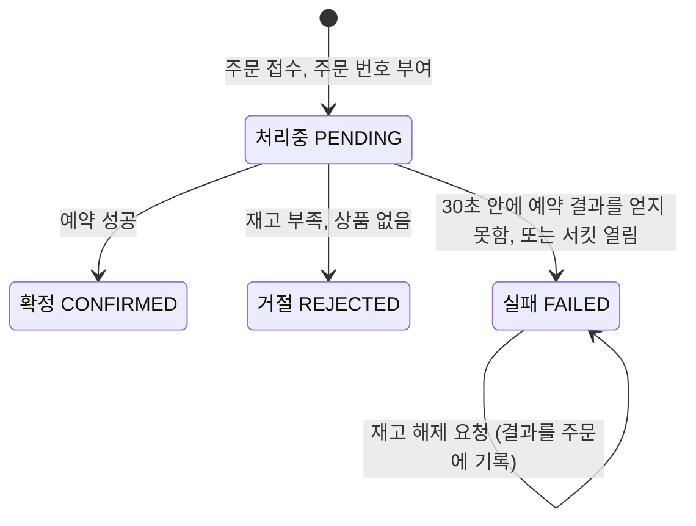
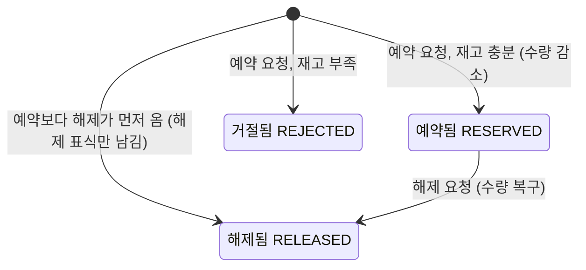

# Feature Specification: 주문 생성

**Feature Branch**: `feat/001-place-order`

**Created**: 2026-10-05

**Status**: Draft (초안)

**Input**: User description: "주문 생성 (spec-kit 티켓 001)". 사용자가 2026-10-05에 `/speckit-specify`로 넘긴 지시(폴더와 브랜치, 범위, 사용자 스토리와 우선순위, 기대값, 조회가 섞인 케이스, 출처 ID, 글쓰기, NEEDS CLARIFICATION 규칙)를 따른다.

## 이 spec을 읽는 법

이 문서는 티켓 001 "주문 생성"이 **무엇을** 해야 하는지 적는다. **어떻게** 만들지는 `/speckit-plan`이 plan.md에 적는다. 이 프로젝트를 처음 보는 주니어 개발자가 다른 파일을 열지 않고 읽을 수 있게 썼다.

**입력 문서** (모두 2026-10-05 확정. 테스트 케이스 문서는 2026-10-07에 케이스 아홉 개와 공통 전제 두 줄을 더했고, 이 spec의 시나리오 1.6, 1.7, 1.8, 2.2, 4.2, 5.2, 6.2, 8.2, 9.2와 공통 전제에 반영했다)

| 문서 | 이 spec에서 쓴 곳 |
|---|---|
| `docs/requirements/uc-001-place-order.md` | 사용자 스토리와 우선순위, 대체 흐름, 업무 규칙, 범위 밖 |
| `docs/test-cases/order-placement.md` | 인수 시나리오와 공통 전제 |
| `docs/requirements/non-functional.md` | Success Criteria |
| `docs/analysis/domain-analysis.md` | 재고 예약의 멱등성, 고객의 중복 주문, 주문 상태, 미결 사항의 결론 |
| `docs/design/architecture.md` | 재시도·제한 시간·서킷 브레이커 값(4절), 해제 시점(3절) |
| `.specify/memory/constitution.md` | 우선순위를 나눈 이유("실패를 전제한 호출" 원칙), 글쓰기 규칙 |

`docs/design/architecture.md`는 사용자가 입력 문서로 적지 않았다. 테스트 케이스가 서킷이 열리는 조건을 이 문서 4절로 넘기기 때문에 함께 읽었다. 이 문서의 5절과 6절에 있는 경로, 필드, 열 이름은 plan까지 제안으로 남아 있어서 이 spec에 옮기지 않았다.

**표기 규칙**

- 항목 ID(`BR-NNN` 형식의 번호)를 쓰면 바로 아래 인용 블록이나 `ID | 출처 | 원문` 표에 출처 파일, 위치, 원문을 적는다. 저장소 루트 `CLAUDE.md` 2절의 규칙이다.
- 원문은 그대로 옮겼다. 바꾼 것은 두 가지뿐이다. 첫째, 출처·근거·관련 칸은 옮기지 않았다. 둘째, 문장 끝 괄호 안의 출처 표시(출처 ID, 결정 날짜)는 뺐다. ID가 아닌 원문(기본 흐름, 설명 문단, 표)을 옮길 때와 절 제목을 적을 때도 같은 규칙을 따랐다.
- `[제안]`은 기준 문서에 없는데 Claude가 채운 내용이다. 사용자가 검토해서 받아들이면 태그를 지운다. 모든 `[제안]`은 Assumptions 끝의 "`[제안]` 모음"에도 모았다.
- 인수 시나리오에는 "시나리오 2.1"처럼 번호를 붙였다. 앞 숫자는 사용자 스토리 번호이고, 뒤 숫자는 그 스토리 안의 순서다. 다른 절에서 시나리오를 가리킬 때는 이 번호를 쓴다. 테스트 케이스 ID를 다시 쓰면 본문 전체를 다시 옮겨야 하기 때문이다.
- 기술 중립으로 썼다. 예외로, 기대값에 들어 있는 HTTP 상태 코드, 헤더 이름(`Idempotency-Key`), UUID, 서비스 이름(주문 서비스, 재고 서비스), 예약 결과 값(RESERVED, REJECTED, RELEASED)은 원문 그대로 두었다.
- 인용 블록 안의 원문에는 기술 이름(예: `ORA-00060`, WireMock, Pod)이 들어 있을 수 있다. 원문을 바꾸지 않는다는 규칙이 기술 중립보다 앞서기 때문이다.

## User Scenarios & Testing *(mandatory)*

### 기능 한눈에 보기

주문 생성은 두 서비스가 함께 한다. 주문 서비스는 고객의 주문을 받아 기록하고 결과를 돌려준다. 재고 서비스는 상품별 재고 수량을 관리하고, 주문 번호 단위로 재고를 예약하고 해제한다. 주문 서비스는 재고 데이터를 직접 읽지 않고 재고 서비스에 요청한다.

아무 문제가 없을 때의 흐름은 아래와 같다. 대체 흐름의 "2단계", "4단계"는 이 단계 번호를 가리킨다.

> 출처: `docs/requirements/uc-001-place-order.md` 4절 "기본 흐름 — 주문 확정"
> 1. 고객이 주문 항목(상품과 수량) 하나 이상과 주문 요청 키를 담아 주문을 요청한다.
> 2. 시스템이 로그인한 고객을 확인하고 주문 항목을 검사한다.
> 3. 시스템이 주문을 "처리중"으로 기록하고 주문 번호를 붙인다.
> 4. 시스템이 주문 번호와 함께 주문 항목 전체의 재고를 한꺼번에 예약한다.
> 5. 모두 예약되면 시스템이 주문을 "확정"으로 바꾼다.
> 6. 시스템이 고객에게 주문 번호와 확정 결과를 돌려준다.

주문은 네 가지 상태 가운데 하나다. "처리중"은 재고 예약 결과를 기다리는 상태다. "확정"은 모든 항목의 재고를 예약한 상태다. "거절"은 재고가 부족하거나 없는 상품이 있어 재고를 하나도 예약하지 않은 상태다. "실패"는 정해진 시간 안에 예약 결과를 얻지 못한 주문, 재고 서비스가 계속 실패해 재고 확인을 잠시 멈춘 상태에서 들어온 주문, 재고 서비스가 요청 키 충돌(409)이나 서버 오류(500)를 돌려준 주문이다. 상태 그림은 Key Entities 절에 있다.

### 공통 전제

모든 인수 시나리오는 아래 전제 위에서 읽는다. 테스트 케이스 문서의 "공통 전제"를 그대로 옮겼다.

> 출처: `docs/test-cases/order-placement.md` 머리말의 "공통 전제"
> - 고객 C1, C2(`CUSTOMER`)와 관리자 M1(`ADMIN`)이 있다.
> - 따로 적지 않으면 "고객"은 C1로 로그인한 상태다.
> - 재시도 대기와 제한 시간은 OQ-004 값을 기준으로 적는다. 테스트에서는 같은 비율로 줄여 돌릴 수 있다.
> - 시간 기대값의 허용 오차: "30초 안"은 30초 + 1초 안으로 판정한다. 재시도 간격은 기대 간격의 80% 이상 150% 이하면 맞다. 대기 없이 바로 하는 재시도("즉시")는 앞 시도의 응답을 받은 뒤 0.5초 안에 가야 맞다. 테스트에서 시간을 줄여 돌리면 이 값도 같은 비율로 줄인다.
> - 30초가 되기 전이면, 남은 시간이 시도당 제한 시간(2.5초)보다 짧아도 시도를 시작한다. 시도는 30초에 끊는다.
> - 주문 API의 오류 응답 코드: 토큰 없음 401, 관리자가 아닌 사람의 관리자 조회 403, 다른 고객의 주문 404, 요청 키가 없거나 UUID 형식이 아님 400, 같은 요청 키에 다른 내용 422, 주문 항목이 잘못됨 400.
> - 재고 서비스가 409나 500을 돌려주면 주문 서비스는 재시도하지 않는다. 주문을 "실패"로 기록하고 재고 서비스에 해제를 요청한다. 재고 서비스는 교착(ORA-00060)이 나면 500을 돌려준다.
> - 주문 서비스의 health 확인이 "정상"이라는 것은 1초 안에 200으로 응답한다는 뜻이다.
> - 주문 API의 성공 응답 코드: 새 주문을 기록하면(확정·거절·실패) 201, 같은 고객이 같은 요청 키로 다시 보내면(처리중 포함) 200.
> - 주문 API의 오류 응답 본문은 Problem Details 형식이다. 토큰이 없으면 `code`는 `UNAUTHORIZED`다.

> **OQ-004** · `docs/analysis/domain-analysis.md` 9절 "미결 사항"
> 질문: 제한 시간과 재시도는?
> 결론: **결정 (2026-10-04)**: 재시도를 포함한 전체 한도 30초. 최초 시도 후 재시도 최대 5회(총 6회), 재시도 전 대기는 즉시, 1, 2, 4, 8초. 시도당 제한 시간 2.5초. 30초를 시도당 제한 시간으로 보면 최악 195초가 걸려서 전체 한도로 정했다

오류 응답 코드 가운데 403과 404는 주문 조회에서만 나온다. 주문 조회는 티켓 002에서 다룬다.

이 기능에서 더하는 전제는 아래와 같다(2026-10-05 사용자 결정).

- 시나리오의 "기록되어 있다", "기록되지 않는다"는 저장된 주문을 직접 보고 확인한다. 주문 조회 기능(티켓 002)을 거치지 않는다.
- 시나리오에 조회가 섞여 있으면, 조회 부분은 "티켓 002에서 검증"으로 표시하고 이 기능에서는 검증하지 않는다. 해당하는 곳은 시나리오 3.1과 4.1이다.

### 우선순위와 PR 단계

사용자 스토리 9개와 우선순위는 `docs/requirements/uc-001-place-order.md` 7절 "spec-kit 사용자 스토리로 옮길 때"의 표를 그대로 따른다. P1이 1개, P2가 6개, P3가 2개다. 우선순위가 PR 3개의 경계가 된다(2026-10-05 사용자 결정).

| PR 단계 | 담는 것 | 사용자 스토리 |
|---|---|---|
| P1 단계 PR | 빌드 골격, 기계 검사, P1 스토리 | 1 |
| P2 단계 PR | P2 스토리 | 2, 3, 4, 5, 6, 7 |
| P3 단계 PR | P3 스토리 | 8, 9 |

다만 P2·P3 스토리의 재고 쪽 인수 시나리오(시나리오 2.1, 3.1, 3.3, 6.1, 8.1, 9.1의 재고 쪽)는 P1 단계 PR에서 검증한다. 재고 서비스는 P1 단계 PR에서 모두 만들어지므로, 테스트를 구현보다 먼저 쓰려면 같은 PR에 넣어야 하기 때문이다. 시나리오 9.1의 재고 쪽은 2026-10-05 사용자 결정이고, 나머지는 2026-10-06 사용자 승인이다.

우선순위를 이렇게 나눈 이유는 7절 표 아래 문단에 있다.

> 출처: `docs/requirements/uc-001-place-order.md` 7절 "spec-kit 사용자 스토리로 옮길 때", 표 아래 문단
> 우선순위는 단계마다 PR 하나로 병합해도 헌법의 "실패를 전제한 호출" 원칙을 지키도록 나눴다. P1은 재고의 예약·해제만 만들고 서비스 사이 호출이 없다. P2에서 재고 호출이 처음 생기므로, 시도당 제한 시간과 서킷 브레이커를 P2에 처음부터 넣는다. 재시도와 전체 30초 한도는 P3에서 더한다.

헌법의 "실패를 전제한 호출" 원칙은 서비스 사이 호출마다 제한 시간과 서킷 브레이커를 두라고 한다. 그래서 재고 호출을 처음 만드는 P2 단계 PR에 제한 시간과 서킷 브레이커가 함께 들어간다. 같은 원칙은 재시도를 멱등한 호출에만 하고, 재시도를 포함한 전체 시간 한도 안에서만 하라고 한다. 그래서 재시도는 전체 30초 한도와 함께 P3 단계 PR에 들어간다.

---

### User Story 1 - 재시도나 동시 주문이 있어도 재고가 맞게 줄어든다 (Priority: P1)

재고 서비스가 재고를 예약하고 해제하는 동작을 만든다. 주문 서비스는 응답을 받지 못하면 같은 주문 번호로 예약을 다시 보낸다. 여러 주문이 같은 상품을 동시에 예약하기도 한다. 여러 상품을 담은 주문들이 항목을 서로 다른 순서로 적어 동시에 들어오기도 한다. 해제 요청이 예약 요청보다 먼저 도착하기도 한다. 이런 경우에도 재고는 한 번만, 맞는 만큼만 줄고, 0보다 작아지지 않는다.

이 스토리의 근거(7절 표의 "근거" 칸)는 아래와 같다.

| ID | 출처 | 원문 |
|---|---|---|
| A6 예약 재요청 | `docs/requirements/uc-001-place-order.md` 5절 "대체 흐름" | 유스케이스: UC-001 조건: 4단계의 결과를 받지 못해 같은 주문 번호로 예약을 다시 요청한다 처리: 재고는 한 번만 줄어든다. 처음과 같은 결과를 돌려준다 |
| UC-001 | `docs/requirements/uc-001-place-order.md` 제목, 1절 "개요" | 제목: UC-001 주문 생성 개요: 로그인한 고객이 상품 하나 이상을 주문한다. 시스템은 주문을 기록하고 주문 항목 전체의 재고를 한꺼번에 예약한다. 모두 예약되면 주문을 확정하고, 하나라도 재고가 부족하면 거절하고, 정해진 시간 안에 결과를 얻지 못하면 실패로 처리한다. 결과와 관계없이 주문은 기록되고 조회할 수 있다. |
| BR-001 | `docs/requirements/uc-001-place-order.md` 6절 "업무 규칙" | 한 주문의 재고 예약은 몇 번 요청되어도 한 번만 반영된다 |
| BR-003 | `docs/requirements/uc-001-place-order.md` 6절 "업무 규칙" | 재고 수량은 0보다 작아지지 않는다. 동시에 들어온 주문이 같은 재고를 두고 다퉈도 마찬가지다 |

**Why this priority**: 이 스토리는 재고 서비스 안의 예약·해제만 다룬다. 그래서 고객이 주문하는 최소 기능(MVP)이 아니다. spec-kit 안내는 P1을 MVP로 보지만, 이 기능은 헌법의 "실패를 전제한 호출" 원칙 때문에 이렇게 나눴다. P1에는 서비스 사이 호출이 없으므로, 제한 시간과 서킷 브레이커 없이 병합해도 그 원칙을 어기지 않는다. P2의 주문 흐름은 이 스토리의 예약·해제를 부른다.

**Independent Test**: 재고 서비스만 띄운다. 예약·해제 요청을 재고 서비스에 직접 보내고, 응답과 재고 수량을 확인한다. 주문 서비스가 없어도 검증할 수 있다.

**Acceptance Scenarios**:

P1 단계에는 주문 서비스가 없다. 그래서 이 스토리의 시나리오는 재고 서비스에 예약 요청을 직접 보내 검증한다. 시나리오 1.2와 1.5의 "주문 N건"은 서로 다른 주문 번호로 보낸 예약 요청 N건으로 읽는다 `[제안]`. 같은 시나리오의 "확정"은 예약 결과 RESERVED로, "거절"은 예약 결과 REJECTED로 읽는다 `[제안]`. 도메인 분석 4절에서 주문은 예약에 성공하면 "확정", 재고가 부족하면 "거절"이 되기 때문이다.

**시나리오 1.1 — TC-003. 이 스토리에서 전부 검증한다.**

> **TC-003** · `docs/test-cases/order-placement.md` 절 "TC-003 같은 주문으로 예약을 다시 요청해도 재고는 한 번만 줄어든다"
> - **Given** 상품 A의 재고가 10개다
> - **And** 주문 번호 1001로 상품 A 3개 예약이 이미 처리됐다
> - **When** 같은 주문 번호 1001, 상품 A, 3개로 예약을 다시 요청한다
> - **Then** 재고 서비스는 처음과 같은 RESERVED를 돌려준다
> - **And** 상품 A의 재고는 4개가 아니라 7개다
> - 변형:
>   - 같은 요청 두 개를 동시에 보내도 재고는 7개이고 두 응답 모두 RESERVED다.
>   - 첫 결과가 REJECTED였다면, 그 뒤 재고를 채운 다음 재요청해도 REJECTED를 돌려준다.

**시나리오 1.2 — TC-005. 이 스토리에서 전부 검증한다.**

> **TC-005** · `docs/test-cases/order-placement.md` 절 "TC-005 같은 상품에 주문이 동시에 몰려도 초과 판매되지 않는다"
> - **Given** 상품 A의 재고가 10개다
> - **When** 서로 다른 주문 20건이 동시에 상품 A를 1개씩 주문한다
> - **Then** "확정"은 정확히 10건, "거절"은 10건이다
> - **And** 상품 A의 재고는 0개이고 음수가 아니다
> - 비고: 재고 Pod가 2개이므로 동시 요청이 서로 다른 Pod에서 같은 행을 바꾼다. `[추론]`

**시나리오 1.3 — TC-007. 이 스토리에서 전부 검증한다.**

> **TC-007** · `docs/test-cases/order-placement.md` 절 "TC-007 해제가 예약보다 먼저 도착해도 재고는 줄지 않는다"
> - **Given** 상품 A의 재고가 10개이고, 주문 번호 1002의 예약 기록이 없다
> - **When** 주문 번호 1002의 해제 요청이 먼저 오고, 그 뒤에 1002, 상품 A, 3개의 예약 요청이 도착한다
> - **Then** 해제 요청은 RELEASED를 돌려준다
> - **And** 예약 요청은 반영되지 않고 RELEASED를 돌려준다
> - **And** 상품 A의 재고는 10개다
> - **When** 같은 해제 요청이 한 번 더 온다
> - **Then** 재고는 여전히 10개다

**시나리오 1.4 — TC-008의 재고 쪽. 주문 쪽은 시나리오 7.2에서 검증한다.**

> **TC-008** · `docs/test-cases/order-placement.md` 절 "TC-008 같은 주문 번호에 다른 내용이 오면 거부한다"
> - **Given** 주문 번호 1003으로 상품 A 3개 예약이 처리됐다
> - **When** 주문 번호 1003, 상품 A, 5개로 예약을 요청한다
> - **Then** 재고 서비스는 요청 키 충돌(409)을 돌려준다
> - **And** 재고는 변하지 않는다
> - **And** 주문 서비스는 이 응답에 재시도하지 않는다
> - **And** 그 주문은 "실패"로 기록되고, 재고 서비스에 해제 요청이 간다

이 스토리에서 검증하는 줄:

- **Given** 주문 번호 1003으로 상품 A 3개 예약이 처리됐다
- **When** 주문 번호 1003, 상품 A, 5개로 예약을 요청한다
- **Then** 재고 서비스는 요청 키 충돌(409)을 돌려준다
- **And** 재고는 변하지 않는다

시나리오 7.2에서 검증하는 줄: "주문 서비스는 이 응답에 재시도하지 않는다", "그 주문은 "실패"로 기록되고, 재고 서비스에 해제 요청이 간다".

**시나리오 1.5 — TC-012. 이 스토리에서 전부 검증한다.**

> **TC-012** · `docs/test-cases/order-placement.md` 절 "TC-012 여러 상품 주문이 서로 다른 순서로 동시에 들어와도 교착 없이 처리된다"
> - **Given** 상품 A와 B의 재고가 각각 100개다
> - **When** 주문 50건은 "B 1개, A 1개" 순서로, 다른 50건은 "A 1개, B 1개" 순서로 항목을 적어 동시에 요청한다
> - **Then** 100건 모두 "확정"이다. 교착 오류(ORA-00060)로 실패한 주문이 없다
> - **And** 상품 A와 B의 재고는 각각 0개다
> - 비고: 교착이 나면 재고 서비스는 500을 돌려주고, 주문 서비스는 500에 재시도하지 않는다. 그래서 교착이 한 번이라도 나면 "100건 모두 확정"이 깨진다.

**시나리오 1.6 — TC-016. 이 스토리에서 전부 검증한다.**

> **TC-016** · `docs/test-cases/order-placement.md` 절 "TC-016 거절된 예약에 해제 요청이 와도 재고는 그대로다"
> - **Given** 상품 A의 재고가 2개다
> - **And** 주문 번호 2001로 상품 A 3개 예약을 요청해 REJECTED를 받았다
> - **When** 주문 번호 2001의 해제 요청이 온다
> - **Then** 해제 요청은 REJECTED를 돌려준다
> - **And** 상품 A의 재고는 2개다

**시나리오 1.7 — TC-017. 이 스토리에서 전부 검증한다.**

> **TC-017** · `docs/test-cases/order-placement.md` 절 "TC-017 해제한 예약의 기록은 남아 있어서, 같은 예약 요청이 다시 와도 재고가 줄지 않는다"
> - **Given** 상품 A의 재고가 10개다
> - **And** 주문 번호 2002로 상품 A 3개 예약이 처리됐고, 그 뒤 해제됐다
> - **When** 주문 번호 2002, 상품 A, 3개로 예약을 다시 요청한다
> - **Then** 재고 서비스는 RELEASED를 돌려준다
> - **And** 상품 A의 재고는 10개다

**시나리오 1.8 — TC-020. 이 스토리에서 전부 검증한다.**

> **TC-020** · `docs/test-cases/order-placement.md` 절 "TC-020 예약된 재고에 해제가 두 번 와도 수량은 한 번만 돌아온다"
> - **Given** 상품 A의 재고가 10개다
> - **And** 주문 번호 2003으로 상품 A 3개 예약이 처리됐다
> - **When** 주문 번호 2003의 해제 요청이 온다
> - **Then** 해제 요청은 RELEASED를 돌려준다
> - **And** 상품 A의 재고는 10개다
> - **When** 같은 해제 요청이 한 번 더 온다
> - **Then** 해제 요청은 RELEASED를 돌려준다
> - **And** 상품 A의 재고는 여전히 10개다 (13개가 아니다)

---

### User Story 2 - 고객은 재고가 있는 상품 여러 개를 한 번에 주문하고 확정 결과를 받는다 (Priority: P2)

로그인한 고객이 주문 항목 하나 이상과 주문 요청 키를 담아 주문한다. 주문 서비스는 주문을 "처리중"으로 기록하고 주문 번호를 붙인다. 그다음 재고 서비스에 주문 항목 전체의 예약을 한 번에 요청한다. 모든 항목이 예약되면 주문을 "확정"으로 바꾸고, 고객에게 주문 번호와 "확정"을 돌려준다.

이 스토리의 근거(7절 표의 "근거" 칸)는 "기본 흐름"과 아래 업무 규칙이다. 기본 흐름은 "기능 한눈에 보기"에 옮겼다.

> **BR-004** · `docs/requirements/uc-001-place-order.md` 6절 "업무 규칙"
> 주문은 모든 항목의 재고 예약에 성공한 경우에만 "확정"이 된다

**Why this priority**: 고객이 주문하는 기본 흐름이다. 7절 표에서 P2다. 이 스토리에서 주문 서비스가 재고 서비스를 처음 부르므로, 시도당 제한 시간과 서킷 브레이커(User Story 7)가 같은 P2 단계 PR에 들어간다.

**Independent Test**: 주문 서비스를 띄우고 재고 서비스 자리에는 테스트용 가짜 서버를 둔다. 가짜 서버가 RESERVED를 돌려줄 때 고객이 주문 번호와 "확정"을 받는지, 주문이 "확정"으로 저장되는지 확인한다. 재고 수량 기대값은 Assumptions의 "재고 수량 기대값을 나눠 검증한다" 방식으로 확인한다 `[제안]`.

**Acceptance Scenarios**:

**시나리오 2.1 — TC-001. 이 스토리에서 전부 검증한다.**

> **TC-001** · `docs/test-cases/order-placement.md` 절 "TC-001 재고가 충분하면 여러 상품 주문이 확정된다"
> - **Given** 상품 A의 재고가 10개, 상품 B의 재고가 5개다
> - **When** 고객이 상품 A 3개와 상품 B 2개를 한 주문으로 요청한다
> - **Then** 고객은 주문 번호와 "확정" 결과를 받는다
> - **And** 그 주문이 C1의 주문으로 두 항목과 함께 "확정" 상태로 기록되어 있다
> - **And** 상품 A의 재고는 7개, 상품 B의 재고는 3개다
> - 변형: 상품 하나만 담은 주문도 같은 방식으로 확정된다.

**시나리오 2.2 — TC-024. 이 스토리에서 전부 검증한다.**

> **TC-024** · `docs/test-cases/order-placement.md` 절 "TC-024 주문 서비스는 재고 서비스 호출에 추적 정보를 넘긴다"
> - **Given** 재고 서비스가 예약 요청에 RESERVED를 돌려준다
> - **When** 고객이 상품 A 1개를 주문한다
> - **Then** 재고 서비스가 받은 예약 요청에 W3C `traceparent` 헤더가 있다

이 시나리오는 기능 요구가 아니라 헌법 "관측 가능성" 원칙에서 왔다. 대응하는 요구사항은 FR-038이다.

---

### User Story 3 - 고객은 항목 하나라도 재고가 부족하거나 없는 상품이면 거절 결과를 받고, 어느 상품의 재고도 줄지 않는다 (Priority: P2)

주문 항목 가운데 하나라도 재고가 주문 수량보다 적거나, 재고 데이터에 없는 상품이면 주문 전체를 거절한다. 일부 항목만 예약하지 않는다. 거절된 주문도 기록한다. 고객은 주문 번호, "거절", 사유, 부족한 상품 목록이나 없는 상품 목록을 받는다. 재고 부족이나 상품 없음은 다시 물어도 결과가 같으므로 예약을 다시 요청하지 않는다.

이 스토리의 근거(7절 표의 "근거" 칸)는 아래와 같다.

| ID | 출처 | 원문 |
|---|---|---|
| A1 재고 부족 | `docs/requirements/uc-001-place-order.md` 5절 "대체 흐름" | 유스케이스: UC-001 조건: 4단계에서 항목 하나라도 재고가 주문 수량보다 적다 처리: 어느 항목도 예약하지 않는다. 주문을 "거절"로 바꾸고, 고객에게 거절과 부족한 상품 목록을 돌려준다 |
| UC-001 | `docs/requirements/uc-001-place-order.md` 제목, 1절 "개요" | 제목: UC-001 주문 생성 개요: 로그인한 고객이 상품 하나 이상을 주문한다. 시스템은 주문을 기록하고 주문 항목 전체의 재고를 한꺼번에 예약한다. 모두 예약되면 주문을 확정하고, 하나라도 재고가 부족하면 거절하고, 정해진 시간 안에 결과를 얻지 못하면 실패로 처리한다. 결과와 관계없이 주문은 기록되고 조회할 수 있다. |
| A2 상품 없음 | `docs/requirements/uc-001-place-order.md` 5절 "대체 흐름" | 유스케이스: UC-001 조건: 4단계에서 없는 상품이 있다 처리: A1과 같이 "거절"로 처리하고 사유를 "상품 없음"으로 둔다. 재고가 부족한 상품도 함께 있으면 사유는 "상품 없음"으로 두고, 없는 상품 목록과 부족한 상품 목록을 모두 돌려준다 |
| BR-002 | `docs/requirements/uc-001-place-order.md` 6절 "업무 규칙" | 주문 항목 중 하나라도 재고가 부족하면 어느 항목도 예약하지 않고 주문 전체를 거절한다. 일부 항목만 확정하지 않는다 |
| BR-005 | `docs/requirements/uc-001-place-order.md` 6절 "업무 규칙" | "거절"이나 "실패"로 끝난 주문 때문에 재고가 줄어든 채 남지 않는다. 예약 요청을 보낸 적이 있는 실패 주문은 예약 해제를 요청한다 |

**Why this priority**: 7절 표에서 P2다. 거절은 기본 흐름과 같은 재고 호출의 결과에서 갈라지므로, 재고 호출을 처음 만드는 P2 단계 PR에 함께 들어간다.

**Independent Test**: 주문 서비스를 띄우고 재고 서비스 자리에 테스트용 가짜 서버를 둔다. 가짜 서버가 REJECTED와 부족한 상품 목록(또는 없는 상품 목록)을 돌려줄 때, 고객이 받는 응답과 저장된 주문, 예약 요청 횟수를 확인한다. 재고 수량 기대값은 Assumptions의 "재고 수량 기대값을 나눠 검증한다" 방식으로 확인한다 `[제안]`.

**Acceptance Scenarios**:

**시나리오 3.1 — TC-002. "C1이 조회할 수 있다"만 티켓 002에서 검증하고, 나머지는 이 스토리에서 검증한다.**

> **TC-002** · `docs/test-cases/order-placement.md` 절 "TC-002 항목 하나라도 재고가 부족하면 주문 전체가 거절되고 기록된다"
> - **Given** 상품 A의 재고가 10개, 상품 B의 재고가 1개다
> - **When** 고객이 상품 A 3개와 상품 B 2개를 한 주문으로 요청한다
> - **Then** 고객은 주문 번호와 "거절", 부족한 상품 B를 받는다
> - **And** 그 주문이 "거절" 상태로 기록되어 있고 C1이 조회할 수 있다
> - **And** 상품 A의 재고는 10개, 상품 B의 재고는 1개 그대로다 (A도 줄지 않는다)

이 스토리에서 검증하는 줄:

- **Given** 상품 A의 재고가 10개, 상품 B의 재고가 1개다
- **When** 고객이 상품 A 3개와 상품 B 2개를 한 주문으로 요청한다
- **Then** 고객은 주문 번호와 "거절", 부족한 상품 B를 받는다
- **And** 그 주문이 "거절" 상태로 기록되어 있고 — 저장된 주문으로 확인한다
- **And** 상품 A의 재고는 10개, 상품 B의 재고는 1개 그대로다 (A도 줄지 않는다)

티켓 002에서 검증하는 부분: "C1이 조회할 수 있다".

**시나리오 3.2 — TC-009. 이 스토리에서 전부 검증한다.**

> **TC-009** · `docs/test-cases/order-placement.md` 절 "TC-009 재고 부족 응답에는 재시도하지 않는다"
> - **Given** 상품 A의 재고가 2개다
> - **When** 고객이 상품 A를 3개 주문한다
> - **Then** 예약 요청은 정확히 1번 갔다

P2 단계에는 재시도가 없으므로 이 시나리오는 P2에서 자연히 통과한다. 재시도를 더하는 P3 단계 PR 뒤에도 계속 통과해야 한다.

**시나리오 3.3 — TC-015. 이 스토리에서 전부 검증한다.**

> **TC-015** · `docs/test-cases/order-placement.md` 절 "TC-015 없는 상품이 섞이면 주문 전체가 거절되고 기록된다"
> - **Given** 상품 A의 재고가 10개다. 상품 Z는 재고 데이터에 없다
> - **When** 고객이 상품 A 3개와 상품 Z 1개를 한 주문으로 요청한다
> - **Then** 고객은 주문 번호와 "거절", 사유 "상품 없음", 없는 상품 Z를 받는다
> - **And** 그 주문이 "거절" 상태로 기록되어 있다
> - **And** 상품 A의 재고는 10개 그대로다
> - **And** 예약 요청은 정확히 1번 갔다 (재시도하지 않는다)
> - 변형: 상품 B의 재고가 1개일 때 상품 A 3개, 상품 Z 1개, 상품 B 2개를 한 주문으로 요청하면, 사유는 "상품 없음"이고 없는 상품 Z와 부족한 상품 B를 모두 받는다. 상품 A와 B의 재고는 그대로다.

시나리오 3.2와 같이, "예약 요청은 정확히 1번 갔다"는 P3 단계 PR 뒤에도 계속 통과해야 한다.

---

### User Story 4 - 로그인하지 않은 사람은 주문할 수 없다 (Priority: P2)

주문은 로그인한 고객만 할 수 있다. 시스템이 고객을 확인할 수 없는 요청은 주문을 기록하지 않고 거부한다. 주문의 주인은 로그인으로 확인한 고객 본인이다.

이 스토리의 근거(7절 표의 "근거" 칸)는 아래와 같다.

| ID | 출처 | 원문 |
|---|---|---|
| A8 로그인 안 됨 | `docs/requirements/uc-001-place-order.md` 5절 "대체 흐름" | 유스케이스: UC-001 조건: 2단계에서 고객을 확인할 수 없다 처리: 주문을 기록하지 않고 거부한다 |
| UC-001 | `docs/requirements/uc-001-place-order.md` 제목, 1절 "개요" | 제목: UC-001 주문 생성 개요: 로그인한 고객이 상품 하나 이상을 주문한다. 시스템은 주문을 기록하고 주문 항목 전체의 재고를 한꺼번에 예약한다. 모두 예약되면 주문을 확정하고, 하나라도 재고가 부족하면 거절하고, 정해진 시간 안에 결과를 얻지 못하면 실패로 처리한다. 결과와 관계없이 주문은 기록되고 조회할 수 있다. |
| BR-006 | `docs/requirements/uc-001-place-order.md` 6절 "업무 규칙" | 주문은 로그인한 고객 본인의 이름으로만 만든다 |

**Why this priority**: 7절 표에서 P2다. P2 단계 PR에서 주문 API가 처음 외부에 열린다. 헌법의 "서비스가 직접 확인하는 신원과 코드 밖의 비밀" 원칙은 외부에 열린 API를 서비스가 직접 인증하라고 하므로, 인증은 주문 API와 같은 PR에 들어간다.

**Independent Test**: 주문 서비스에 로그인 정보(토큰) 없이 주문을 보낸다. 401을 받는지, 주문이 저장되지 않았는지 확인한다.

**Acceptance Scenarios**:

**시나리오 4.1 — TC-010. 첫 When/Then만 이 스토리에서 검증하고, 조회 부분은 티켓 002에서 검증한다.**

> **TC-010** · `docs/test-cases/order-placement.md` 절 "TC-010 로그인한 사람만 주문하고, 자기 주문만 본다"
> - **When** 토큰 없이 주문한다
> - **Then** 401을 받고 주문은 기록되지 않는다
> - **Given** C1의 주문 1004가 있다
> - **When** C2가 주문 1004를 조회한다
> - **Then** "없음"(404)을 받는다
> - **When** C1이 자기 주문 목록을 조회한다
> - **Then** C1의 주문만 나온다
> - **When** C1이 관리자 조회를 요청한다
> - **Then** 403을 받는다
> - **Given** C1과 C2에게 각각 "실패" 주문이 있다
> - **When** M1이 상태 "실패"로 관리자 조회를 한다
> - **Then** C1과 C2의 실패 주문이 모두 재고 해제 결과와 함께 나온다

이 스토리에서 검증하는 줄:

- **When** 토큰 없이 주문한다
- **Then** 401을 받고 주문은 기록되지 않는다

티켓 002에서 검증하는 부분: 다른 고객의 주문 조회(404), 자기 주문 목록 조회, 고객의 관리자 조회(403), 관리자의 실패 주문 조회. 위 인용의 셋째 줄부터 끝까지다.

**시나리오 4.2 — TC-021. 이 스토리에서 전부 검증한다.**

> **TC-021** · `docs/test-cases/order-placement.md` 절 "TC-021 서명이 틀리거나 만료된 토큰으로는 주문할 수 없다"
> - **When** 서명이 틀린 토큰으로 주문한다
> - **Then** 401을 받고 주문은 기록되지 않는다
> - **When** 만료된 토큰으로 주문한다
> - **Then** 401을 받고 주문은 기록되지 않는다

---

### User Story 5 - 잘못된 주문 항목은 기록되지 않고 오류를 받는다 (Priority: P2)

주문 항목은 1개 이상 20개 이하여야 한다. 각 수량은 1 이상 99 이하여야 하고, 같은 상품은 한 줄에만 나와야 한다. 이 규칙을 어긴 주문은 기록하지 않고 400을 돌려준다. 재고 서비스에도 요청하지 않는다.

이 스토리의 근거(7절 표의 "근거" 칸)는 아래와 같다.

| ID | 출처 | 원문 |
|---|---|---|
| A9 주문 항목이 잘못됨 | `docs/requirements/uc-001-place-order.md` 5절 "대체 흐름" | 유스케이스: UC-001 조건: 2단계에서 BR-009를 어긴다 처리: 주문을 기록하지 않고 오류를 돌려준다 |
| UC-001 | `docs/requirements/uc-001-place-order.md` 제목, 1절 "개요" | 제목: UC-001 주문 생성 개요: 로그인한 고객이 상품 하나 이상을 주문한다. 시스템은 주문을 기록하고 주문 항목 전체의 재고를 한꺼번에 예약한다. 모두 예약되면 주문을 확정하고, 하나라도 재고가 부족하면 거절하고, 정해진 시간 안에 결과를 얻지 못하면 실패로 처리한다. 결과와 관계없이 주문은 기록되고 조회할 수 있다. |
| BR-009 | `docs/requirements/uc-001-place-order.md` 6절 "업무 규칙" | 주문 항목은 1개 이상 20개 이하이고, 각 수량은 1 이상 99 이하이며, 같은 상품은 한 줄에만 나온다 |

**Why this priority**: 7절 표에서 P2다. 주문 API가 처음 생기는 P2 단계 PR에서 요청을 받을 때 항목도 검사한다.

**Independent Test**: 주문 서비스에 규칙을 어긴 주문 다섯 가지를 보낸다. 모두 400을 받는지, 주문이 저장되지 않았는지, 재고 서비스 자리의 가짜 서버에 요청이 가지 않았는지 확인한다.

**Acceptance Scenarios**:

**시나리오 5.1 — TC-014. 이 스토리에서 전부 검증한다.**

> **TC-014** · `docs/test-cases/order-placement.md` 절 "TC-014 잘못된 주문 항목은 기록되지 않는다"
> - **When** 항목이 하나도 없는 주문, 수량이 0인 항목이 있는 주문, 같은 상품이 두 줄에 나오는 주문, 항목이 21개인 주문, 수량이 100인 항목이 있는 주문을 각각 요청한다
> - **Then** 다섯 경우 모두 400을 받는다
> - **And** 주문은 기록되지 않고 재고 서비스에 요청이 가지 않는다

**시나리오 5.2 — TC-022. 이 스토리에서 전부 검증한다.**

> **TC-022** · `docs/test-cases/order-placement.md` 절 "TC-022 형식이 틀린 주문 항목은 기록되지 않는다"
> - **When** 상품 ID가 빈 항목이 있는 주문, 수량이 정수가 아닌(1.5) 항목이 있는 주문을 각각 요청한다
> - **Then** 두 경우 모두 400을 받는다
> - **And** 주문은 기록되지 않고 재고 서비스에 요청이 가지 않는다

---

### User Story 6 - 고객이 같은 주문을 실수로 두 번 보내도 주문은 하나다 (Priority: P2)

고객 앱은 주문 화면에서 "주문하기"를 처음 누를 때 주문 요청 키(UUID)를 하나 만든다. 같은 주문 시도를 다시 보낼 때는 같은 키를 쓴다. 같은 고객이 같은 키로 다시 요청하면 시스템은 새 주문을 만들지 않고, 이미 있는 주문의 주문 번호와 현재 상태를 돌려준다. 첫 요청이 아직 처리 중이면 "처리중"을 돌려준다. 키는 같은데 내용이 다르면 422를 돌려준다. 키가 없거나 UUID 형식이 아니면 400을 돌려주고 주문을 기록하지 않는다.

이 스토리의 근거(7절 표의 "근거" 칸)는 아래와 같다.

| ID | 출처 | 원문 |
|---|---|---|
| A7 같은 주문 요청 다시 보냄 | `docs/requirements/uc-001-place-order.md` 5절 "대체 흐름" | 유스케이스: UC-001 조건: 고객이 같은 주문 요청 키로 다시 요청한다 처리: 새 주문을 만들지 않고, 이미 있는 주문의 현재 상태를 돌려준다. 키는 같은데 내용이 다르면 오류를 돌려준다 |
| UC-001 | `docs/requirements/uc-001-place-order.md` 제목, 1절 "개요" | 제목: UC-001 주문 생성 개요: 로그인한 고객이 상품 하나 이상을 주문한다. 시스템은 주문을 기록하고 주문 항목 전체의 재고를 한꺼번에 예약한다. 모두 예약되면 주문을 확정하고, 하나라도 재고가 부족하면 거절하고, 정해진 시간 안에 결과를 얻지 못하면 실패로 처리한다. 결과와 관계없이 주문은 기록되고 조회할 수 있다. |
| BR-008 | `docs/requirements/uc-001-place-order.md` 6절 "업무 규칙" | 같은 고객이 같은 주문 요청 키로 보낸 요청은 주문 하나가 된다. 새 주문은 새 키로 보낸다 |

**Why this priority**: 7절 표에서 P2다. 고객 앱은 응답을 못 받으면 같은 요청을 다시 보낸다. 주문 처리에 시간이 걸리므로, 주문 API가 처음 열리는 P2 단계 PR부터 중복 주문을 막아야 한다.

**Independent Test**: 주문 서비스에 같은 키와 같은 내용으로 두 번 주문하고, 두 응답의 주문 번호가 같은지 확인한다. 키를 바꾸거나, 내용을 바꾸거나, 고객을 바꾸거나, 키를 빼거나, 형식이 틀린 키를 보내 각각의 결과를 확인한다.

**Acceptance Scenarios**:

**시나리오 6.1 — TC-011. 이 스토리에서 전부 검증한다.**

> **TC-011** · `docs/test-cases/order-placement.md` 절 "TC-011 같은 주문 요청 키로 다시 보내면 주문은 하나다"
> - **Given** 상품 A의 재고가 10개다
> - **When** 고객이 요청 키 K1로 상품 A 3개를 주문하고, 같은 키 K1로 같은 요청을 한 번 더 보낸다
> - **Then** 두 응답의 주문 번호가 같다
> - **And** 상품 A의 재고는 7개다
> - **When** 고객이 새 요청 키 K2로 같은 내용을 주문한다
> - **Then** 새 주문 번호를 받고 상품 A의 재고는 4개다
> - **When** 고객이 K1으로 상품 A 5개를 주문한다
> - **Then** 422(요청 키 충돌)를 받는다
> - **When** C2가 K1으로 상품 A 1개를 주문한다
> - **Then** 새 주문이 만들어진다 (키는 고객마다 따로 본다)
> - **When** 요청 키 없이 주문한다
> - **Then** 400을 받고 주문은 기록되지 않는다
> - **When** UUID 형식이 아닌 요청 키로 주문한다
> - **Then** 400을 받고 주문은 기록되지 않는다
> - **When** 고객이 요청 키 K3로 상품 A 1개를 주문하고, 재고 서비스의 응답이 늦어 그 요청이 아직 처리 중일 때 같은 키 K3로 같은 요청을 한 번 더 보낸다
> - **Then** 둘째 응답은 첫 요청과 같은 주문 번호와 "처리중"을 받는다
> - **And** 주문은 하나만 기록된다

**시나리오 6.2 — TC-023. 이 스토리에서 전부 검증한다.**

> **TC-023** · `docs/test-cases/order-placement.md` 절 "TC-023 거부된 요청의 키는 남지 않고, 같은 키의 내용 비교는 항목 순서를 보지 않는다"
> - **When** 고객이 요청 키 K4로 수량이 0인 항목이 있는 주문을 보내 400을 받고, 같은 키 K4로 상품 A 1개를 주문한다
> - **Then** 주문 번호를 받고 그 주문이 기록된다
> - **When** 고객이 요청 키 K5로 상품 A 1개와 상품 B 1개를 "A, B" 순서로 주문하고, 같은 키 K5로 "B, A" 순서로 같은 요청을 한 번 더 보낸다
> - **Then** 두 응답의 주문 번호가 같다 (422가 아니다)
> - **And** 주문은 하나만 기록된다

---

### User Story 7 - 재고 서비스가 계속 실패하면 고객은 기다리지 않고 바로 실패 응답을 받는다 (Priority: P2)

재고 서비스 호출이 계속 실패하면 시스템은 재고 확인을 잠시 멈춘다(서킷이 열린 상태). 그동안 들어온 주문은 재고 서비스를 부르지 않고 바로 "실패"로 기록하고, 고객에게 1초 안에 "잠시 후 다시 시도"를 돌려준다. 이 주문은 예약 요청을 보낸 적이 없으므로 해제할 것도 없다. 열려 있는 시간이 지나면 시험 호출로 재고 서비스가 회복했는지 확인하고, 회복했으면 다시 정상으로 처리한다.

재고 서비스가 요청 키 충돌(409)이나 서버 오류(500)를 돌려줘도 재시도하지 않는다. 그 주문은 "실패"로 기록하고 재고 서비스에 해제를 요청한다.

이 스토리의 근거(7절 표의 "근거" 칸)는 아래와 같다.

| ID | 출처 | 원문 |
|---|---|---|
| A5 재고 확인이 계속 실패하는 중 | `docs/requirements/uc-001-place-order.md` 5절 "대체 흐름" | 유스케이스: UC-001 조건: 최근 재고 확인이 계속 실패해 시스템이 재고 확인을 잠시 멈춘 상태다 처리: 기다리지 않고 바로 주문을 "실패"로 바꾸고 "잠시 후 다시 시도"를 돌려준다. 예약 요청을 한 번도 보내지 않았으므로 해제도 하지 않는다 |
| UC-001 | `docs/requirements/uc-001-place-order.md` 제목, 1절 "개요" | 제목: UC-001 주문 생성 개요: 로그인한 고객이 상품 하나 이상을 주문한다. 시스템은 주문을 기록하고 주문 항목 전체의 재고를 한꺼번에 예약한다. 모두 예약되면 주문을 확정하고, 하나라도 재고가 부족하면 거절하고, 정해진 시간 안에 결과를 얻지 못하면 실패로 처리한다. 결과와 관계없이 주문은 기록되고 조회할 수 있다. |
| NFR-002 | `docs/requirements/non-functional.md` 비기능 요구사항 표 | 요구사항: **장애 전파 차단.** 재고 서비스가 느리거나 멈춰도 주문 서비스는 멈추지 않고, 정해진 제한 시간 안에 실패를 응답한다 목표값: 재시도 포함 전체 30초, 시도당 2.5초, 재시도 최대 5회(즉시, 1, 2, 4, 8초 뒤). 서킷이 열린 뒤에는 1초 안에 실패 응답 |

**Why this priority**: 7절 표 아래 문단이 이유다. P2에서 재고 호출이 처음 생기므로, 시도당 제한 시간과 서킷 브레이커를 P2에 처음부터 넣는다. 재시도는 P3에서 더하므로, P2 단계에서는 재고 호출을 한 번만 시도한다.

**Independent Test**: 주문 서비스를 띄우고 재고 서비스 자리의 가짜 서버가 모든 예약 요청에 503을 돌려주게 한다. 주문을 연달아 보내 서킷이 열리는지, 그 뒤 주문이 1초 안에 실패 응답을 받는지 확인한다. 가짜 서버가 409를 돌려주게 해서 재시도하지 않는지, 해제 요청이 가는지도 확인한다.

**Acceptance Scenarios**:

**시나리오 7.1 — TC-013. 이 스토리에서 전부 검증한다.**

> **TC-013** · `docs/test-cases/order-placement.md` 절 "TC-013 재고 서비스 실패가 이어지면 서킷이 열려 바로 실패한다"
> - **Given** 재고 서비스가 모든 예약 요청에 503을 돌려준다
> - **When** 고객들이 주문을 연달아 요청한다
> - **Then** 실패한 시도가 서킷의 열림 조건(design 4절)에 이르면 서킷이 열린다
> - **And** 그 뒤의 주문은 재고 서비스에 요청을 보내지 않고 1초 안에 "실패"와 "잠시 후 다시 시도"를 받는다
> - **And** 그 주문들은 "해제 불필요"로 기록되고 해제 요청도 가지 않는다
> - **And** 서킷이 열리기 전에 예약 요청을 보낸 주문은 "실패"로 기록되고, 재고 서비스가 계속 503을 돌려주는 동안 해제도 실패해 "해제 실패"로 기록된다
> - **When** 재고 서비스가 정상으로 돌아오고 서킷의 열림 시간이 지난다
> - **Then** 시험 호출이 성공해 서킷이 닫히고, 새 주문이 "확정"된다
> - 비고: 서비스 통합 테스트에서 WireMock으로 검증한다. 열림 시간 같은 값은 테스트에서 짧게 바꾼다.

서킷의 열림 조건과 열림 시간은 Functional Requirements의 "재고 호출이 실패할 때" 묶음에 옮긴 설계 4절 표를 따른다. P2 단계에는 재시도가 없으므로, "서킷이 열리기 전에 예약 요청을 보낸 주문"은 P2에서 예약을 한 번씩만 시도하고 "실패"로 끝난다 `[제안]`.

**시나리오 7.2 — TC-008의 주문 쪽. 재고 쪽은 시나리오 1.4에서 검증한다.**

> **TC-008** · `docs/test-cases/order-placement.md` 절 "TC-008 같은 주문 번호에 다른 내용이 오면 거부한다"
> - **Given** 주문 번호 1003으로 상품 A 3개 예약이 처리됐다
> - **When** 주문 번호 1003, 상품 A, 5개로 예약을 요청한다
> - **Then** 재고 서비스는 요청 키 충돌(409)을 돌려준다
> - **And** 재고는 변하지 않는다
> - **And** 주문 서비스는 이 응답에 재시도하지 않는다
> - **And** 그 주문은 "실패"로 기록되고, 재고 서비스에 해제 요청이 간다

이 스토리에서 검증하는 줄:

- 재고 서비스 자리의 가짜 서버가 예약 요청에 요청 키 충돌(409)을 돌려줄 때 `[제안]`
- **And** 주문 서비스는 이 응답에 재시도하지 않는다
- **And** 그 주문은 "실패"로 기록되고, 재고 서비스에 해제 요청이 간다

첫 줄은 Given/When/Then 가운데 재고 서비스 쪽 줄을 주문 서비스 테스트에서 어떻게 만드는지 적은 것이다. 같은 주문 번호로 다른 내용을 보내는 상황은 주문 서비스가 정상일 때 생기지 않으므로, 가짜 서버가 409를 돌려주게 해서 만든다.

---

### User Story 8 - 재고 서비스에 잠깐 오류가 나도 주문은 확정된다 (Priority: P3)

재고 호출이 연결 실패, 시도 제한 시간 초과, 일시 오류로 실패하면 시스템은 같은 주문 번호로 다시 시도한다. 대기는 즉시, 1초, 2초, 4초, 8초이고 최대 5번이다. 다시 시도해서 예약되면 주문은 "확정"이 된다. 예약은 주문 번호로 한 번만 반영되므로(User Story 1) 다시 시도해도 재고가 두 번 줄지 않는다.

이 스토리의 근거(7절 표의 "근거" 칸)는 아래와 같다.

> **A3 일시 오류** · `docs/requirements/uc-001-place-order.md` 5절 "대체 흐름"
> 유스케이스: UC-001
> 조건: 4단계가 연결 실패, 시간 초과, 일시 오류로 실패한다
> 처리: 즉시, 1초, 2초, 4초, 8초 뒤에 최대 5번 다시 시도한다. 성공하면 5단계로 간다

> **UC-001** · `docs/requirements/uc-001-place-order.md` 제목, 1절 "개요"
> 제목: UC-001 주문 생성
> 개요: 로그인한 고객이 상품 하나 이상을 주문한다. 시스템은 주문을 기록하고 주문 항목 전체의 재고를 한꺼번에 예약한다. 모두 예약되면 주문을 확정하고, 하나라도 재고가 부족하면 거절하고, 정해진 시간 안에 결과를 얻지 못하면 실패로 처리한다. 결과와 관계없이 주문은 기록되고 조회할 수 있다.

**Why this priority**: 7절 표 아래 문단이 이유다. 재시도와 전체 30초 한도는 P3에서 더한다. 재시도는 멱등한 호출에만 해야 하므로, 예약의 멱등성(P1)과 제한 시간·서킷 브레이커(P2)가 먼저 있어야 한다.

**Independent Test**: 주문 서비스를 띄우고 재고 서비스 자리의 가짜 서버가 처음 두 번은 503을, 세 번째부터는 RESERVED를 돌려주게 한다. 고객이 "확정"을 받는지, 예약 요청 횟수와 간격이 기대값과 맞는지 확인한다. 테스트에서는 대기 시간을 같은 비율로 줄여 돌린다.

**Acceptance Scenarios**:

**시나리오 8.1 — TC-006. 이 스토리에서 전부 검증한다.**

> **TC-006** · `docs/test-cases/order-placement.md` 절 "TC-006 재고 서비스의 일시 오류는 재시도로 넘어간다"
> - **Given** 상품 A의 재고가 10개다
> - **And** 재고 서비스가 처음 두 번의 예약 요청에 503을 돌려주고, 세 번째부터 정상으로 처리한다
> - **When** 고객이 상품 A를 3개 주문한다
> - **Then** 고객은 "확정"을 받는다
> - **And** 예약 요청은 정확히 3번 갔다. 두 번째는 첫 번째 응답을 받은 뒤 0.5초 안에, 세 번째는 두 번째 응답을 받은 뒤 0.8초 이상 1.5초 이하에 갔다
> - **And** 상품 A의 재고는 7개다

**시나리오 8.2 — TC-018. 이 스토리에서 전부 검증한다.**

> **TC-018** · `docs/test-cases/order-placement.md` 절 "TC-018 재시도하던 중에 서킷이 열리면 남은 재시도를 하지 않는다"
> - **Given** 재고 서비스가 모든 예약 요청과 해제 요청에 503을 돌려준다
> - **And** 고객 C1의 첫 주문이 예약 요청 6번을 모두 실패하고 "실패"로 끝났다
> - **When** 고객 C1이 둘째 주문을 요청한다
> - **Then** 둘째 주문의 예약 요청은 6번보다 적게 간다. 서킷이 열린 뒤에는 남은 재시도를 하지 않는다
> - **And** 둘째 주문은 "실패"로 기록되고 고객은 "잠시 후 다시 시도"를 받는다
> - 비고: 첫 주문의 해제 요청도 같은 서킷을 지나가므로, 둘째 주문의 요청이 정확히 몇 번인지는 해제가 언제 끼어드는지에 따라 달라진다. 그래서 "6번보다 적다"로 판정한다.

---

### User Story 9 - 재고 확인이 30초 안에 끝나지 않으면 고객은 실패 응답을 받고, 재고는 줄어든 채 남지 않는다 (Priority: P3)

재시도를 포함해 30초 안에 예약 결과를 얻지 못하면 시스템은 주문을 "실패"로 바꾸고 고객에게 주문 번호와 "잠시 후 다시 시도"를 돌려준다. 시간 초과는 "재고가 줄지 않았다"는 뜻이 아니다. 예약은 됐는데 응답만 늦었을 수 있다. 그래서 고객에게 응답한 뒤 재고 서비스에 해제를 요청하고, 해제 결과를 주문에 기록한다. 그동안에도 주문 서비스는 멈추지 않는다.

이 스토리의 근거(7절 표의 "근거" 칸)는 아래와 같다.

| ID | 출처 | 원문 |
|---|---|---|
| A4 시간 안에 결과 없음 | `docs/requirements/uc-001-place-order.md` 5절 "대체 흐름" | 유스케이스: UC-001 조건: 재시도를 포함해 30초 안에 예약 결과를 얻지 못한다 처리: 주문을 "실패"로 바꾸고 고객에게 "잠시 후 다시 시도"를 돌려준다. 그 뒤 예약 해제를 요청하고, 해제 결과를 주문에 기록한다 |
| UC-001 | `docs/requirements/uc-001-place-order.md` 제목, 1절 "개요" | 제목: UC-001 주문 생성 개요: 로그인한 고객이 상품 하나 이상을 주문한다. 시스템은 주문을 기록하고 주문 항목 전체의 재고를 한꺼번에 예약한다. 모두 예약되면 주문을 확정하고, 하나라도 재고가 부족하면 거절하고, 정해진 시간 안에 결과를 얻지 못하면 실패로 처리한다. 결과와 관계없이 주문은 기록되고 조회할 수 있다. |
| BR-005 | `docs/requirements/uc-001-place-order.md` 6절 "업무 규칙" | "거절"이나 "실패"로 끝난 주문 때문에 재고가 줄어든 채 남지 않는다. 예약 요청을 보낸 적이 있는 실패 주문은 예약 해제를 요청한다 |
| NFR-002 | `docs/requirements/non-functional.md` 비기능 요구사항 표 | 요구사항: **장애 전파 차단.** 재고 서비스가 느리거나 멈춰도 주문 서비스는 멈추지 않고, 정해진 제한 시간 안에 실패를 응답한다 목표값: 재시도 포함 전체 30초, 시도당 2.5초, 재시도 최대 5회(즉시, 1, 2, 4, 8초 뒤). 서킷이 열린 뒤에는 1초 안에 실패 응답 |

**Why this priority**: 7절 표 아래 문단이 이유다. 재시도와 전체 30초 한도는 P3에서 더한다. 이 스토리는 User Story 8의 재시도가 끝없이 길어지지 않게 막는 한도다.

**Independent Test**: 주문 서비스를 띄우고 재고 서비스 자리의 가짜 서버가 예약 요청에 3초 뒤에 응답하고, 해제 요청에는 바로 응답하게 한다. 고객 응답 시간, 예약 요청 횟수, 주문 상태와 해제 결과, health 확인 응답을 확인한다. 해제하면 재고 수량이 돌아오는지는 재고 서비스 테스트에서 따로 확인한다(아래 인용의 비고).

**Acceptance Scenarios**:

**시나리오 9.1 — TC-004. 이 스토리에서 전부 검증한다.**

> **TC-004** · `docs/test-cases/order-placement.md` 절 "TC-004 30초 안에 예약 결과를 못 받으면 실패로 기록하고 재고를 해제한다"
> - **Given** 상품 A의 재고가 10개다
> - **And** 재고 서비스가 예약 요청을 처리해 재고를 줄이지만, 응답은 3초 뒤에 준다 (시도당 제한 시간 2.5초보다 길다)
> - **And** 재고 서비스는 해제 요청에는 바로 정상으로 응답한다
> - **When** 고객이 상품 A를 3개 주문한다
> - **Then** 고객은 31초 안에 주문 번호와 "잠시 후 다시 시도"를 받는다
> - **And** 예약 요청은 정확히 6번 갔다
> - **And** 그 주문은 "실패" 상태로 기록되어 있다
> - **And** 고객 응답 뒤 5초 안에 재고 서비스에 해제 요청이 가고, 주문에 "해제 완료"가 기록된다
> - **And** 상품 A의 재고는 10개다
> - **And** 그동안 주문 서비스의 health 확인은 1초 안에 200으로 응답한다
> - 비고: 한 테스트로 두 서비스를 다 확인하기 어렵다. 주문 쪽(시도 횟수, 실패 기록, 해제 요청)은 WireMock으로 지연을 넣어 검증하고, 재고 쪽(해제하면 수량이 복구된다)은 재고 서비스 테스트로 검증한다.

**시나리오 9.2 — TC-019. 이 스토리에서 전부 검증한다.**

> **TC-019** · `docs/test-cases/order-placement.md` 절 "TC-019 해제 요청도 일시 오류면 같은 정책으로 재시도한다"
> - **Given** 재고 서비스가 예약 요청에 409를 돌려준다
> - **And** 재고 서비스가 해제 요청의 처음 두 번에 503을 돌려주고, 세 번째부터 정상으로 처리한다
> - **When** 고객이 상품 A를 3개 주문한다
> - **Then** 고객은 주문 번호와 "잠시 후 다시 시도"를 받는다
> - **And** 해제 요청은 정확히 3번 갔다. 두 번째는 첫 번째 응답을 받은 뒤 0.5초 안에, 세 번째는 두 번째 응답을 받은 뒤 0.8초 이상 1.5초 이하에 갔다
> - **And** 주문에 "해제 완료"가 기록된다

---

### Edge Cases

아래는 인수 시나리오 바깥에서 생길 수 있는 경계 상황과, 기준 문서가 정해 둔 처리다. 기준 문서에 없는 처리에는 `[제안]`을 붙였다.

- **같은 주문 번호의 예약 두 개가 동시에 도착한다.** 한쪽만 반영되고, 나중 요청은 앞 요청이 끝나기를 기다렸다가 그 결과를 돌려준다. 시나리오 1.1의 첫째 변형이 확인한다.
- **재고 부족으로 거절된 주문 번호로 예약이 다시 온다.** 그사이 재고가 늘어도 다시 판단하지 않고 첫 결과(REJECTED)를 돌려준다. 시나리오 1.1의 둘째 변형이 확인한다.
- **30초 직전에 시도할 차례가 온다.** 30초가 되기 전이면 남은 시간이 2.5초보다 짧아도 시도를 시작하고, 시도는 30초에 끊는다. 공통 전제에 있다.
- **서킷이 열린 상태에서 해제를 요청해야 한다.** 해제도 같은 서킷을 거친다. 해제가 서킷에 막히면 해제의 재시도 정책을 따르고, 끝내 실패하면 "해제 실패"로 기록한다. 설계 4절 서킷 브레이커의 둘째 설명에 있다.
- **해제 요청도 실패한다.** 오류 로그를 남기고 주문에 "해제 실패"로 기록한다. 관리자 조회(티켓 002)로 찾는다. 자동으로 다시 맞추는 일은 결제 단계에서 다룬다. 도메인 분석 4절에 있다.
- **해제를 하던 주문 서비스 인스턴스가 사라진다.** 해제 결과가 비어 있는 "실패" 주문이 남는다. 관리자 조회(티켓 002)로 찾는다. 설계 3절에 있다.
- **재고 예약 결과를 기다리던 주문 서비스 인스턴스가 사라진다.** 주문은 "처리중"으로 남는다. 도메인 분석 4절에 있다. 이 주문을 자동으로 정리하는 처리는 기준 문서에 없고, 이 기능에서 만들지 않는다 `[제안]`.
- **예약은 성공했는데 주문을 "확정"으로 바꾸는 저장이 실패한다.** 주문은 "처리중", 재고는 줄어든 채 남는다. 오류 로그만 남기는 알려진 한계다.

  > **OQ-003** · `docs/analysis/domain-analysis.md` 9절 "미결 사항"
  > 질문: 예약 성공 후 주문 저장이 실패하면?
  > 결론: **결정 (2026-10-04)**: (가) 알려진 한계로 두고 로그만 남긴다

- **같은 키로 다시 보냈는데 처음 주문이 이미 "실패"나 "거절"로 끝났다.** 새 주문을 만들지 않고 그 주문의 현재 상태를 돌려준다. 고객이 다시 주문하려면 새 키를 써야 한다. 시나리오 6.1의 근거인 업무 규칙("새 주문은 새 키로 보낸다")에 있다.
- **400이나 401로 거부된 요청의 키를 고쳐서 다시 쓴다.** 거부된 요청은 주문을 기록하지 않으므로 키도 남지 않는다. 그래서 같은 키로 고쳐 보낸 올바른 요청은 새 주문이 된다 `[제안]`.
- **같은 키로 보낸 두 요청이 항목 순서만 다르다.** 항목 순서는 내용 비교에서 보지 않는다. 같은 상품과 같은 수량이면 같은 내용이다 `[제안]`.
- **토큰은 있지만 서명이 틀리거나 만료됐다.** 고객을 확인할 수 없는 경우로 보고, 토큰이 없을 때와 같이 401로 거부하고 주문을 기록하지 않는다 `[제안]`.
- **관리자 역할만 있는 사용자가 주문한다.** 역할과 관계없이 로그인한 사용자는 주문할 수 있다 `[제안]`. 유스케이스 2절 "액터"가 고객을 "로그인한 사용자"로 정의하고, 공통 전제의 오류 응답 코드에 주문 생성의 403이 없기 때문이다.
- **주문 항목의 형식이 틀렸다(상품이 비었거나 수량이 정수가 아니다).** 주문 항목이 잘못된 경우로 보고 400을 돌려준다. 주문을 기록하지 않고 재고 서비스에도 요청하지 않는다 `[제안]`.

## Requirements *(mandatory)*

### Functional Requirements

요구사항은 PR 단계별로 묶었다. 각 요구사항 아래에 근거가 되는 항목의 원문을 옮겼다.

#### 재고 예약과 해제 (P1 단계 PR, 재고 서비스)

재고 예약의 멱등성은 도메인 분석 6절이 정해 두었다. 아래 요구사항이 "위 표 N번"으로 가리키는 표가 이것이다.

> 출처: `docs/analysis/domain-analysis.md` 6절 "재고 예약의 멱등성"의 첫 문단과 표 (표의 "검증" 칸은 뺐다)
>
> 멱등 키는 **주문 번호**로 한다. 주문 하나에 예약 하나가 짝지어지므로 따로 키를 만들 필요가 없다. 예약 하나에는 주문 항목 전체가 들어간다. 같은 주문 번호로 온 요청은 "같은 요청"이고, 내용(상품 순으로 정렬한 항목 목록)이 다르면 호출한 쪽의 버그로 본다.
>
> | # | 상황 | 처리 |
> |---|---|---|
> | 1 | 같은 주문 번호, 같은 내용으로 재요청 (응답 유실 후 재시도) | 저장된 첫 결과를 그대로 돌려준다. 재고는 변하지 않는다 |
> | 2 | 첫 요청이 아직 처리 중일 때 재시도가 다른 재고 Pod에 도착 | 예약 기록의 주문 번호 고유 제약 때문에 한쪽만 반영된다. 나중 요청은 앞 요청이 끝나기를 기다렸다가 그 결과를 돌려준다 |
> | 3 | 같은 주문 번호, 다른 내용 | 반영하지 않고 "요청 키 충돌" 오류를 돌려준다. 재시도하지 않는다 |
> | 4 | 재고 부족으로 거절된 주문 번호로 재요청 | 첫 결과(재고 부족)를 그대로 돌려준다. 그사이 재고가 늘어도 다시 판단하지 않는다 |
> | 5 | 해제 요청, 예약됨 상태 | 수량을 복구하고 해제됨으로 바꾼다 |
> | 6 | 해제 요청, 예약 기록 없음 (예약 요청이 아직 안 왔거나 사라짐) | 해제 표식(해제됨)만 남긴다 |
> | 7 | 해제 표식이 있는데 늦게 예약 요청이 도착 | 반영하지 않고 "해제됨"을 돌려준다 |
> | 8 | 해제 요청을 여러 번 | 수량은 한 번만 복구된다 |
> | 9 | 다른 주문 번호, 같은 내용 | 별개의 예약이다. 정상 처리한다 |

- **FR-001**: 재고 서비스는 주문 번호 하나에 예약 하나를 짝짓는다. 예약 하나에는 그 주문의 항목 전체가 들어간다. 주문 번호가 다르면 내용이 같아도 별개의 예약이다(위 표 9번). 근거: OQ-005.

  > **OQ-005** · `docs/analysis/domain-analysis.md` 9절 "미결 사항"
  > 질문: 재고 예약의 멱등 기준은?
  > 결론: **결정 (2026-10-04)**: 주문 번호. 6절. 2단계 예약(예약 ID 발급 → 확정/취소, 시간이 지나면 자동 해제)은 결제 단계의 Saga를 설계할 때 다시 검토한다

- **FR-002**: 같은 주문 번호, 같은 내용으로 예약 요청이 다시 오면 재고를 다시 줄이지 않고 저장된 첫 결과를 그대로 돌려준다. 첫 요청이 아직 처리 중일 때 같은 요청이 와도 한쪽만 반영되고, 나중 요청은 앞 요청의 결과를 돌려준다(위 표 1번, 2번). 근거: BR-001.

  > **BR-001** · `docs/requirements/uc-001-place-order.md` 6절 "업무 규칙"
  > 한 주문의 재고 예약은 몇 번 요청되어도 한 번만 반영된다

- **FR-003**: 재고 부족으로 거절된 주문 번호로 예약 요청이 다시 오면, 그사이 재고가 늘었어도 다시 판단하지 않고 첫 결과(REJECTED)를 돌려준다(위 표 4번).
- **FR-004**: 같은 주문 번호로 다른 내용의 예약 요청이 오면 반영하지 않고 요청 키 충돌(409)을 돌려준다. 재고는 변하지 않는다(위 표 3번). 내용은 상품 순으로 정렬한 항목 목록으로 비교한다.
- **FR-005**: 예약 요청의 항목 가운데 하나라도 재고가 주문 수량보다 적거나 재고 데이터에 없는 상품이면, 어느 항목의 재고도 줄이지 않고 예약을 거절한다. 일부 항목만 예약하지 않는다. 근거: BR-002.

  > **BR-002** · `docs/requirements/uc-001-place-order.md` 6절 "업무 규칙"
  > 주문 항목 중 하나라도 재고가 부족하면 어느 항목도 예약하지 않고 주문 전체를 거절한다. 일부 항목만 확정하지 않는다

- **FR-006**: 거절 결과의 사유는 없는 상품이 하나라도 있으면 "상품 없음"이고, 그렇지 않으면 "재고 부족"이다. 거절 결과에는 부족한 상품 목록과 없는 상품 목록을 모두 담는다. 근거: A2 상품 없음.

  > **A2 상품 없음** · `docs/requirements/uc-001-place-order.md` 5절 "대체 흐름"
  > 유스케이스: UC-001
  > 조건: 4단계에서 없는 상품이 있다
  > 처리: A1과 같이 "거절"로 처리하고 사유를 "상품 없음"으로 둔다. 재고가 부족한 상품도 함께 있으면 사유는 "상품 없음"으로 두고, 없는 상품 목록과 부족한 상품 목록을 모두 돌려준다

  > **UC-001** · `docs/requirements/uc-001-place-order.md` 제목, 1절 "개요"
  > 제목: UC-001 주문 생성
  > 개요: 로그인한 고객이 상품 하나 이상을 주문한다. 시스템은 주문을 기록하고 주문 항목 전체의 재고를 한꺼번에 예약한다. 모두 예약되면 주문을 확정하고, 하나라도 재고가 부족하면 거절하고, 정해진 시간 안에 결과를 얻지 못하면 실패로 처리한다. 결과와 관계없이 주문은 기록되고 조회할 수 있다.

  > **A1 재고 부족** · `docs/requirements/uc-001-place-order.md` 5절 "대체 흐름"
  > 유스케이스: UC-001
  > 조건: 4단계에서 항목 하나라도 재고가 주문 수량보다 적다
  > 처리: 어느 항목도 예약하지 않는다. 주문을 "거절"로 바꾸고, 고객에게 거절과 부족한 상품 목록을 돌려준다

- **FR-007**: 재고 수량은 0보다 작아지지 않는다. 같은 상품에 예약이 동시에 몰려도 남은 재고보다 많이 예약하지 않는다. 근거: BR-003.

  > **BR-003** · `docs/requirements/uc-001-place-order.md` 6절 "업무 규칙"
  > 재고 수량은 0보다 작아지지 않는다. 동시에 들어온 주문이 같은 재고를 두고 다퉈도 마찬가지다

- **FR-008**: 여러 상품을 담은 예약들이 항목을 서로 다른 순서로 적어 동시에 들어와도, 교착 때문에 실패하는 예약이 없어야 한다. 막는 방법은 도메인 분석 6절에 정해 두었고, plan이 그대로 쓴다.

  > 출처: `docs/analysis/domain-analysis.md` 6절 "재고 예약의 멱등성", 표 아래 셋째 설명
  > **여러 항목을 동시에 예약할 때의 교착**: 주문 X가 A→B 순서로, 주문 Y가 B→A 순서로 재고 행을 잠그면 서로를 기다리다 교착이 생긴다. 항목을 언제나 상품 ID 순서로 처리해서 막는다. `[추론]`

- **FR-009**: 해제 요청을 받으면 재고 서비스는 예약 상태에 따라 처리한다. 예약됨이면 줄였던 수량을 되돌리고 해제됨으로 바꾼다(위 표 5번). 예약 기록이 없으면 해제 표식(해제됨)만 남긴다(위 표 6번). 거절됨이거나 이미 해제됨이면 그대로 둔다. 해제 요청이 여러 번 와도 수량은 한 번만 되돌린다(위 표 8번). "거절됨이면 그대로 둔다"는 설계 6절 "해제 처리" 2번에 있다.
- **FR-010**: 해제 표식이 있는 주문 번호로 예약 요청이 늦게 도착하면 반영하지 않고 RELEASED를 돌려준다(위 표 7번).
- **FR-011**: 예약 기록은 이번 단계에서 지우지 않는다. 도메인 분석 5절 "예약 기록 상태"에 있다.
- **FR-012**: 재고 데이터는 초기 데이터로만 넣는다. 재고를 등록하거나 조회하는 기능은 만들지 않는다. 재고 서비스는 외부에 열지 않는다. 근거: OQ-001.

  > **OQ-001** · `docs/analysis/domain-analysis.md` 9절 "미결 사항"
  > 질문: 재고 데이터는 어떻게 넣는가?
  > 결론: **결정 (2026-10-04)**: 초기 데이터로만 넣는다. 재고 등록·조회 API는 만들지 않는다

  "재고 서비스는 외부에 열지 않는다"는 도메인 분석 2절 "서비스 경계와 데이터 소유"에 있다.

#### 주문 접수와 결과 (P2 단계 PR, 주문 서비스)

- **FR-013**: 로그인한 고객만 주문할 수 있다. 고객을 확인할 수 없는 요청은 주문을 기록하지 않고 거부한다. 토큰이 없으면 401을 돌려준다(공통 전제의 오류 응답 코드). 근거: A8 로그인 안 됨.

  > **A8 로그인 안 됨** · `docs/requirements/uc-001-place-order.md` 5절 "대체 흐름"
  > 유스케이스: UC-001
  > 조건: 2단계에서 고객을 확인할 수 없다
  > 처리: 주문을 기록하지 않고 거부한다

  > **UC-001** · `docs/requirements/uc-001-place-order.md` 제목, 1절 "개요"
  > 제목: UC-001 주문 생성
  > 개요: 로그인한 고객이 상품 하나 이상을 주문한다. 시스템은 주문을 기록하고 주문 항목 전체의 재고를 한꺼번에 예약한다. 모두 예약되면 주문을 확정하고, 하나라도 재고가 부족하면 거절하고, 정해진 시간 안에 결과를 얻지 못하면 실패로 처리한다. 결과와 관계없이 주문은 기록되고 조회할 수 있다.

- **FR-014**: 주문의 주인은 로그인으로 확인한 고객이다. 요청 본문이나 헤더에 적힌 사용자 정보로 주인을 정하지 않는다. 헌법의 "서비스가 직접 확인하는 신원과 코드 밖의 비밀" 원칙도 같은 것을 요구한다. 근거: BR-006.

  > **BR-006** · `docs/requirements/uc-001-place-order.md` 6절 "업무 규칙"
  > 주문은 로그인한 고객 본인의 이름으로만 만든다

- **FR-015**: 주문 항목은 1개 이상 20개 이하, 각 수량은 1 이상 99 이하, 같은 상품은 한 줄에만 나와야 한다. 이를 어기면 400을 돌려주고, 주문을 기록하지 않고, 재고 서비스에 요청하지 않는다. 근거: BR-009, A9 주문 항목이 잘못됨.

  | ID | 출처 | 원문 |
  |---|---|---|
  | BR-009 | `docs/requirements/uc-001-place-order.md` 6절 "업무 규칙" | 주문 항목은 1개 이상 20개 이하이고, 각 수량은 1 이상 99 이하이며, 같은 상품은 한 줄에만 나온다 |
  | A9 주문 항목이 잘못됨 | `docs/requirements/uc-001-place-order.md` 5절 "대체 흐름" | 유스케이스: UC-001 조건: 2단계에서 BR-009를 어긴다 처리: 주문을 기록하지 않고 오류를 돌려준다 |
  | UC-001 | `docs/requirements/uc-001-place-order.md` 제목, 1절 "개요" | 제목: UC-001 주문 생성 개요: 로그인한 고객이 상품 하나 이상을 주문한다. 시스템은 주문을 기록하고 주문 항목 전체의 재고를 한꺼번에 예약한다. 모두 예약되면 주문을 확정하고, 하나라도 재고가 부족하면 거절하고, 정해진 시간 안에 결과를 얻지 못하면 실패로 처리한다. 결과와 관계없이 주문은 기록되고 조회할 수 있다. |

- **FR-016**: 고객이 확인되고 항목과 주문 요청 키가 올바른 주문 요청은 결과와 관계없이 모두 기록한다. 재고를 예약하기 전에 주문을 "처리중"으로 먼저 기록하고 주문 번호를 붙인다. 근거: BR-007, OQ-002.

  | ID | 출처 | 원문 |
  |---|---|---|
  | BR-007 | `docs/requirements/uc-001-place-order.md` 6절 "업무 규칙" | 고객이 확인되고 항목이 올바른 주문 요청은 결과와 관계없이 모두 기록한다 |
  | OQ-002 | `docs/analysis/domain-analysis.md` 9절 "미결 사항" | 질문: 확정이 아닌 결과에서 주문을 기록하는가? 결론: **결정 (2026-10-04)**: 모든 주문을 기록한다. 재고 부족은 "거절", 시간 초과·오류는 "실패"로 두고 재고는 차감하지 않으며(혹시 줄었으면 해제), 조회할 수 있게 한다 |

  "처리중"을 먼저 기록하는 이유는 도메인 분석 4절 "주문 상태"의 표 아래 첫째 설명에 있다. 모든 주문을 기록하려면 재고를 예약하기 전에 주문을 남겨야 한다. 그러면 예약 결과를 기다리던 인스턴스가 사라져도 주문이 "처리중"으로 남아 조회할 수 있다.

- **FR-017**: 주문 서비스는 주문 번호와 함께 주문 항목 전체의 재고 예약을 한 번에 요청한다. 같은 주문의 예약을 다시 요청할 때는 같은 주문 번호를 보낸다. 기본 흐름 4단계와 설계 3절 "요청 흐름"의 둘째 설명("주문 번호는 첫 예약 요청 **전에** 정하고, 재시도할 때 같은 번호를 보낸다.")에 있다.
- **FR-018**: 모든 항목이 예약되면 주문을 "확정"으로 바꾸고, 고객에게 주문 번호와 "확정"을 돌려준다. 근거: BR-004.

  > **BR-004** · `docs/requirements/uc-001-place-order.md` 6절 "업무 규칙"
  > 주문은 모든 항목의 재고 예약에 성공한 경우에만 "확정"이 된다

- **FR-019**: 예약이 거절되면 주문을 "거절"로 바꾸고, 고객에게 주문 번호, "거절", 사유, 부족한 상품 목록과 없는 상품 목록을 돌려준다. 거절된 주문 때문에 어느 상품의 재고도 줄지 않는다. 근거: A1 재고 부족, A2 상품 없음, BR-005.

  | ID | 출처 | 원문 |
  |---|---|---|
  | A1 재고 부족 | `docs/requirements/uc-001-place-order.md` 5절 "대체 흐름" | 유스케이스: UC-001 조건: 4단계에서 항목 하나라도 재고가 주문 수량보다 적다 처리: 어느 항목도 예약하지 않는다. 주문을 "거절"로 바꾸고, 고객에게 거절과 부족한 상품 목록을 돌려준다 |
  | UC-001 | `docs/requirements/uc-001-place-order.md` 제목, 1절 "개요" | 제목: UC-001 주문 생성 개요: 로그인한 고객이 상품 하나 이상을 주문한다. 시스템은 주문을 기록하고 주문 항목 전체의 재고를 한꺼번에 예약한다. 모두 예약되면 주문을 확정하고, 하나라도 재고가 부족하면 거절하고, 정해진 시간 안에 결과를 얻지 못하면 실패로 처리한다. 결과와 관계없이 주문은 기록되고 조회할 수 있다. |
  | A2 상품 없음 | `docs/requirements/uc-001-place-order.md` 5절 "대체 흐름" | 유스케이스: UC-001 조건: 4단계에서 없는 상품이 있다 처리: A1과 같이 "거절"로 처리하고 사유를 "상품 없음"으로 둔다. 재고가 부족한 상품도 함께 있으면 사유는 "상품 없음"으로 두고, 없는 상품 목록과 부족한 상품 목록을 모두 돌려준다 |
  | BR-005 | `docs/requirements/uc-001-place-order.md` 6절 "업무 규칙" | "거절"이나 "실패"로 끝난 주문 때문에 재고가 줄어든 채 남지 않는다. 예약 요청을 보낸 적이 있는 실패 주문은 예약 해제를 요청한다 |

- **FR-020**: 주문에는 거절·실패 사유와 상품 목록을 함께 기록한다. 주문 조회(티켓 002)가 이 값을 보여 주기 때문이다. 주문 조회 유스케이스(`docs/requirements/uc-002-view-orders.md` 2-1절)는 각 주문에 "거절·실패 사유(재고 부족이면 부족한 상품)"가 있다고 적는다.

#### 중복 주문 (P2 단계 PR, 주문 서비스)

주문 요청 키의 규칙은 도메인 분석 7절이 정해 두었다.

> 출처: `docs/analysis/domain-analysis.md` 7절 "고객의 중복 주문"의 결정 목록 가운데 일부 (문장 끝 괄호의 출처 표시는 뺐다)
> - 고객 앱이 **주문 화면에서 "주문하기"를 처음 누를 때** 키(UUID)를 하나 만들고, 그 주문 시도를 다시 보낼 때는 같은 키를 쓴다. 새 주문을 할 때는 새 키를 만든다.
> - 서버는 (고객, 키)가 같으면 새 주문을 만들지 않고 이미 있는 주문을 돌려준다. 처리 중이면 "처리중"을 돌려준다.
> - 같은 키인데 내용이 다르면 오류를 돌려준다.
> - 주문 생성 요청에는 키가 반드시 있어야 한다. 없으면 오류를 돌려준다.
> - 키는 UUID 문자열(36자)이어야 한다. 형식이 다르면 400 오류를 돌려준다.
> - 키는 주문과 함께 저장하고 지우지 않는다. 같은 고객 안에서만 비교한다.

- **FR-021**: 같은 고객이 같은 주문 요청 키로 다시 요청하면 새 주문을 만들지 않는다. 이미 있는 주문의 주문 번호와 현재 상태를 돌려준다. 첫 요청이 아직 처리 중이면 "처리중"을 돌려준다. 근거: BR-008, A7 같은 주문 요청 다시 보냄.

  | ID | 출처 | 원문 |
  |---|---|---|
  | BR-008 | `docs/requirements/uc-001-place-order.md` 6절 "업무 규칙" | 같은 고객이 같은 주문 요청 키로 보낸 요청은 주문 하나가 된다. 새 주문은 새 키로 보낸다 |
  | A7 같은 주문 요청 다시 보냄 | `docs/requirements/uc-001-place-order.md` 5절 "대체 흐름" | 유스케이스: UC-001 조건: 고객이 같은 주문 요청 키로 다시 요청한다 처리: 새 주문을 만들지 않고, 이미 있는 주문의 현재 상태를 돌려준다. 키는 같은데 내용이 다르면 오류를 돌려준다 |
  | UC-001 | `docs/requirements/uc-001-place-order.md` 제목, 1절 "개요" | 제목: UC-001 주문 생성 개요: 로그인한 고객이 상품 하나 이상을 주문한다. 시스템은 주문을 기록하고 주문 항목 전체의 재고를 한꺼번에 예약한다. 모두 예약되면 주문을 확정하고, 하나라도 재고가 부족하면 거절하고, 정해진 시간 안에 결과를 얻지 못하면 실패로 처리한다. 결과와 관계없이 주문은 기록되고 조회할 수 있다. |

- **FR-022**: 같은 고객이 같은 키로 다른 내용을 보내면 새 주문을 만들지 않고 422(요청 키 충돌)를 돌려준다(공통 전제의 오류 응답 코드). 근거: OQ-008.

  > **OQ-008** · `docs/analysis/domain-analysis.md` 9절 "미결 사항"
  > 질문: 고객이 같은 주문을 두 번 보내는 경우도 막는가?
  > 결론: **결정 (2026-10-04)**: 주문 요청 키로 막는다. 7절

- **FR-023**: 주문 요청에는 주문 요청 키가 반드시 있어야 하고, 키는 UUID 문자열(36자)이어야 한다. 키가 없거나 UUID 형식이 아니면 400을 돌려주고 주문을 기록하지 않는다(위 인용의 넷째, 다섯째 줄).
- **FR-024**: 키는 고객마다 따로 본다. 다른 고객이 같은 키를 쓰면 새 주문이 된다. 키는 주문과 함께 저장하고 지우지 않는다(위 인용의 여섯째 줄).

#### 재고 호출이 실패할 때 (P2 단계 PR, 주문 서비스)

재시도와 제한 시간, 서킷 브레이커의 값은 설계 4절이 정해 두었다. 아래 요구사항과 P3 묶음이 이 두 표를 가리킨다.

> 출처: `docs/design/architecture.md` 4절 "재시도와 제한 시간"의 첫 표
>
> | 항목 | 값 |
> |---|---|
> | 전체 한도 | 30초. 넘으면 남은 재시도를 하지 않고 "실패"로 처리한다 |
> | 시도 횟수 | 최초 1번 + 재시도 최대 5번 |
> | 재시도 전 대기 | 즉시, 1초, 2초, 4초, 8초 |
> | 시도당 제한 시간 | 2.5초 (연결 포함) |
> | 재시도하는 경우 | 연결 실패, 시도 제한 시간 초과, 502·503·504 |
> | 재시도하지 않는 경우 | RESERVED·REJECTED·RELEASED 응답, 400·401·403·409·500 |

> 출처: `docs/design/architecture.md` 4절 "재시도와 제한 시간" 안의 "서킷 브레이커" 표와 그 아래 설명 (문장 끝 괄호의 출처 표시는 뺐다)
>
> | 항목 | 값 |
> |---|---|
> | 대상 | 재고 서비스 호출(예약, 해제)에 서킷 하나 |
> | 기록 단위 | 시도 하나하나 (재시도 안쪽에서 센다) |
> | 실패로 세는 것 | 연결 실패, 시도 제한 시간 초과, 5xx. 업무 결과(RESERVED·REJECTED·RELEASED)와 4xx는 성공으로 센다 |
> | 열리는 조건 | 최근 10번의 시도 중 50% 이상 실패 (최소 10번 기록된 뒤) |
> | 열려 있는 시간 | 10초. 그 뒤 반쯤 열린 상태로 바꿔 시험 호출 3번을 보낸다 |
> | 반쯤 열린 상태 | 시험 호출이 기준 아래로 실패하면 닫고, 아니면 다시 연다 |
> | 열려 있을 때 | 재고를 부르지 않고 바로 실패한다. **재시도도 하지 않는다** |
>
> - 서킷이 처음부터 열려 있어 예약 요청을 한 번도 보내지 않은 주문은 해제할 것이 없다. 주문에 "해제 불필요"로 기록한다.
> - 예약 요청을 한 번이라도 보낸 뒤 서킷이 열리면, 그 주문은 "실패"로 끝내고 해제를 요청한다. 해제도 서킷에 막히면 해제 재시도 정책을 따르고, 끝내 실패하면 "해제 실패"로 기록한다.

- **FR-025**: 재고 호출 한 번(한 시도)은 연결을 포함해 2.5초를 넘겨 기다리지 않는다. 근거: NFR-002.

  > **NFR-002** · `docs/requirements/non-functional.md` 비기능 요구사항 표
  > 요구사항: **장애 전파 차단.** 재고 서비스가 느리거나 멈춰도 주문 서비스는 멈추지 않고, 정해진 제한 시간 안에 실패를 응답한다
  > 목표값: 재시도 포함 전체 30초, 시도당 2.5초, 재시도 최대 5회(즉시, 1, 2, 4, 8초 뒤). 서킷이 열린 뒤에는 1초 안에 실패 응답

- **FR-026**: 재고 서비스가 예약 결과(RESERVED, REJECTED, RELEASED)를 돌려주면 예약을 다시 요청하지 않는다. 결과는 다시 물어도 같기 때문이다(설계 4절 첫 표의 "재시도하지 않는 경우").
- **FR-027**: 재고 서비스가 409나 500을 돌려주면 재시도하지 않는다. 주문을 "실패"로 기록하고 고객에게 주문 번호와 "잠시 후 다시 시도"를 돌려준 뒤, 재고 서비스에 해제를 요청한다. 공통 전제의 일곱째 줄에 있다. 고객에게 돌려주는 말은 도메인 분석 4절 표("실패"이면 "잠시 후 다시 시도")에 있다.
- **FR-028**: P2 단계에는 재시도가 없다. 시도 한 번이 연결 실패, 시도 제한 시간 초과, 일시 오류 응답(502·503·504)으로 끝나면 주문을 "실패"로 기록하고, 고객에게 주문 번호와 "잠시 후 다시 시도"를 돌려준 뒤 해제를 요청한다 `[제안]`. P3 단계 PR에서 FR-033과 FR-034가 이 동작을 "재시도한 뒤 30초 한도에서 실패"로 바꾼다. 7절 표 아래 문단이 재시도를 P3로 미뤘기 때문에 생기는 P2의 중간 동작이다.
- **FR-029**: 재고 서비스 호출(예약, 해제)에 서킷 브레이커를 하나 둔다. 서킷이 열려 있으면 재고 서비스를 부르지 않고 바로 주문을 "실패"로 기록하고, 고객에게 1초 안에 "잠시 후 다시 시도"를 돌려준다. 이 주문은 "해제 불필요"로 기록하고 해제를 요청하지 않는다. 열리는 조건, 열려 있는 시간, 시험 호출은 위 서킷 브레이커 표를 따른다. 근거: A5 재고 확인이 계속 실패하는 중, NFR-002, OQ-009.

  | ID | 출처 | 원문 |
  |---|---|---|
  | A5 재고 확인이 계속 실패하는 중 | `docs/requirements/uc-001-place-order.md` 5절 "대체 흐름" | 유스케이스: UC-001 조건: 최근 재고 확인이 계속 실패해 시스템이 재고 확인을 잠시 멈춘 상태다 처리: 기다리지 않고 바로 주문을 "실패"로 바꾸고 "잠시 후 다시 시도"를 돌려준다. 예약 요청을 한 번도 보내지 않았으므로 해제도 하지 않는다 |
  | UC-001 | `docs/requirements/uc-001-place-order.md` 제목, 1절 "개요" | 제목: UC-001 주문 생성 개요: 로그인한 고객이 상품 하나 이상을 주문한다. 시스템은 주문을 기록하고 주문 항목 전체의 재고를 한꺼번에 예약한다. 모두 예약되면 주문을 확정하고, 하나라도 재고가 부족하면 거절하고, 정해진 시간 안에 결과를 얻지 못하면 실패로 처리한다. 결과와 관계없이 주문은 기록되고 조회할 수 있다. |
  | NFR-002 | `docs/requirements/non-functional.md` 비기능 요구사항 표 | 요구사항: **장애 전파 차단.** 재고 서비스가 느리거나 멈춰도 주문 서비스는 멈추지 않고, 정해진 제한 시간 안에 실패를 응답한다 목표값: 재시도 포함 전체 30초, 시도당 2.5초, 재시도 최대 5회(즉시, 1, 2, 4, 8초 뒤). 서킷이 열린 뒤에는 1초 안에 실패 응답 |
  | OQ-009 | `docs/analysis/domain-analysis.md` 9절 "미결 사항" | 질문: 재고 서비스가 오래 멈췄을 때 주문 서비스를 어떻게 지키는가? 주문마다 최대 30초씩 요청 스레드를 잡는데, Java 17이라 가상 스레드를 쓸 수 없다. 초당 7건 남짓(Tomcat 기본 스레드 200개 ÷ 30초)만 들어와도 스레드가 바닥난다 결론: **결정 (2026-10-04)**: 서킷 브레이커를 둔다. 최근 호출의 실패율이 높으면 재고를 부르지 않고 바로 "실패"로 처리하고, 잠시 뒤 시험 호출로 회복을 확인한다. 설정값은 design 4절. 서킷이 열린 뒤에는 1초 안에 실패를 응답한다 |

- **FR-030**: 서킷이 열린 뒤 열려 있는 시간이 지나면 시험 호출로 재고 서비스가 회복했는지 확인한다. 시험 호출의 실패가 기준 아래면 서킷을 닫고 다시 재고 서비스를 부른다. 아니면 서킷을 다시 연다(위 서킷 브레이커 표의 "열려 있는 시간", "반쯤 열린 상태").
- **FR-031**: 예약 요청을 한 번이라도 보낸 뒤 "실패"로 끝난 주문은, 고객에게 응답한 뒤 재고 서비스에 해제를 요청한다. 해제 결과("해제 완료" 또는 "해제 실패")를 주문에 기록한다. 해제마저 실패하면 오류 로그를 남기고 "해제 실패"로 기록한다. 근거: BR-005.

  > **BR-005** · `docs/requirements/uc-001-place-order.md` 6절 "업무 규칙"
  > "거절"이나 "실패"로 끝난 주문 때문에 재고가 줄어든 채 남지 않는다. 예약 요청을 보낸 적이 있는 실패 주문은 예약 해제를 요청한다

  해제를 고객 응답 뒤에 하는 것은 설계 3절 "요청 흐름"의 셋째 설명("해제는 고객 응답 뒤에 비동기로 한다.")에 있다. 해제마저 실패할 때의 처리는 도메인 분석 4절 "주문 상태"의 셋째 설명에 있다.

- **FR-032**: 재고 서비스가 느리거나 멈춰도 주문 서비스는 멈추지 않는다. 그동안 주문 서비스의 health 확인은 1초 안에 200으로 응답한다. 근거: NFR-002.

  > **NFR-002** · `docs/requirements/non-functional.md` 비기능 요구사항 표
  > 요구사항: **장애 전파 차단.** 재고 서비스가 느리거나 멈춰도 주문 서비스는 멈추지 않고, 정해진 제한 시간 안에 실패를 응답한다
  > 목표값: 재시도 포함 전체 30초, 시도당 2.5초, 재시도 최대 5회(즉시, 1, 2, 4, 8초 뒤). 서킷이 열린 뒤에는 1초 안에 실패 응답

#### 재시도와 전체 한도 (P3 단계 PR, 주문 서비스)

- **FR-033**: 예약 시도가 연결 실패, 시도 제한 시간 초과, 일시 오류 응답(502·503·504)으로 끝나면, 같은 주문 번호로 즉시, 1초, 2초, 4초, 8초 뒤에 최대 5번 다시 시도한다. 최초 시도를 포함해 최대 6번이다. 재시도하지 않는 응답은 FR-026, FR-027과 같다. 근거: A3 일시 오류, OQ-004.

  | ID | 출처 | 원문 |
  |---|---|---|
  | A3 일시 오류 | `docs/requirements/uc-001-place-order.md` 5절 "대체 흐름" | 유스케이스: UC-001 조건: 4단계가 연결 실패, 시간 초과, 일시 오류로 실패한다 처리: 즉시, 1초, 2초, 4초, 8초 뒤에 최대 5번 다시 시도한다. 성공하면 5단계로 간다 |
  | UC-001 | `docs/requirements/uc-001-place-order.md` 제목, 1절 "개요" | 제목: UC-001 주문 생성 개요: 로그인한 고객이 상품 하나 이상을 주문한다. 시스템은 주문을 기록하고 주문 항목 전체의 재고를 한꺼번에 예약한다. 모두 예약되면 주문을 확정하고, 하나라도 재고가 부족하면 거절하고, 정해진 시간 안에 결과를 얻지 못하면 실패로 처리한다. 결과와 관계없이 주문은 기록되고 조회할 수 있다. |
  | OQ-004 | `docs/analysis/domain-analysis.md` 9절 "미결 사항" | 질문: 제한 시간과 재시도는? 결론: **결정 (2026-10-04)**: 재시도를 포함한 전체 한도 30초. 최초 시도 후 재시도 최대 5회(총 6회), 재시도 전 대기는 즉시, 1, 2, 4, 8초. 시도당 제한 시간 2.5초. 30초를 시도당 제한 시간으로 보면 최악 195초가 걸려서 전체 한도로 정했다 |

- **FR-034**: 재시도를 포함한 전체 한도는 30초다. 30초가 되기 전이면 남은 시간이 시도당 제한 시간(2.5초)보다 짧아도 시도를 시작하고, 시도는 30초에 끊는다(공통 전제). 30초 안에 예약 결과를 얻지 못하면 주문을 "실패"로 바꾸고, 고객에게 주문 번호와 "잠시 후 다시 시도"를 돌려준 뒤 해제를 요청한다. 근거: A4 시간 안에 결과 없음.

  > **A4 시간 안에 결과 없음** · `docs/requirements/uc-001-place-order.md` 5절 "대체 흐름"
  > 유스케이스: UC-001
  > 조건: 재시도를 포함해 30초 안에 예약 결과를 얻지 못한다
  > 처리: 주문을 "실패"로 바꾸고 고객에게 "잠시 후 다시 시도"를 돌려준다. 그 뒤 예약 해제를 요청하고, 해제 결과를 주문에 기록한다

  > **UC-001** · `docs/requirements/uc-001-place-order.md` 제목, 1절 "개요"
  > 제목: UC-001 주문 생성
  > 개요: 로그인한 고객이 상품 하나 이상을 주문한다. 시스템은 주문을 기록하고 주문 항목 전체의 재고를 한꺼번에 예약한다. 모두 예약되면 주문을 확정하고, 하나라도 재고가 부족하면 거절하고, 정해진 시간 안에 결과를 얻지 못하면 실패로 처리한다. 결과와 관계없이 주문은 기록되고 조회할 수 있다.

- **FR-035**: 서킷이 열려 있으면 재시도도 하지 않는다. 재시도를 하던 주문이 서킷에 막히면 그 주문은 "실패"로 끝내고 해제를 요청한다(위 서킷 브레이커 표의 "열려 있을 때"와 그 아래 둘째 설명).
- **FR-036**: 해제 요청에도 예약과 같은 재시도 정책을 쓴다. 해제가 서킷에 막히면 그 정책을 따르고, 끝내 실패하면 "해제 실패"로 기록한다. 설계 3절 그림의 해제 단계("비동기, 같은 재시도 정책")와 설계 4절 서킷 브레이커 아래 둘째 설명에 있다. P2 단계에는 재시도가 없으므로 해제도 한 번만 시도한다 `[제안]`.

#### 관측 (P2 단계 PR, 주문 서비스)

- **FR-038**: 주문 서비스는 재고 서비스를 부를 때 추적 정보를 함께 넘긴다. 그래야 주문 한 건이 두 서비스에 남긴 기록을 하나로 이어 찾을 수 있다. 헌법 "관측 가능성" 원칙("서비스 사이 호출에 추적 정보를 넘긴다")과 시나리오 2.2가 근거다(2026-10-07 사용자 결정).

#### 설정 (모든 단계)

- **FR-037**: 시도당 제한 시간, 재시도 횟수와 대기, 전체 한도, 서킷 브레이커 값은 코드에 고정하지 않고 바꿀 수 있는 설정값으로 둔다. 테스트에서는 같은 비율로 줄여 돌린다. 헌법의 "실패를 전제한 호출" 원칙("제한 시간은 코드에 적지 않고 설정값으로 둔다"), 공통 전제의 셋째 줄, 설계 9절 "설정"에 있다.

### Key Entities *(include if feature involves data)*

도메인 분석 3절 "핵심 개념"과 4절, 5절의 상태 그림을 바탕으로 적었다.

- **고객**: 로그인한 사용자다. 로그인으로 확인한 값으로만 구별한다. 테스트 케이스의 C1, C2가 고객이다.
- **주문**: 고객이 주문 항목 하나 이상을 정해 요청한 것이다. 결과와 관계없이 모두 기록한다. 주문 번호, 주인인 고객, 주문 요청 키, 주문 항목, 주문 상태, 거절·실패 사유와 상품 목록, 재고 해제 결과가 있다.
- **주문 항목**: 주문 안의 한 줄이다. 상품과 수량이 있다. 한 주문에 같은 상품은 한 줄만 있다.
- **주문 번호**: 주문 서비스가 주문을 처음 기록할 때 붙이는 번호다. 재고 예약의 멱등 키가 된다. 같은 주문의 예약을 다시 요청할 때 같은 번호를 쓴다.
- **주문 요청 키**: 고객 앱이 주문 시도마다 만들어 `Idempotency-Key` 헤더로 보내는 UUID다. 같은 고객이 같은 키로 보낸 요청은 같은 주문이다.
- **주문 상태**: 처리중, 확정, 거절, 실패 가운데 하나다. 아래 그림과 같이 바뀐다.
- **재고 해제 결과**: "실패" 주문의 예약 해제가 어떻게 끝났는지 적는 값이다. 비어 있음(해제 요청 전), 해제 불필요, 해제 완료, 해제 실패 가운데 하나다. 값의 목록은 설계 6절 "데이터"의 설명에 있다.
- **재고 수량**: 상품별로 남은 수량이다. 0보다 작아지지 않는다.
- **예약 기록**: 재고 서비스가 주문 번호마다 한 줄씩 남기는 기록이다. 예약 내용(항목 목록)과 예약 결과(예약됨 RESERVED, 거절됨 REJECTED, 해제됨 RELEASED)가 있다. 이번 단계에서 지우지 않는다.
- **해제 표식**: 예약 기록이 없는데 해제 요청이 먼저 왔을 때 남기는 "해제됨" 기록이다. 늦게 도착한 예약 요청이 재고를 줄이지 못하게 막는다.

주문 상태 그림 (출처: `docs/analysis/domain-analysis.md` 4절 "주문 상태"의 그림을 그대로 옮겼다)

이 그림에는 없지만, 재고 서비스가 409나 500을 돌려준 주문도 "처리중"에서 "실패"로 간다(공통 전제의 일곱째 줄). P2 단계에서는 재시도 없이 시도 한 번이 일시 오류로 끝난 주문도 "실패"로 간다 `[제안]`.

예약 기록 상태 그림 (출처: `docs/analysis/domain-analysis.md` 5절 "예약 기록 상태 (재고 서비스)"의 그림을 그대로 옮겼다)

이 그림의 "재고 부족"에는 없는 상품이 섞인 경우도 들어간다. 설계 6절 "예약 처리" 3번이 두 경우를 모두 REJECTED로 정한다.

## Success Criteria *(mandatory)*

### Measurable Outcomes

이 기능의 Success Criteria에는 비기능 요구사항 문서의 목표값 가운데, 이 기능의 인수 시나리오로 검증되는 것만 옮겼다. 해당하는 항목은 NFR-002 하나다. NFR-002는 운영 테스트(재고 서비스 전체가 멈춘 상황)로도 한 번 더 확인하는데, 그 운영 테스트는 티켓 003에서 다룬다. 문서에 없는 수치 목표(사용자 만족도, 처리량 등)는 만들지 않았다.

> **NFR-002** · `docs/requirements/non-functional.md` 비기능 요구사항 표
> 요구사항: **장애 전파 차단.** 재고 서비스가 느리거나 멈춰도 주문 서비스는 멈추지 않고, 정해진 제한 시간 안에 실패를 응답한다
> 목표값: 재시도 포함 전체 30초, 시도당 2.5초, 재시도 최대 5회(즉시, 1, 2, 4, 8초 뒤). 서킷이 열린 뒤에는 1초 안에 실패 응답

시간 기대값은 공통 전제의 허용 오차로 판정한다. 테스트에서 시간을 줄여 돌리면 허용 오차도 같은 비율로 줄인다.

- **SC-001**: 재고 확인 결과를 30초 안에 얻지 못하면, 고객은 주문을 보낸 뒤 31초 안에(전체 한도 30초 + 허용 오차 1초) 주문 번호와 "잠시 후 다시 시도"를 받는다. 목표값의 "재시도 포함 전체 30초"에 대응한다. 검증: 시나리오 9.1.
- **SC-002**: 재고 서비스가 시도마다 3초 뒤에 응답하면, 예약 요청은 정확히 6번(최초 1번 + 재시도 5번) 간다. 설계 4절의 최악 시간표대로 시도마다 2.5초에서 끊어야 여섯째 시도가 27.5초에 시작한다. 시도마다 3초를 다 기다리면 여섯째 시도는 30초가 되기 전에 시작하지 못한다. 그래서 이 결과가 시도당 제한 시간도 함께 확인한다. 목표값의 "시도당 2.5초, 재시도 최대 5회"에 대응한다. 검증: 시나리오 9.1.
- **SC-003**: 일시 오류 뒤 첫 재시도는 앞 시도의 응답을 받은 뒤 0.5초 안에 가고, 둘째 재시도는 0.8초 이상 1.5초 이하 뒤에 간다. 목표값의 "(즉시, 1, 2, 4, 8초 뒤)" 가운데 앞의 두 간격에 대응한다. 검증: 시나리오 8.1. 2초, 4초, 8초 간격을 따로 재는 인수 시나리오는 테스트 케이스 문서에 없다.
- **SC-004**: 서킷이 열린 뒤의 주문은 재고 서비스에 요청을 보내지 않고 1초 안에 "실패"와 "잠시 후 다시 시도"를 받는다. 목표값의 "서킷이 열린 뒤에는 1초 안에 실패 응답"에 대응한다. 검증: 시나리오 7.1.
- **SC-005**: 재고 서비스가 시도마다 3초 뒤에 응답하는 동안에도 주문 서비스의 health 확인은 1초 안에 200으로 응답한다. 요구사항의 "주문 서비스는 멈추지 않고"에 대응한다. 검증: 시나리오 9.1.

### 이 기능에서 검증하지 않는 비기능 요구사항

아래 항목은 운영 테스트(티켓 003)나 PR 리뷰로 판정하거나, 결제 단계에서 다룬다. 이 기능의 인수 시나리오로 검증되지 않으므로 Success Criteria에 넣지 않았다.

| ID | 출처 | 원문 |
|---|---|---|
| NFR-001 | `docs/requirements/non-functional.md` 비기능 요구사항 표 | 요구사항: **인스턴스 장애 내성.** 한 서비스의 Pod 하나가 갑자기 사라져도 주문 요청은 계속 처리된다 목표값: 재고 Pod 하나를 지워도 주문 요청 실패 0건 |
| NFR-003 | `docs/requirements/non-functional.md` 비기능 요구사항 표 | 요구사항: **무중단 배포.** 새 버전을 배포하는 동안 요청이 실패하지 않는다. 준비되지 않은 새 버전은 요청을 받지 않고 교체가 멈추며, 명령 하나로 이전 버전으로 되돌릴 수 있다 목표값: 배포 중 실패 0건 |
| NFR-004 | `docs/requirements/non-functional.md` 비기능 요구사항 표 | 요구사항: **버전 공존.** 배포 도중 옛 버전과 새 버전이 섞여 서로 호출해도 호출이 성공한다 목표값: 수치 목표 없음. 검증 칸의 테스트 케이스 통과로 판정한다 |
| NFR-005 | `docs/requirements/non-functional.md` 비기능 요구사항 표 | 요구사항: **독립 확장.** 주문 서비스의 Pod 수만 바꿀 수 있고, 재고 서비스는 영향을 받지 않는다 목표값: 수치 목표 없음. 검증 칸의 테스트 케이스 통과로 판정한다 |
| NFR-006 | `docs/requirements/non-functional.md` 비기능 요구사항 표 | 요구사항: **자가 복구.** 프로세스는 살아 있지만 응답하지 않는 인스턴스는 사람이 손대지 않아도 재시작된다 목표값: 응답하지 않게 된 뒤 30초 안에 재시작, 재시작 뒤 90초 안에 다시 준비 완료 |
| NFR-007 | `docs/requirements/non-functional.md` 비기능 요구사항 표 | 요구사항: **요청 추적.** 주문 한 건이 거친 모든 서비스의 로그를 추적 번호 하나로 한곳에서 찾을 수 있다. 처리한 Pod가 교체된 뒤에도 찾을 수 있다 목표값: 수치 목표 없음. 검증 칸의 테스트 케이스 통과로 판정한다 |
| NFR-008 | `docs/requirements/non-functional.md` 비기능 요구사항 표 | 요구사항: **환경 이식성.** 같은 이미지를 환경에 상관없이 그대로 쓴다. 환경마다 다른 값은 배포할 때 넣는다 목표값: 수치 목표 없음. PR 리뷰로 판정한다 |
| NFR-009 | `docs/requirements/non-functional.md` 비기능 요구사항 표 | 요구사항: **서비스 간 데이터 일관성.** 서비스 사이 처리 중 일부가 실패해도 "재고만 줄고 주문은 없는" 상태가 남지 않는다 목표값: **후속 단계** |

결제 단계에서 다루는 것은 "서비스 간 데이터 일관성"이다. PR 리뷰로 판정하는 것은 "환경 이식성"이다. 나머지 여섯 가지(인스턴스 장애 내성, 무중단 배포, 버전 공존, 독립 확장, 자가 복구, 요청 추적)는 운영 테스트로 판정하므로 티켓 003에서 다룬다.

## Assumptions

### 사용자가 정한 것 (2026-10-05)

- 기능 폴더는 `specs/001-place-order`이고, 브랜치는 `feat/001-place-order`다.
- 빌드 골격과 기계 검사(`docs/standards/coding-conventions.md` 3-8절 "기계로 검사하는 규칙")는 사용자 스토리가 아니므로 스토리로 만들지 않는다. P1 단계 PR에 함께 들어가고, plan과 tasks의 준비 단계에서 다룬다.
- 우선순위가 PR 3개의 경계가 된다. P1 단계 PR은 빌드 골격, 기계 검사, P1 스토리를 담는다. P2 단계 PR은 P2 스토리를, P3 단계 PR은 P3 스토리를 담는다.
- 인수 시나리오의 기대값은 `docs/test-cases/order-placement.md`에서 그대로 옮긴다. 줄이거나 바꿔 말하거나, 문서에 없는 값을 지어내지 않는다.
- "기록되어 있다", "기록되지 않는다"는 저장된 주문으로 확인한다. 조회가 섞인 부분(시나리오 3.1의 "C1이 조회할 수 있다", 시나리오 4.1의 조회 부분)은 티켓 002에서 검증한다.
- 기대값에 들어 있는 HTTP 상태 코드, 헤더 이름, UUID, 서비스 이름은 기술 중립 원칙의 예외로 원문 그대로 둔다.

### 기준 문서에서 가져온 전제

- 고객 계정과 재고는 초기 데이터로 들어 있다. 유스케이스 3절 "사전 조건"에 있다.

  > 출처: `docs/requirements/uc-001-place-order.md` 3절 "사전 조건" (문장 끝 괄호의 출처 표시는 뺐다)
  > - 고객이 로그인해 있다.
  > - 주문할 상품의 재고가 초기 데이터로 들어 있다.

- 서킷 브레이커 값은 설계 4절 표를 따른다. 설계 문서는 "값은 2026-10-05에 정했다. 값을 바꿔야 하면 근거를 들어 사용자에게 묻는다."고 적는다.
- 확정·거절·실패·처리중 응답의 HTTP 상태 코드와 오류 응답 형식은 2026-10-07부터 테스트 케이스 문서의 공통 전제(위 "공통 전제"의 마지막 두 줄)와 설계 5절에 있다. spec을 처음 쓴 2026-10-05에는 기준 문서에 없어서, 설계 5절의 안내대로 plan에서 정했다(research.md 결정 13, 사용자 결정).
- 예약에 성공한 뒤 주문을 "확정"으로 바꾸는 저장이 실패하는 경우와, 해제를 하던 인스턴스가 사라지는 경우는 알려진 한계로 둔다. 자동 복구는 결제 단계에서 다룬다(Edge Cases).

### 재고 수량 기대값을 나눠 검증한다 `[제안]`

시나리오 2.1, 3.1, 3.3, 6.1에는 재고 수량 기대값(예: "상품 A의 재고는 7개다")이 있다. 그런데 주문 서비스의 테스트는 재고 서비스 자리에 테스트용 가짜 서버를 둔다(헌법 "실제 조건에서 테스트 먼저" 원칙). 가짜 서버에는 실제 재고 수량이 없다. 그래서 이 기대값은 시나리오 9.1의 비고와 같은 방식으로 나눠 검증한다 `[제안]`.

- 주문 쪽: 가짜 서버에 간 예약 요청의 횟수와 내용(주문 번호, 상품, 수량)을 확인한다 `[제안]`.
- 재고 쪽: 같은 내용의 예약 요청을 실제 재고 서비스에 보냈을 때 재고 수량이 기대값과 같은지 확인한다 `[제안]`.

두 서비스를 함께 띄워 재고 수량을 한 번에 확인하는 일은 E2E 테스트(티켓 003)에서 한다.

### `[제안]` 모음

기준 문서에 없는데 Claude가 채운 내용이다. 사용자가 검토해서 받아들이면 태그를 지운다.

1. **P1 시나리오의 읽는 법** (User Story 1의 Acceptance Scenarios 머리말): 시나리오 1.2와 1.5의 "주문 N건"은 서로 다른 주문 번호로 보낸 예약 요청 N건으로, "확정"은 RESERVED로, "거절"은 REJECTED로 읽는다.
2. **재고 수량 기대값을 나눠 검증한다** (위 절, 그리고 User Story 2·3의 Independent Test): 주문 쪽은 예약 요청의 횟수와 내용을, 재고 쪽은 같은 요청에 대한 재고 수량을 확인한다.
3. **P2 단계의 실패 처리** (FR-028, Key Entities 주문 상태 그림 아래, 시나리오 7.1 아래): P2에는 재시도가 없으므로, 시도 한 번이 일시 오류로 끝나면 주문을 "실패"로 끝내고 해제를 요청한다.
4. **P2 단계의 해제** (FR-036): P2에는 재시도가 없으므로 해제도 한 번만 시도한다.
5. **시나리오 7.2의 상황 만들기**: 가짜 서버가 409를 돌려주게 해서 "같은 주문 번호에 다른 내용" 상황을 만든다.
6. **"처리중"으로 남은 주문** (Edge Cases): 자동으로 정리하는 처리는 이 기능에서 만들지 않는다.
7. **거부된 요청의 키** (Edge Cases): 400이나 401로 거부된 요청의 키는 남지 않으므로, 같은 키로 고쳐 보낸 올바른 요청은 새 주문이 된다.
8. **같은 키의 내용 비교** (Edge Cases): 항목 순서는 보지 않는다. 같은 상품과 같은 수량이면 같은 내용이다.
9. **서명이 틀리거나 만료된 토큰** (Edge Cases): 토큰이 없을 때와 같이 401로 거부하고 주문을 기록하지 않는다.
10. **관리자 역할만 있는 사용자의 주문** (Edge Cases): 역할과 관계없이 로그인한 사용자는 주문할 수 있다.
11. **형식이 틀린 주문 항목** (Edge Cases): 상품이 비었거나 수량이 정수가 아니면 400을 돌려준다.

## 범위 밖 (Out of Scope)

아래는 이 기능에서 만들지 않는다.

- **주문 조회(고객, 관리자)**: 티켓 002에서 다룬다. 주문 조회 유스케이스는 `docs/requirements/uc-002-view-orders.md`에 있다. 시나리오 3.1과 4.1의 조회 부분도 티켓 002에서 검증한다.
- **운영 테스트(`docs/test-cases/operations.md`), kind 배포, Gateway**: 티켓 003에서 다룬다.
- **테스트 케이스 문서가 E2E로 한 번 더 확인하라고 한 주요 흐름**: 테스트 케이스 문서 머리말의 "구현 위치"는 주요 흐름 세 가지(이 spec의 시나리오 2.1, 3.1, 4.1)를 `tests/e2e/`에서도 한 번 더 확인하라고 적는다. E2E는 kind 클러스터가 있어야 하므로 티켓 003에서 다룬다.
- **결제, 주문 취소, 재고 등록·조회 API, 회원 가입, 부분 주문**: 유스케이스 8절 "범위 밖"에 있다.

  > 출처: `docs/requirements/uc-001-place-order.md` 8절 "범위 밖" (문장 끝 괄호의 출처 표시는 뺐다)
  > - 결제. 결제 서비스를 추가하는 나중 단계에서 다룬다.
  > - 주문 취소, 재고 등록·조회 API, 회원 가입. 고객 계정은 Keycloak 초기 데이터로 넣는다.
  > - 일부 항목만 확정하는 부분 주문.

- **서비스 사이 데이터 불일치의 자동 복구**: 해제 실패나 확정 저장 실패로 남은 불일치를 자동으로 맞추는 일은 결제 단계에서 다룬다. Success Criteria 절의 "서비스 간 데이터 일관성" 항목이다.

## 용어

- **티켓 (spec-kit ticket)**: `specs/` 아래 기능 폴더 하나로 다루는 작업 단위다. 이 프로젝트는 001 주문 생성, 002 주문 조회, 003 배포와 운영 테스트로 나눴다.
- **사용자 스토리 (user story)**: 사용자가 무엇을 할 수 있는지를 사용자 입장에서 한 문장으로 쓴 요구사항이다. 이 spec은 스토리마다 우선순위(P1, P2, P3)를 붙이고, 그 우선순위로 PR을 나눈다.
- **MVP (minimum viable product)**: 사용자에게 가치를 주는 가장 작은 기능 묶음이다. spec-kit은 P1을 MVP로 보지만, 이 기능의 P1은 재고 예약·해제만 다루므로 MVP가 아니다.
- **인수 시나리오 (acceptance scenario)**: 기능이 완성됐다고 인정하려면 통과해야 하는 시험 상황이다. 이 spec은 `docs/test-cases/order-placement.md`의 테스트 케이스를 그대로 인수 시나리오로 쓴다.
- **Given / When / Then**: 시험 상황을 "이런 상태에서(Given) 이렇게 하면(When) 이렇게 된다(Then)" 순서로 적는 방식이다. 테스트 케이스와 이 spec의 인수 시나리오가 이 형식을 쓴다.
- **변형 (variant)**: 한 테스트 케이스의 조건을 조금 바꿔 같은 규칙을 한 번 더 확인하는 경우다. 각 테스트 케이스 끝의 "변형" 줄에 적혀 있고, 이 spec에서도 검증 대상이다.
- **유스케이스 (use case)**: 사용자가 시스템으로 목표 하나를 이루는 과정을 단계별로 적은 요구사항이다. 주문 생성의 유스케이스는 `docs/requirements/uc-001-place-order.md`에 있다.
- **기본 흐름 (main flow)**: 아무 문제가 없을 때 유스케이스가 진행되는 순서다. 주문 생성의 기본 흐름은 주문이 "확정"으로 끝난다.
- **대체 흐름 (alternative flow)**: 기본 흐름의 한 단계에서 조건이 달라져 다른 길로 가는 흐름이다. 유스케이스는 대체 흐름마다 A와 번호를 붙인다.
- **업무 규칙 (business rule)**: 기술과 관계없이 업무에서 언제나 지켜야 하는 규칙이다. 주문 생성의 업무 규칙은 유스케이스 6절에 있다.
- **비기능 요구사항 (non-functional requirement)**: 기능이 무엇을 하는지가 아니라, 장애를 얼마나 견디고 얼마나 빨라야 하는지 같은 성질을 정한 요구사항이다. 이 spec의 Success Criteria는 비기능 요구사항의 목표값에서 가져온다.
- **미결 사항 (open question)**: 분석 단계에서 답을 정하지 못해 질문으로 남겨 둔 항목이다. 도메인 분석 9절의 미결 사항은 모두 결론이 났고, 이 spec은 그 결론을 따른다.
- **기능 요구사항 (functional requirement, FR)**: 시스템이 반드시 해야 하는 일을 하나씩 적은 항목이다. spec-kit이 `FR-` 번호를 붙이고, plan과 tasks가 이 번호를 가리킨다.
- **성공 기준 (success criteria, SC)**: 기능이 목표를 이뤘는지 재는 측정 가능한 결과다. spec-kit이 `SC-` 번호를 붙인다.
- **재고 예약 (stock reservation)**: 주문 수량만큼 재고 수량을 미리 줄여 다른 주문이 가져가지 못하게 하는 일이다. 이 기능에서는 주문 하나에 예약 하나가 짝지어지고, 주문 항목 전체를 한꺼번에 예약한다.
- **예약 해제 (reservation release)**: 예약으로 줄였던 재고 수량을 되돌리는 일이다. "실패"로 끝난 주문의 재고가 줄어든 채 남지 않게 할 때 쓴다.
- **예약 기록 (reservation record)**: 재고 서비스가 주문 번호마다 남기는 예약 결과다. 같은 주문 번호로 다시 온 요청에 첫 결과를 돌려줄 때 이 기록을 본다.
- **해제 표식 (release marker)**: 예약 기록이 없는데 해제 요청이 먼저 왔을 때 남기는 "해제됨" 기록이다. 늦게 도착한 예약 요청이 재고를 줄이지 못하게 막는다.
- **재고 해제 결과 (release status)**: "실패" 주문의 예약 해제가 어떻게 끝났는지 주문에 적어 두는 값이다. 해제 불필요, 해제 완료, 해제 실패 가운데 하나이고, 해제 요청 전에는 비어 있다.
- **멱등성 (idempotency)**: 같은 요청을 여러 번 받아도 결과가 한 번 받은 것과 같은 성질이다. 재고 예약은 주문 번호로, 주문 생성은 주문 요청 키로 같은 요청인지 알아본다.
- **멱등 키 (idempotency key)**: 받는 쪽이 같은 요청인지 알아보는 데 쓰는 값이다. 재고 예약의 멱등 키는 주문 번호이고, 주문 생성의 멱등 키는 주문 요청 키다.
- **주문 요청 키 (Idempotency-Key)**: 고객 앱이 주문 시도마다 만들어 `Idempotency-Key` 헤더로 보내는 UUID다. 같은 고객이 같은 키로 다시 보내면 서버는 새 주문을 만들지 않고 이미 있는 주문을 돌려준다.
- **UUID (Universally Unique Identifier)**: 하이픈을 포함해 36자로 된, 다른 값과 겹칠 일이 거의 없는 식별자다. 주문 요청 키는 이 형식이어야 하고, 아니면 400 오류를 받는다.
- **토큰 (token)**: 로그인한 사용자가 누구인지 담아 요청과 함께 보내는 값이다. 주문 서비스는 토큰으로 고객을 확인하고, 토큰이 없으면 401을 돌려준다.
- **역할 (role)**: 사용자에게 붙여 할 수 있는 일을 나누는 이름이다. 테스트 케이스에는 고객(`CUSTOMER`)과 관리자(`ADMIN`) 두 역할이 나온다.
- **HTTP 상태 코드 (HTTP status code)**: 서버가 요청을 어떻게 처리했는지 세 자리 숫자로 알리는 값이다. 이 spec에서는 200(정상), 400(잘못된 요청), 401(인증 없음), 409(요청 키 충돌), 422(같은 요청 키에 다른 내용), 500(서버 오류), 502·503·504(일시 오류)가 나온다.
- **시도 (attempt)**: 재고 서비스에 보내는 요청 한 번이다. 시도마다 제한 시간이 있고, 재시도는 새 시도를 한 번 더 하는 것이다.
- **재시도 (retry)**: 실패한 호출을 잠시 기다렸다가 다시 보내는 것이다. 이 기능에서는 일시 오류에만, 최대 5번까지, 전체 30초 안에서 한다.
- **제한 시간 (timeout)**: 응답을 기다리는 최대 시간이다. 재고 호출은 시도당 2.5초를 넘기지 않는다.
- **전체 한도 (overall time limit)**: 재시도를 포함해 재고 예약 결과를 기다리는 최대 시간이다. 이 기능에서는 30초다.
- **일시 오류 (transient error)**: 잠시 뒤 다시 하면 성공할 수 있는 오류다. 이 기능에서는 연결 실패, 시도 제한 시간 초과, 502·503·504 응답이 일시 오류다.
- **서킷 브레이커 (circuit breaker)**: 상대 서비스 호출이 계속 실패하면 한동안 호출을 멈추고 바로 실패를 돌려주는 장치다. 재고 서비스가 멈췄을 때 주문 서비스까지 멈추지 않게 막는다.
- **서킷이 열린 상태 (open circuit)**: 서킷 브레이커가 호출을 멈춘 상태다. 이 상태에서는 재고 서비스를 부르지 않고 바로 "실패"로 처리한다.
- **반쯤 열린 상태 (half-open)**: 열린 서킷이 정해진 시간이 지난 뒤 시험 호출 몇 번만 보내 보는 상태다. 시험 호출의 실패가 기준보다 적으면 서킷을 닫고, 아니면 다시 연다.
- **시험 호출 (trial call)**: 반쯤 열린 상태에서 상대 서비스가 회복했는지 보려고 보내는 호출이다. 이 기능에서는 3번 보낸다.
- **교착 (deadlock)**: 두 작업이 서로 상대가 잡은 잠금을 기다리며 둘 다 멈추는 상태다. 여러 상품 주문이 동시에 들어올 때 생길 수 있어서 막아야 한다.
- **ORA-00060**: Oracle DB가 교착을 발견하고 한쪽 문장을 끊을 때 내는 오류 번호다. 인용한 테스트 케이스 원문에 나오며, 재고 서비스는 이 오류가 나면 500을 돌려준다.
- **초과 판매 (overselling)**: 있는 재고보다 많이 팔리는 것이다. 같은 상품에 동시 주문이 몰릴 때 막아야 한다.
- **허용 오차 (tolerance)**: 측정값이 기대값과 조금 달라도 맞다고 보는 범위다. 공통 전제에 시간 기대값의 허용 오차가 정해져 있다.
- **health 확인 (health check)**: 서비스가 정상인지 묻는 요청이다. 테스트 케이스에서 "정상"은 1초 안에 200으로 응답한다는 뜻이다.
- **비동기 (asynchronous)**: 일을 맡긴 쪽이 결과를 기다리지 않고 다음 일을 하는 방식이다. 실패한 주문의 예약 해제는 고객에게 응답한 뒤 비동기로 한다.
- **알려진 한계 (known limitation)**: 문제가 생길 수 있는 줄 알지만 지금 단계에서는 고치지 않고 기록만 해 두는 것이다. 예약에 성공한 뒤 주문 저장이 실패하는 경우가 이 기능의 알려진 한계다.
- **초기 데이터 (seed data)**: 서비스를 처음 띄울 때 미리 넣어 두는 데이터다. 상품 재고와 고객 계정은 초기 데이터로만 넣는다.
- **인스턴스 (instance)**: 같은 서비스를 실행한 프로세스 하나다. 인용한 원문에서는 Pod 하나가 인스턴스 하나다.
- **Pod**: 쿠버네티스가 컨테이너를 실행하는 가장 작은 단위다. 인용한 원문에 나오며, 언제든 지워지고 새로 만들어질 수 있다.
- **빌드 골격 (build skeleton)**: 서비스 코드를 넣기 전에 먼저 만드는 빌드 설정과 폴더 구조다. P1 단계 PR에 들어가고, plan과 tasks의 준비 단계에서 다룬다.
- **기계 검사 (automated rule check)**: 글로 적은 코딩 규칙을 빌드할 때 프로그램이 검사하게 만든 것이다. 규칙 목록은 `docs/standards/coding-conventions.md` 3-8절에 있고, P1 단계 PR에 들어간다.
- **테스트용 가짜 서버 (test double server)**: 다른 서비스인 척 정해진 응답이나 지연, 오류를 돌려주는 테스트용 서버다. 주문 서비스의 테스트에서 재고 서비스 대신 쓴다.
- **WireMock**: 테스트용 가짜 서버를 만드는 도구다. 인용한 테스트 케이스 원문에 나오며, 어떤 도구를 쓸지는 plan과 기준 문서가 정한다.
- **서비스 통합 테스트 (service integration test)**: 서비스 하나를 실제 DB와 함께 띄우고 요청부터 저장까지 확인하는 테스트다. 상대 서비스는 테스트용 가짜 서버로 대신한다.
- **E2E 테스트 (end-to-end test)**: 실제로 배포한 시스템을 밖에서 호출해 처음부터 끝까지 확인하는 테스트다. kind 클러스터가 있어야 하므로 티켓 003에서 다룬다.
- **운영 테스트 (operations test)**: 인스턴스 삭제, 배포, 확장 같은 운영 상황에서 시스템이 버티는지 확인하는 테스트다. `docs/test-cases/operations.md`에 있고 티켓 003에서 다룬다.
- **kind (Kubernetes IN Docker)**: Docker 컨테이너를 노드로 써서 쿠버네티스 클러스터를 만드는 도구다. 이 프로젝트의 로컬 클러스터이고, 티켓 003에서 서비스를 올린다.
- **게이트웨이 (gateway)**: 클러스터 밖에서 들어오는 요청을 먼저 받아 알맞은 서비스로 넘기는 입구다. 티켓 003에서 다룬다.
- **사가 (Saga)**: 여러 서비스에 걸친 처리를 서비스마다 작은 트랜잭션으로 나누고, 중간에 실패하면 앞 단계를 되돌리는 처리로 데이터를 맞추는 패턴이다. 인용한 원문에 나오며, 결제 단계에서 다룬다.
- **2단계 예약 (two-phase reservation)**: 예약 ID를 먼저 받아 두고, 나중에 확정하거나 취소하는 예약 방식이다. 인용한 원문에 나오며, 결제 단계에서 다시 검토한다.
- **가상 스레드 (virtual thread)**: Java 21부터 쓸 수 있는 가벼운 스레드로, 응답을 기다리는 동안 운영체제 스레드를 잡고 있지 않는다. 인용한 원문에 나오며, 이 프로젝트는 쓸 수 없어서 서킷 브레이커로 스레드 고갈을 막는다.
- **Tomcat 스레드 (Tomcat thread)**: 웹 서버 Tomcat이 요청 하나를 처리하는 데 쓰는 스레드다. 인용한 원문에 나오며, 모두 묶이면 새 요청을 받지 못한다.
- **스레드 고갈 (thread exhaustion)**: 요청을 처리할 스레드가 모두 묶여 새 요청을 받지 못하는 상태다. 재고 서비스가 오래 멈추면 주문 서비스에서 생길 수 있다.
- **인용 블록 (blockquote)**: 마크다운에서 줄 앞에 `>`를 붙여 만드는 들여쓴 상자다. 이 spec에서는 ID의 출처와 원문을 옮겨 적는 데 쓴다.
- **`[제안]` 태그 (proposal tag)**: 원문이나 사용자 결정에 없고 Claude가 덧붙인 내용에 붙이는 표시다. 사용자가 검토해서 받아들이면 지운다.
- **추적 정보 (trace context)**: 요청 하나를 여러 서비스에 걸쳐 따라가려고 서비스 사이 호출에 실어 보내는 값이다. 주문 서비스는 재고 서비스를 부를 때 이 값을 넘긴다(FR-038).
- **토큰 서명 (token signature)**: 토큰을 발급한 쪽이 토큰 내용이 바뀌지 않았음을 보증하려고 붙이는 값이다. 서명이 틀리거나 유효 기간이 지난 토큰은 받지 않는다(시나리오 4.2).
